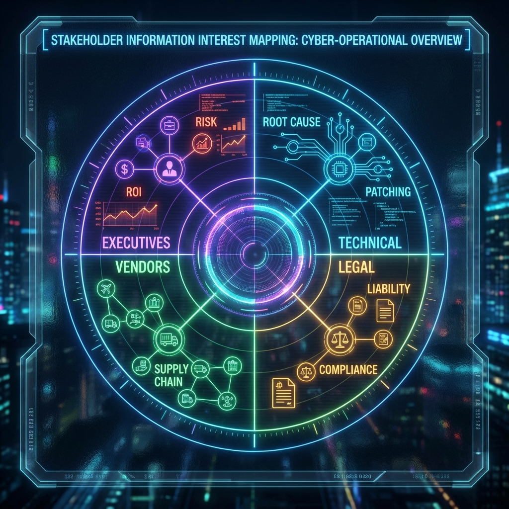

<!--
Chapter: 2
Title: Ethics, Legal, and Stakeholder Communication
Category: Foundations
Difficulty: Beginner
Estimated Time: 18 minutes read time
Hands-on: No
Prerequisites: Chapter 1
Related: Chapters 4 (SOW/RoE), 8 (Evidence), 36 (Reporting)
-->

# Chapter 2: Ethics, Legal, and Stakeholder Communication

_This chapter establishes the critical ethical and legal framework for AI red teaming. You'll learn the principles of responsible security testing, understand legal boundaries and authorization requirements, master stakeholder communication strategies, and develop professional practices for data handling and responsible disclosure in AI security engagements._

## 2.1 Why Ethics Matter in AI Red Teaming

AI red teaming, by its very nature, grants you deep access to sensitive systems and data. With that access comes the responsibility to operate with integrity, professionalism, and a commitment to avoiding harm. Ethical lapses don’t just damage your reputation - they can put clients, end users, and even whole organizations at risk.

- **Trust is foundational:** Clients rely on your honesty, discretion, and judgment.
- **AI is high-stakes:** Model misuse can have consequences beyond IT - think misinformation, privacy violations, or physical harm.
- **Changing landscape:** New regulations (GDPR, EU AI Act) and societal expectations demand transparency and accountability.

## 2.2 Fundamental Ethical Principles

### Integrity

- Never conceal testing activity, results, or mistakes.
- Do not exceed the scope authorized, even if tempted by curiosity.

### Respect for Persons and Data

- Treat all data (especially PII) as if it were your own.
- Redact sensitive information from logs, screenshots, and reports except where strictly needed for remediation.

### Non-Maleficence (“Do No Harm”)

- Avoid unnecessary disruption or damage.
- If you discover critical risks or “accidental” data/power, halt testing and escalate immediately.

### Professional Competence

- Stay up-to-date with the latest in both AI and security best practices.
- Only accept work within your expertise or partner with those who supply what you lack.

## 2.3 Legal Boundaries and Rules of Engagement

### Understanding Authorization

> [!CAUTION]
> Never begin testing without written signoff (e.g., Statement of Work, engagement letter). Unauthorized testing, even with good intentions, is illegal and can result in criminal prosecution under the Computer Fraud and Abuse Act (CFAA) and similar laws.

- Confirm both **scope** (what systems/inputs are fair game) and **methods** (approved techniques, tools, and hours).
- Clarify **reporting paths** for vulnerabilities, especially in critical infrastructure or public systems.

### Regulatory & Compliance Considerations (Non-exhaustive)

- **GDPR and Data Privacy**: AI systems often touch user data. Ensure all test data is properly anonymized.
- **Copyright/Intellectual Property**: Some models/plugins cannot be probed or reverse-engineered without legal approval.
- **Export Controls**: Handling models trained or deployed across borders can invoke additional legal regimes.
- **EU AI Act**: High-risk systems must be protected with rigorous technical and procedural safeguards.

### Reporting and Documentation

> [!IMPORTANT]
> Proper documentation and chain-of-custody practices are not just best practices—they're legal requirements that protect both you and your client in the event of incidents or audits.

- Document every test in detail (date, method, access used, outcomes).
- Use **chain-of-custody** practices for any evidence (logs, screen recordings, exploit code).
- Securely destroy unneeded copies of sensitive data after engagement per client request and relevant laws.

## 2.4 Responsible Disclosure and Coordinated Response

What if you discover a critical vulnerability (in the client’s supply chain, or, say, in an open-source model used worldwide)?

- **Pause and notify**: Follow your organization’s incident handling and the client’s emergency contact protocol.
- If third-party risk is involved, discuss coordinated disclosure, typically with the client’s legal/compliance team.
- Never publicly discuss vulnerabilities until fixed, or until you have explicit permission.

## 2.5 Communicating with Stakeholders

In AI red teaming, technical findings may have legal, business, or even social implications. Effective communication bridges this gap.

### Identifying Stakeholders

- **Executives** (CISO, CIO, CEO): Care most about business risk, public impact, and strategy.
- **Technical leads** (engineers, architects): Want test methodology, technical root causes, and concrete remediations.
- **Compliance/Legal**: Need confirmation that testing followed law and contract; want full documentation trail.
- **Third-party vendors**: May be impacted if their components were involved in findings.

### Principles of Clear Communication

- **Tailor your language**: Use context-appropriate explanations - avoid jargon for business stakeholders, provide depth for technical teams.
- **Early and often**: Regular check-ins help prevent misunderstandings and scope drift.
- **Actionable reporting**: Focus on impact, exploitability, and specific recommendations for mitigation.

### Example: Reporting Table

| Audience         | Communication Style               | Example Message                                                                                                              |
| ---------------- | --------------------------------- | ---------------------------------------------------------------------------------------------------------------------------- |
| Executive        | Plain language, impact-focused    | “Our tests found that anyone can access sensitive customer data in the chat logs, exposing us to GDPR fines.”                |
| Technical        | Technical detail, steps, evidence | “Prompt injection via the ‘/support’ API bypasses intent filters - recommend input validation and stricter role separation.” |
| Compliance/Legal | Documentation, traceability       | “All model access was conducted using the provided test account and logs are attached as evidence.”                          |

## 2.6 Conflicts of Interest, Bias, and Fair Testing

- **Declare conflicts**: If you have worked on the client’s codebase, or have competing interests, disclose and recuse as needed.
- **Be aware of bias**: Test scripts and approaches should model real adversaries, not just “AI labs”-engage a diversity of viewpoints and red teaming experience.
- **Fairness**: Avoid creating or exploiting vulnerabilities for the sake of the test.

## 2.7 The AI Red Teamer’s Oath

> “I will act with integrity, respect confidentiality, never exceed my mandate, and place the safety of users and systems above personal or competitive gain.”

---

## 2.8 Conclusion

### Key Takeaways

1. **Ethics are Non-Negotiable:** Ethical lapses in AI red teaming can result in legal liability, client harm, and destruction of professional reputation—there is no "oops" in unauthorized testing
2. **Written Authorization is Mandatory:** Every engagement must have explicit written permission defining scope, methods, and boundaries before any testing begins
3. **Stakeholder Communication is Critical:** Technical findings must be translated appropriately for executives, engineers, and legal teams—the same vulnerability requires different explanations for different audiences
4. **Privacy and Data Protection are Paramount:** GDPR, CCPA, and similar regulations impose strict requirements on handling data discovered during testing

### Recommendations for Red Teamers

- Maintain a strict authorization checklist and never deviate from approved scope
- Develop communication templates for different stakeholder groups
- Build relationships with legal and compliance teams before engagements begin
- Document everything—if it's not documented, it didn't happen
- When in doubt about ethical boundaries, pause and consult

### Recommendations for Organizations

- Establish clear legal frameworks for AI red team engagements before starting programs
- Create standardized SOW templates that address AI-specific testing scenarios
- Ensure red team has direct escalation paths to executive leadership
- Provide ethics training specifically focused on AI systems and data handling
- Build cross-functional review processes for high-risk findings

### Next Steps

- **Chapter 3:** The Red Teamer's Mindset—develop critical thinking and adversarial perspectives
- **Chapter 4:** SOW, Rules of Engagement, and Client Onboarding—practical templates for authorization
- **Chapter 8:** Evidence, Documentation, and Chain of Custody—proper evidence handling procedures

> [!TIP]
> Create your own "ethics checklist" that you review before every engagement. Include questions like: "Do I have written authorization?", "Have I identified all stakeholders?", "Do I know the escalation procedure for critical findings?"

### Pre-Engagement Checklist

#### Legal and Authorization

- [ ] Review and sign statement of work (SOW) with clear scope definition
- [ ] Obtain explicit written authorization from legally authorized representative
- [ ] Verify rules of engagement are documented and agreed upon
- [ ] Confirm emergency escalation procedures and contact information
- [ ] Review applicable regulations (GDPR, HIPAA, PCI-DSS, etc.)
- [ ] Sign non-disclosure agreements (NDAs) and data handling agreements

#### Stakeholder Identification

- [ ] Identify all stakeholders (executive, technical, legal, compliance)
- [ ] Establish communication channels and reporting cadence
- [ ] Clarify reporting formats and language requirements for each audience
- [ ] Define success criteria and deliverables with stakeholders
- [ ] Set expectations for disclosure timelines and remediation support

#### Ethical Considerations

- [ ] Declare any conflicts of interest
- [ ] Review personal and organizational ethical guidelines
- [ ] Understand client's data classification and handling requirements
- [ ] Verify test data is properly anonymized/synthetic
- [ ] Confirm backup and rollback procedures in case of unintended impact

#### Compliance Documentation

- [ ] Prepare evidence collection methods compliant with legal requirements
- [ ] Set up secure storage for sensitive findings and test data
- [ ] Create chain-of-custody procedures for artifacts
- [ ] Document data retention and deletion policies
- [ ] Establish audit trail for all testing activities

### Post-Engagement Checklist

#### Reporting and Communication

- [ ] Deliver findings report tailored to each stakeholder group
- [ ] Executive summary for leadership (impact, risk, business implications)
- [ ] Technical detail for engineering teams (root cause, reproduction, fixes)
- [ ] Compliance documentation for legal/audit (authorization, evidence trail)
- [ ] Present findings in stakeholder meetings with appropriate depth

#### Responsible Disclosure

- [ ] Follow coordinated disclosure timelines agreed upon with client
- [ ] Escalate critical findings through proper channels immediately
- [ ] Support client in third-party disclosure if supply chain issues found
- [ ] Obtain explicit permission before any public discussion of findings
- [ ] Document all disclosure communications for audit trail

#### Data Handling and Cleanup

- [ ] Securely delete all test data per client agreement and regulations
- [ ] Redact PII and sensitive information from final reports
- [ ] Destroy or securely archive evidence per retention policy
- [ ] Confirm no client data remains on personal or testing systems
- [ ] Provide data deletion certificate to client if requested

#### Professional Obligations

- [ ] Document lessons learned for ethical and legal aspects
- [ ] Review engagement against professional code of conduct
- [ ] Report any ethical concerns or conflicts encountered
- [ ] Update personal ethics checklist based on experience
- [ ] Contribute to community knowledge through responsible channels

#### Compliance and Audit

- [ ] Verify all activities stayed within authorized scope
- [ ] Confirm complete documentation trail exists
- [ ] Archive all authorization documents and communications
- [ ] Prepare for potential audit or legal review
- [ ] Close out all compliance tracking items

---

_In the next chapter, you'll develop the mindset that distinguishes effective AI red teamers from traditional security testers, bridging technology, psychology, and business acuity._
