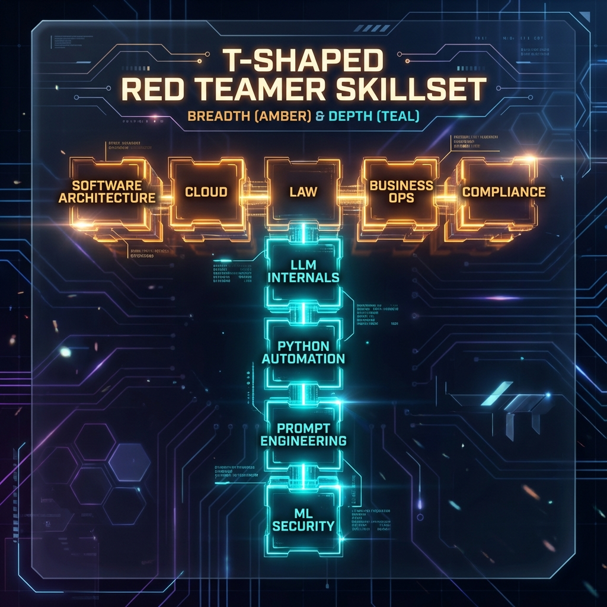
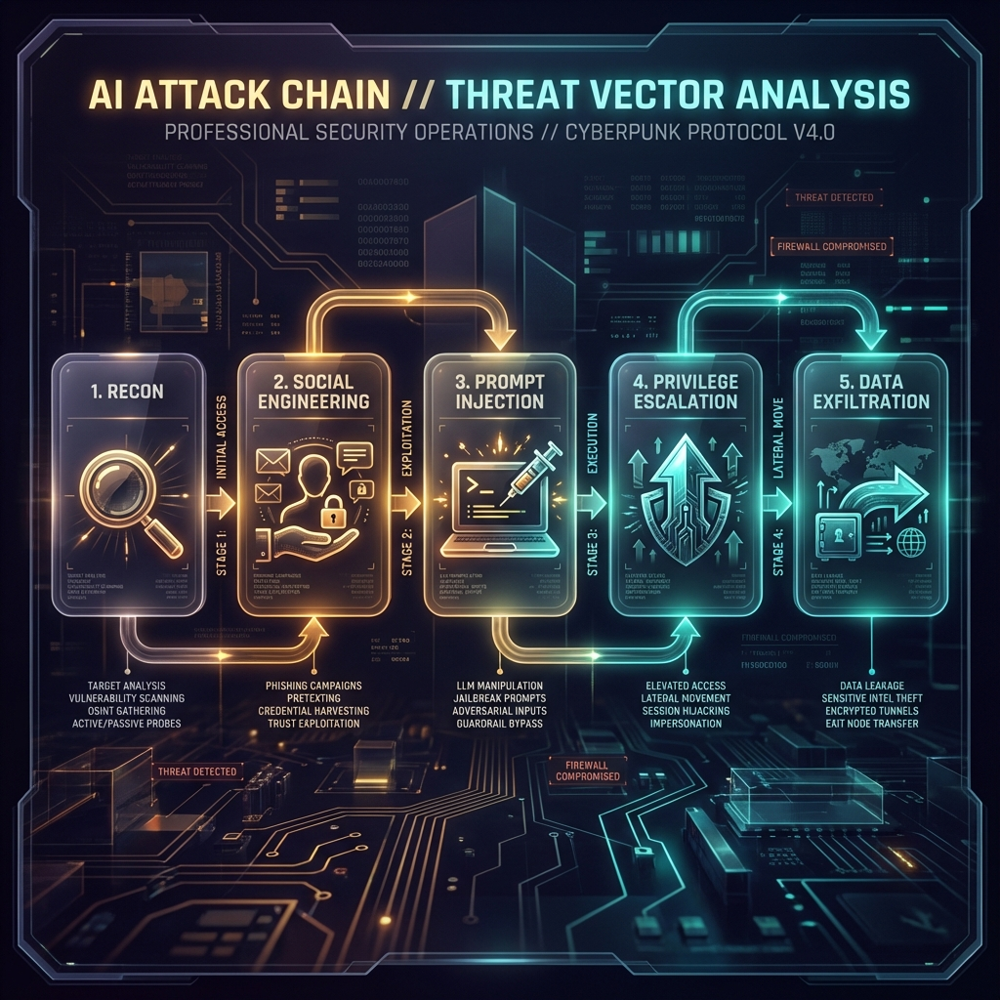

<!--
Chapter: 3
Title: The Red Teamer's Mindset
Category: Foundations
Difficulty: Beginner
Estimated Time: 12 minutes read time
Hands-on: No
Prerequisites: Chapter 1
Related: Chapters 2 (Ethics), 5 (Threat Modeling)
-->

# Chapter 3: The Red Teamer's Mindset

_This chapter develops the critical thinking skills and adversarial perspective essential for effective AI red teaming. You'll learn how to think like an attacker, cultivate skepticism and creativity, balance persistence with professionalism, and develop the psychological resilience needed for this specialized security discipline._

## 3.1 What Sets a Red Teamer Apart?

Unlike traditional vulnerability assessors or automated scanning, a red teamer adopts the mindset of a determined, creative, and unpredictable adversary. Great red teamers aren’t just tool users: they are critical thinkers, problem solvers, and empathetic adversaries who model real-world threats with nuance and rigor.

Key characteristics include:

- **Curiosity:** Relentlessly ask “What happens if…?” and “How else could this be abused?”
- **Creativity:** Combining unexpected tactics, chaining weaknesses, or using psychological levers to reach goals.
- **Persistence:** When a path is blocked, probe laterally, escalate, or try from a different angle.
- **Discipline:** Understand the difference between ethical simulation and real harm. Strict adherence to the Rules of Engagement is paramount.

## 3.2 The Adversarial Mindset: Thinking Like an Attacker

- **Assume Nothing Is Secure:** Question all controls, trust boundaries, and documentation.
- **Anticipate Defenders' Blind Spots:** Where might assumptions, legacy code, or unguarded inputs be exploited?
- **Attack the System, Not Just the Code:** Social engineering, supply chain, and process gaps are all attack surfaces.
- **Map the Path of Least Resistance:** In red teaming, the “easiest” win is the one most likely to be used by a real adversary.

### Example Scenario

You’re given an LLM-powered support bot to test. The documentation claims, “No sensitive data is accessible via the bot.”

#### Red teamer’s thought process

- Can I manipulate the input context to bypass these restrictions?
- What plugins, retrieval tools, or auxiliary APIs are called by the bot that might present openings?
- Is there any outdated or less monitored channel (e.g., logs, obscure endpoints) I can access?

## 3.3 Empathy and Adversarial Simulation

A great adversarial mindset means:

- **Modeling real attackers:** Differentiate between the “script kiddie,” the criminal gang, and the nation-state.
- **Understanding business impact:** What would really cause damage? Data leakage, reputational loss, compliance violations?
- **Simulating user behaviors:** Go beyond “security tester” approaches - think like disgruntled insiders, clever criminals, or naive/persistent end users.

## 3.4 The “T-Shaped” Red Teamer

> [!NOTE]
> Effective red teamers combine deep expertise in specific areas with broad knowledge across multiple domains. This T-shaped skillset enables both technical depth and contextual understanding.

- **Depth:** Deep technical skills in at least one area - ML/LLM systems, Python automation, OS internals, prompt engineering, or network traffic analysis.
- **Breadth:** Working knowledge of software architecture, cloud, law, regulatory frameworks, and business operations.

Continual learning is crucial. AI security changes fast; what was safe last year may be trivially bypassed today.

## 3.5 Adaptability and Lifelong Learning

- **Stay Current:** Follow threat intelligence feeds, security conferences, and AI/ML literature.
- **Practice:** Set up your own labs, replicate real incidents, contribute to public red team events and exercises.
- **Network:** Engage with other red teamers and blue teamers for perspective and collaboration.

## 3.6 Thinking in Attack Chains

Never look at vulnerabilities in isolation. The most devastating real-world attacks are **chains**-a sequence of small weaknesses, each overcome in turn:

- Reconnaissance → Social Engineering → Prompt Injection → Privilege Escalation → Data Exfiltration

Document each step, and always ask: **What risk can this chain create for the business or end user?**

## 3.7 Professionalism Under Pressure

Field engagements can be high-stress: production outages, tense clients, critical findings. Remember:

- **Maintain composure:** Escalate methodically, never cut corners.
- **Document thoroughly:** Good evidence and logs protect both you and your client.
- **Stay ethical:** No “out of scope” actions, no tempting shortcuts.

## 3.8 Sample Self-Assessment: Am I Thinking Like a Red Teamer?

- Do I challenge assumptions and look for what isn’t said?
- When blocked, do I try lateral moves or new attack vectors?
- Do I study both the offensive and defensive sides of AI?
- Can I explain impact in both technical and business terms?
- Am I continuously improving, learning, and seeking feedback?

---

## 3.9 Ethical and Legal Considerations

> [!IMPORTANT]
> The adversarial mindset must always be balanced with ethical constraints. Thinking like an attacker does not mean acting without authorization or exceeding defined boundaries.

### Maintaining Ethical Boundaries While Thinking Adversarially

- **Authorization First:** No matter how creative your attack idea, never test without written permission
- **Scope Discipline:** The red teamer's mindset should find paths within authorized scope, not justify scope creep
- **Document Intent:** Record your thought process and attack chains to demonstrate professional methodology
- **Respect Limits:** Persistence is valuable, but respect "stop" signals and escalation procedures

### Legal Considerations

- Adversarial thinking must operate within legal frameworks (CFAA, data protection laws)
- Creative attack chains do not justify unauthorized access to systems or data
- Document all reconnaissance and attack planning to demonstrate lawful intent
- Consult legal counsel when attack scenarios approach ethical gray areas

> [!CAUTION]
> The same creativity and persistence that makes you an effective red teamer can lead to legal trouble if applied without proper authorization. Always maintain clear boundaries between authorized testing and unauthorized hacking.

---

## 3.10 Conclusion

### Key Takeaways

1. **Red Teaming is a Mindset, Not Just a Skillset:** Technical abilities are necessary but insufficient. Critical thinking, creativity, and adversarial perspective separate effective red teamers from vulnerability scanners
2. **Attack Chains Trump Single Vulnerabilities:** Real-world attackers rarely rely on one exploit. The most impactful findings demonstrate chained weaknesses that create business risk
3. **Empathy Drives Better Testing:** Understanding attacker motivations, user behaviors, and business impact produces more valuable security assessments than pure technical testing
4. **Continuous Learning is Non-Negotiable:** AI security evolves rapidly. Yesterday's secure patterns become tomorrow's vulnerabilities

### Recommendations for Aspiring Red Teamers

- Develop T-shaped expertise: deep in one area, broad across many
- Practice attack chain thinking in lab environments before production engagements
- Study both offensive and defensive perspectives to anticipate countermeasures
- Build a personal knowledge base of attack patterns, tools, and methodologies
- Seek mentorship from experienced red teamers and participate in community events

### Recommendations for Organizations

- Hire for mindset and adaptability, not just current technical skills
- Provide continuous learning opportunities for red team members
- Encourage creative thinking while maintaining strict ethical guidelines
- Foster collaboration between red and blue teams to share perspectives
- Create safe practice environments where red teamers can experiment

### Next Steps

- **Chapter 4:** SOW, Rules of Engagement, and Client Onboarding - translate mindset into structured engagements
- **Chapter 5:** Threat Modeling and Risk Analysis - apply adversarial thinking systematically
- **Chapter 7:** Lab Setup and Environmental Safety - create practice environments for skill development

> [!TIP]
> Maintain a personal "attack pattern library" where you document creative approaches, failed attempts, and successful chains. This becomes your competitive advantage over time.

### Pre-Engagement Checklist

#### Mindset Preparation

- [ ] Review engagement scope and objectives with adversarial lens
- [ ] Identify potential attack surfaces and entry points
- [ ] Research target organization's industry, threats, and adversaries
- [ ] Study similar systems and documented vulnerabilities
- [ ] Develop hypotheses about likely weaknesses and attack paths

#### Knowledge Assessment

- [ ] Verify technical skills match engagement requirements
- [ ] Identify knowledge gaps and address through research/training
- [ ] Review recent threat intelligence relevant to target
- [ ] Study attack techniques applicable to target systems
- [ ] Prepare attack chain scenarios for testing

#### Ethical Framework

- [ ] Review rules of engagement with critical perspective
- [ ] Identify potential ethical gray areas in planned testing
- [ ] Establish escalation procedures for unexpected findings
- [ ] Confirm understanding of authorized vs. unauthorized actions
- [ ] Review personal ethical guidelines and professional code

#### Collaboration

- [ ] Coordinate with blue team on detection testing opportunities
- [ ] Establish communication channels for real-time questions
- [ ] Clarify expectations for attack creativity vs. realism
- [ ] Align on success criteria beyond just "finding vulnerabilities"

### Post-Engagement Checklist

#### Documentation

- [ ] Document complete attack chains, not just individual vulnerabilities
- [ ] Record thought process and decision points throughout engagement
- [ ] Capture failed attack attempts and why they didn't work
- [ ] Note defender blind spots and detection gaps encountered
- [ ] Prepare findings with both technical and business impact context

#### Knowledge Transfer

- [ ] Debrief with blue team on attack techniques used
- [ ] Share lessons learned about target system architecture
- [ ] Document new attack patterns discovered during engagement
- [ ] Identify areas where adversarial thinking produced unique insights
- [ ] Update personal attack pattern library

#### Self-Assessment

- [ ] Review engagement against red teamer mindset principles
- [ ] Identify moments where adversarial thinking was most effective
- [ ] Note areas where technical skills need improvement
- [ ] Assess balance between creativity and discipline
- [ ] Gather feedback from client and team on approach

#### Professional Development

- [ ] Document new techniques or approaches developed
- [ ] Identify skills to develop based on engagement challenges
- [ ] Share anonymized insights with red team community
- [ ] Update personal training plan based on experience
- [ ] Reflect on ethical decisions made during engagement

---

_Mastering the red team mindset primes you for the work ahead: scoping, planning, and then executing engagements with insight, rigor, and integrity. Proceed to the next chapter to learn how to prepare and manage a professional AI red team project from start to finish._
