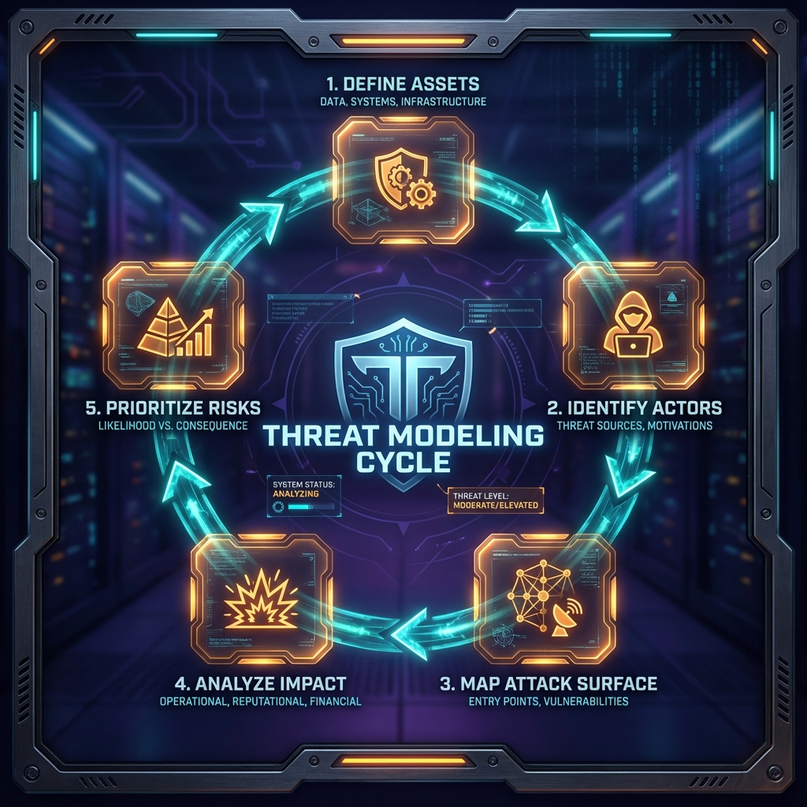

<!--
Chapter: 5
Title: Threat Modeling and Risk Analysis
Category: Foundations
Difficulty: Intermediate
Estimated Time: 16 minutes read time
Hands-on: No
Prerequisites: Chapters 1-4
Related: Chapters 6 (Scoping), 9 (Architectures), 31 (Reconnaissance)
-->

# Chapter 5: Threat Modeling and Risk Analysis

_This chapter teaches systematic threat modeling and risk analysis for AI systems. You'll learn to identify critical assets, enumerate threat actors, map attack surfaces specific to LLMs, prioritize risks by impact and likelihood, and create actionable threat models that drive effective red team engagements._

## 5.1 Why Threat Modeling Matters in AI Red Teaming

Threat modeling is a proactive process that helps you and stakeholders understand **what’s at risk, who might attack, and how they could succeed**. In AI/LLM systems, the landscape is especially dynamic: you must account for unique risks like model manipulation, data leakage via prompts, unintended plugin behavior, and more.

Effective threat modeling:

- Focuses your testing on the highest-risk assets and attack paths
- Helps you communicate business-relevant risk to stakeholders
- Avoids wasted effort on low-impact findings

---

## 5.2 Threat Modeling Process Overview

A robust threat model for AI systems typically includes:

1. **Defining Assets**: What are you trying to protect? (Model weights, training data, business logic, plugins, user data, reputation)
2. **Identifying Threat Actors**: Who might attack? (Disgruntled insiders, malicious users, competitors, hacktivists, nation-states)
3. **Enumerating Attack Surfaces and Vectors**: Where and how could attacks happen? (Prompt/API, plugin misuse, supply chain, logs)
4. **Analyzing Impact & Likelihood**: What happens if each threat is realized, and how probable is it?
5. **Prioritizing Risks**: Rank threats to focus red team efforts.

---

## 5.3 Step 1: Defining Assets in AI/LLM Systems

- **Model Artifacts:** Trained model weights, architectures, fine-tuning data
- **Business Logic:** Prompt templates, routing, plugin selection criteria
- **Data Inputs & Outputs:** User queries, logs, plugin responses, database records
- **Secrets & Credentials:** API keys, private endpoints, plugin credentials
- **User Trust & Reputation:** Potential for misuse to cause reputational, legal, or compliance harm

### Example Questions

- What’s the most confidential/restricted piece of information accessible through the LLM?
- Can an attack on the model lead to broader systems compromise or data exfiltration?
- Could success harm the client’s customers or brand reputation?

---

## 5.4 Step 2: Identifying Threat Actors

- **Malicious Users:** Attempting prompt injection, data leakage, or jailbreaks for personal gain.
- **Insiders:** Employees or contractors with legitimate but abused access.
- **Competitors:** Seeking model extraction/theft or sabotage.
- **Automated Attackers:** Bots fuzzing prompts, APIs, or plugins at scale.
- **Unintentional Actors:** Well-meaning users who inadvertently trigger unwanted behaviors.

---

## 5.5 Step 3: Enumerating Attack Surfaces and Vectors

AI/LLM systems have unique and overlapping attack surfaces:

- **Prompt Inputs:** Primary user interface, susceptible to injection and manipulation.
- **Plugins/APIs:** Extensions where the model can trigger unintended behaviors via code or service calls.
- **Supply Chain:** Dependencies in model training, plugin sourcing, or codebase.
- **Model-to-Model Connections:** LLMs triggering actions or responses in other LLM-driven systems.
- **Logging and Monitoring:** Where outputs or sensitive content may leak.

**Tools:** Use data/flow diagrams and system architecture charts to visualize these surfaces.

---

## 5.6 Step 4: Analyzing Impact and Likelihood

For each identified threat:

- **Impact:** What’s the worst-case outcome? (Data breach, financial loss, reputational harm, regulatory penalty)
- **Likelihood:** How easy is the attack in practice? Consider attacker capability, system complexity, existing defenses.

### Example Threat Table

| Asset         | Threat             | Actor          | Likelihood | Impact | Risk Level |
| ------------- | ------------------ | -------------- | ---------- | ------ | ---------- |
| Model weights | Theft via API      | Competitor     | Medium     | High   | High       |
| Customer Data | Leakage via prompt | Malicious user | High       | High   | Critical   |
| Plugins       | Command Injection  | Insider        | Low        | High   | Medium     |
| Logs          | Data Exfiltration  | Insider        | Low        | Medium | Low        |

---

## 5.7 Step 5: Prioritizing and Using the Threat Model

- Highlight **“Critical” and “High”** risk scenarios for focused red team attention.
- Tie each risk back to business impact for client buy-in and prioritization.
- Use this as a living document; update it based on findings from red teaming.

---

## 5.8 AI/LLM-Specific Threat Modeling Methodologies

- **Adapt STRIDE/DREAD:** Traditional security frameworks (e.g., Spoofing, Tampering, Repudiation, etc.) can be tailored for AI systems.
- **LLM Kill Chain:** Reconnaissance ➔ Prompt Engineering ➔ Model Behavior Manipulation ➔ Data Extraction/Impact.

**Tip:** Incorporate “AI safety” and “model misuse” perspectives that go beyond classic code/network vulnerability approaches.

---

## 5.9 Documenting and Communicating the Threat Model

A good threat model is:

- Visual (models, tables, attack trees)
- Accessible to both technical and business stakeholders
- Used as a reference for reporting and remediation

---

## 5.10 Sample Threat Modeling Worksheet (AI System)

1. List all entry points to the LLM (UI, API, plugins, ingestion)
2. Identify all forms of sensitive data or actions accessible via the LLM
3. Brainstorm attacker profiles and motives
4. Map end-to-end data flows, including third-party integrations
5. Rank potential threats and justify priorities

---

_With a strong threat model, your red team engagement becomes risk-driven and results-focused. The next chapter will walk you through scoping these findings into a feasible, valuable engagement plan._

## 5.11 Conclusion

### Chapter Takeaways

1. **Threat Modeling is Foundational:** Effective AI red teaming begins with systematic threat modeling that identifies assets, threat actors, attack surfaces, and prioritizes risks based on impact and likelihood
2. **AI Systems Have Unique Attack Surfaces:** LLMs introduce distinct vulnerabilities through prompts, plugins, model weights, and training data that require specialized threat analysis beyond traditional security frameworks
3. **Risk-Driven Testing is Essential:** Focusing red team efforts on high-impact, high-likelihood threats ensures efficient use of resources and delivers maximum value to stakeholders
4. **Threat Models Are Living Documents:** Continuously update threat models based on red team findings, emerging attack techniques, and changes to the AI system architecture

### Recommendations for Red Teamers

- **Start Every Engagement with Threat Modeling:** Don't begin testing until you've mapped assets, actors, and attack vectors specific to the target AI system
- **Adapt Traditional Frameworks:** Use STRIDE, DREAD, and kill chain methodologies but tailor them to AI-specific risks like model extraction, data leakage, and prompt manipulation
- **Communicate Business Impact:** Always tie technical findings back to business risks—data breaches, regulatory penalties, reputational harm—to ensure stakeholder buy-in

### Recommendations for Defenders

- **Integrate Threat Modeling into Development:** Make threat modeling a standard part of AI system design, not an afterthought
- **Prioritize High-Risk Scenarios:** Focus defensive resources on critical and high-risk threats identified through systematic analysis
- **Update Threat Models Regularly:** As AI systems evolve and new attack techniques emerge, revisit and refine threat models to reflect current reality

### Future Considerations

As AI systems become more complex with multi-modal capabilities, agentic behaviors, and deeper integration into critical infrastructure, threat modeling will need to evolve. Expect to see:

- Threat modeling frameworks specifically designed for AI/ML systems
- Automated threat modeling tools that analyze system architecture and generate risk assessments
- Integration of AI safety concerns (fairness, bias, misuse) alongside traditional security threats
- Regulatory requirements for documented threat models in high-risk AI applications

### Next Steps

- Chapter 6: Scoping an Engagement—translating threat models into actionable testing plans
- Chapter 9: LLM Architectures and System Components—understanding the technical foundation for identifying attack surfaces
- Chapter 31: AI System Reconnaissance—applying threat modeling insights to gather intelligence during engagements

---
