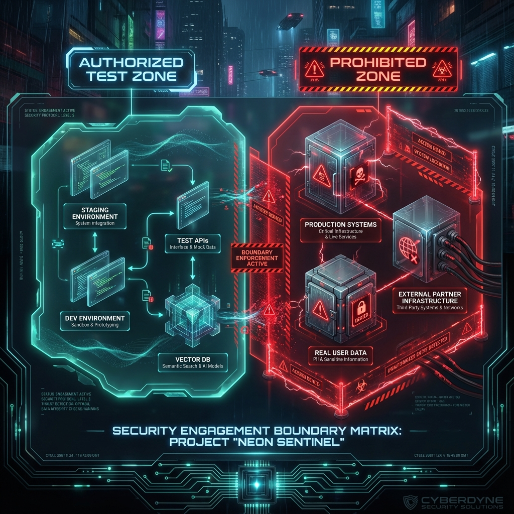

<!--
Chapter: 6
Title: Scoping an Engagement
Category: Foundations
Difficulty: Intermediate
Estimated Time: 14 minutes read time
Hands-on: No
Prerequisites: Chapters 1-5
Related: Chapters 4 (SOW/RoE), 5 (Threat Modeling), 7 (Lab Setup)
-->

# Chapter 6: Scoping an Engagement

  

_This chapter guides you through the critical process of scoping AI red team engagements. You'll learn to define realistic boundaries, estimate timelines and resources, identify technical and business constraints, communicate scope effectively to stakeholders, and avoid common scoping pitfalls that derail engagements._

## 6.1 The Importance of Proper Scoping

A well-scoped engagement ensures that the red teaming exercise is effective, safe, focused, and delivers value to the client. Poor scoping can lead to missed risks, out-of-control timelines, client confusion, or legal exposure. In AI red teaming, scoping must adapt to the unique complexities and dynamic nature of machine learning systems, APIs, plugins, and data flows.

---

## 6.2 Goals of the Scoping Process

- **Align on business and technical objectives.**
- **Define what’s in scope** (systems, models, environments, plugins, data flows).
- **Clarify out-of-scope areas** to prevent accidental overreach.
- **Set realistic limits on time, methods, and resources available.**
- **Ensure all stakeholders share the same expectations.**

---

## 6.3 Determining Scope: Key Areas

### 6.3.1 System Boundaries

- Which LLMs, APIs, plugins, or platforms will be tested?
- Are there distinct environments (dev, staging, production) to consider?
- Are any legacy or deprecated systems involved?
- Are third-party integrations or vendor systems included?

### 6.3.2 Data and Function Scope

- Is any real user data involved? What about anonymized or synthetic data?
- Will testing involve live workflows (e.g., chatbots responding to real users)?
- Which actions can be triggered by the model - data retrieval, plugin execution, email sending?

### 6.3.3 Attack Surface Delineation

- Are only prompt inputs in scope? What about indirect input (documents, emails)?
- Is code review (white-box), black-box, or both in scope?
- Will there be AI supply chain review or only external-facing attack simulation?

### 6.3.4 Risk-related Constraints

- Which actions are forbidden (e.g., testing against production, attempting denial-of-service, using real PII)?
- Are there time-of-day or business hours restrictions?
- Should social engineering or insider simulation be included?

---

## 6.4 Gathering Scoping Information

### 6.4.1 Stakeholder Interviews

Talk to business, security, engineering, and compliance leads. Questions may include:

- What’s the most critical asset the LLM protects or can access?
- What are your biggest AI-related fears?
- Has your system been previously attacked or audited?

### 6.4.2 Technical Reconnaissance

- Review architecture diagrams, plugin documentation, data flow charts.
- Request lists of endpoints, access methods, and supporting infrastructure.
- Enumerate pre-existing controls and known limitations.

---

## 6.5 Documenting and Confirming Scope

Create a scoping document (or section in the SOW) summarizing:

  

**Always review and get sign-off from all stakeholders** before starting the red team assessment.

---

## 6.6 Managing Scope Creep and Unplanned Findings

- **If a vulnerability is discovered that reaches into “out-of-scope” territory:** Pause and discuss with the client before proceeding.
- **Document anything found** that relates to high-risk findings, whether in-scope or not, but respect the agreed rules.
- **Rescope if necessary**: For long or evolving projects, expect to review and adjust scope as systems change or new knowledge is surfaced.

---

## 6.7 Sample Scoping Checklist

- [ ] All in-scope systems and components identified and documented.
- [ ] Explicit out-of-scope boundaries defined and acknowledged.
- [ ] Data sensitivity, production limitations, business hours, and testing methods agreed.
- [ ] All stakeholder approvals obtained.
- [ ] Written record (scoping doc/SOW) shared and archived.

---

## 6.8 Scope: The Core of Trust

An accurately scoped engagement shows professionalism and respect for the client. It protects both parties, clarifies legal obligations, and ensures that time and resources target the highest-value risks.

---

_With a precise scope in place, you are ready to establish the laboratory, test environments, and safety measures needed for executing a secure and efficient AI red teaming exercise. Continue to the next chapter for practical lab setup and environmental safety._

## 6.9 Conclusion

### Chapter Takeaways

1. **Scope Defines Success:** Proper scoping ensures red team engagements are focused, legally protected, resource-efficient, and aligned with business objectives
2. **Clarity Prevents Conflicts:** Explicit in-scope/out-of-scope boundaries protect both red teamers and clients from misunderstandings and legal exposure
3. **Scoping is Collaborative:** Engaging stakeholders from business, security, engineering, and compliance ensures comprehensive coverage and buy-in
4. **Flexibility is Necessary:** Be prepared to manage scope creep and adjust boundaries as new findings emerge or system architecture changes

### Recommendations for Red Teamers

- **Document Everything:** Create detailed scoping documents with clear in-scope/out-of-scope tables and get written approval before testing
- **Ask Probing Questions:** Don't accept vague answers—drill down on exactly which systems, data, and attack vectors are permitted
- **Communicate Continuously:** When discoveries push against scope boundaries, pause and consult with stakeholders before proceeding

### Recommendations for Defenders

- **Involve Technical Teams Early:** Ensure engineers who built the AI system participate in scoping to provide accurate technical boundaries
- **Be Realistic About Coverage:** Don't over-scope engagements with unrealistic timelines or under-scope by protecting too many systems
- **Plan for Follow-Up:** Scoping should allow for iterative testing as AI systems evolve and new attack techniques emerge

### Future Considerations

As AI systems grow in complexity and integration depth, scoping will become more challenging. Expect to see standardized scoping frameworks for AI red teaming, automated scope discovery tools that map AI attack surfaces, and regulatory guidance on minimum testing requirements for high-risk AI applications.

### Next Steps

- Chapter 7: Lab Setup and Environmental Safety—creating secure testing environments within the defined scope
- Chapter 4: SOW, Rules of Engagement, and Client Onboarding—reviewing the contractual framework that supports scoping
- Practice: Develop scoping documents for hypothetical AI engagements to refine your scoping process

---
