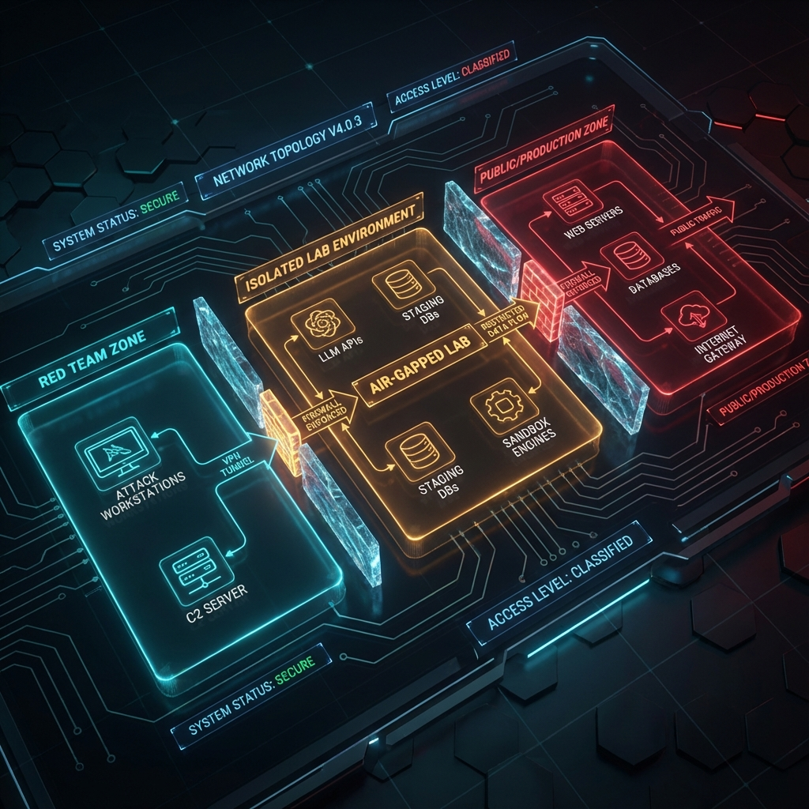
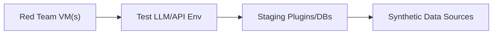
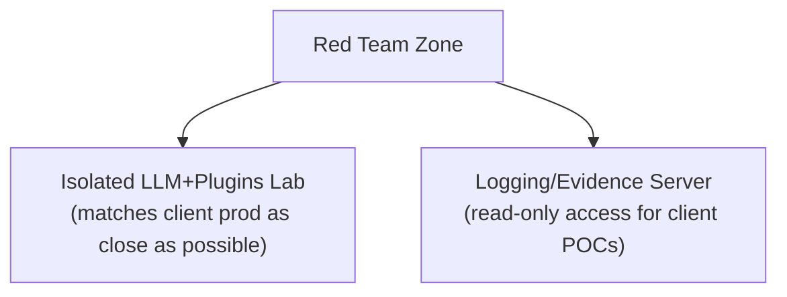

<!--
Chapter: 7
Title: Lab Setup and Environmental Safety
Category: Technical Deep-Dives
Difficulty: Intermediate
Estimated Time: 25 minutes read time
Hands-on: Yes
Prerequisites: Chapters 1-6
Related: Chapters 9 (Architectures), 32 (Automation), 33 (Red Team Frameworks)
-->

# Chapter 7: Lab Setup and Environmental Safety

  

_This chapter provides hands-on guidance for setting up safe, isolated AI red teaming environments. You'll learn to configure local and cloud-based labs, implement proper network isolation, deploy test models and applications, establish monitoring and logging, and create reproducible test environments for ethical AI security research._

## 7.1 Why Lab Setup and Environmental Safety Matter

A properly designed test environment (or "lab") is crucial in AI red teaming to:

- Prevent accidental impact on production systems or real users.
- Ensure security and privacy of test data and credentials.
- Allow realistic simulation of adversarial actions.
- Enable efficient logging, evidence capture, and troubleshooting.

AI/LLM red teaming often deals with powerful models, sensitive data, and complex cloud/software stacks - amplifying the need for rigorous safety throughout engagement.

---

## 7.2 Key Properties of a Secure Red Team Lab

- **Isolation:** The lab should be separated from production networks, data, and users. Use separate credentials, access tokens, and compute resources.
- **Replicability:** The lab setup should be reproducible. Document networking, configs, plugin versions, and data snapshots.
- **Controlled Data:** Use synthetic or anonymized data whenever possible; never expose real customer data unless absolutely required and authorized.
- **Monitoring:** Enable comprehensive logging (system, model, plugin, and network) for easy tracking of all red team actions and system responses.
- **Access Control:** Restrict lab access to authorized red teamers and client observers. Employ temporary or revocable credentials.

---

## 7.3 Lab Setup Tasks

1. **Provision Isolated Environments**
   - Dedicated VMs, containers, or cloud environments (e.g., staging, sandbox, test).
   - No connectivity to production unless specifically needed and approved.
2. **Deploy Target Systems**
   - LLMs, plugins, APIs, and other components in scope installed and configured to match production as closely as practical.
   - Populate with safe test data or limited synthetic sensitive data if needed.
3. **Configure Access Controls**
   - Create test accounts, temporary tokens, restricted network/firewall rules.
   - Audit permissions - least privilege should be enforced everywhere.
4. **Install Monitoring and Logging**
   - Ensure all red team actions and system events are captured.
   - Use SIEM/log aggregation solutions or simple file-based logs as appropriate.
5. **Evidence and Artifact Handling**
   - Set up secure storage for logs, screenshots, code artifacts, and red team “tools.”
   - Plan evidence handoff protocol for later reporting and remediation.

---

## 7.4 Safety Precautions for LLM Testing

- **Rate Limiting:** Prevent accidental denial-of-service or brute-force flooding of systems.
- **Kill Switches:** Maintain mechanisms to pause or halt the environment instantly in case of runaway tests or unintentional impacts.
- **Credential Safety:** Never reuse production credentials. Treat any credential, API key, or secret as sensitive - even in test.
- **Data Containment:** Prevent test data (especially adversarial prompts or outputs) from leaking outside the controlled lab.

---

## 7.5 Example Lab Topologies

### Simple Topology

  

### Segmented Topology (for large engagements)

---

## 7.6 Checklist: Is Your Lab Ready?

- [ ] All in-scope systems deployed and functional in isolated environment.
- [ ] Logs, monitoring, and evidence capture methods tested.
- [ ] Access/control boundaries reviewed and verified with client.
- [ ] Test data scrubbed or synthetic.
- [ ] Direct connectivity to production confirmed as out-of-scope or properly firewalled.
- [ ] Emergency pause procedure documented and tested.

---

## 7.7 Environmental Safety: Ethics and Practicality

Remember:

- Any error in lab setup can lead to privacy violations, regulatory breaches, or business impact.
- Pre-engagement "fire drills" (e.g., test your kill switch, credential revocation, and isolation) are vital for real-world readiness.
- Communicate environment changes or unexpected lab events promptly to the client.

---

_With a robust lab and clear safety controls in place, you’re prepared to gather and preserve evidence in a trustworthy manner. Continue to the next chapter to master documentation and evidence handling in AI red team engagements._

## 7.8 Conclusion

### Chapter Takeaways

1. **Isolation is Paramount:** Test environments must be completely separated from production to prevent accidental impact on live systems and real users
2. **Proper Lab Setup Enables Effective Testing:** Replicable, monitored, and controlled environments allow red teamers to safely simulate real-world attacks
3. **Safety Requires Planning:** Kill switches, rate limiting, credential management, and data containment prevent unintended consequences
4. **Documentation Supports Reproducibility:** Well-documented lab configurations ensure consistent testing and enable knowledge transfer

### Recommendations for Red Teamers

- **Test Your Safety Controls First:** Before any red team activity, verify that kill switches, logging, and isolation mechanisms work as intended
- **Use Synthetic Data When Possible:** Avoid exposure of real customer data unless absolutely necessary and explicitly authorized
- **Document Your Lab Configuration:** Maintain detailed records of network topology, software versions, and configurations for reproducibility

### Recommendations for Defenders

- **Provide Realistic Test Environments:** Labs that closely mirror production architecture yield more valuable red team findings
- **Enable Comprehensive Logging:** Ensure red team activity can be fully monitored and analyzed without compromising isolation
- **Support Iterative Lab Updates:** As AI systems evolve, update test environments to reflect architectural changes

### Future Considerations

Expect to see standardized AI red teaming lab templates, infrastructure-as-code solutions for rapid lab deployment, cloud-based isolated testing platforms specifically designed for AI security assessments, and regulatory requirements for documented testing environments in high-risk AI applications.

### Next Steps

- [Chapter 8: Evidence Documentation and Chain of Custody](Chapter_08_Evidence_Documentation_and_Chain_of_Custody.md)
- [Chapter 14: Prompt Injection](Chapter_14_Prompt_Injection.md)
- Practice: Set up a minimal LLM testing environment using the checklists provided

---
