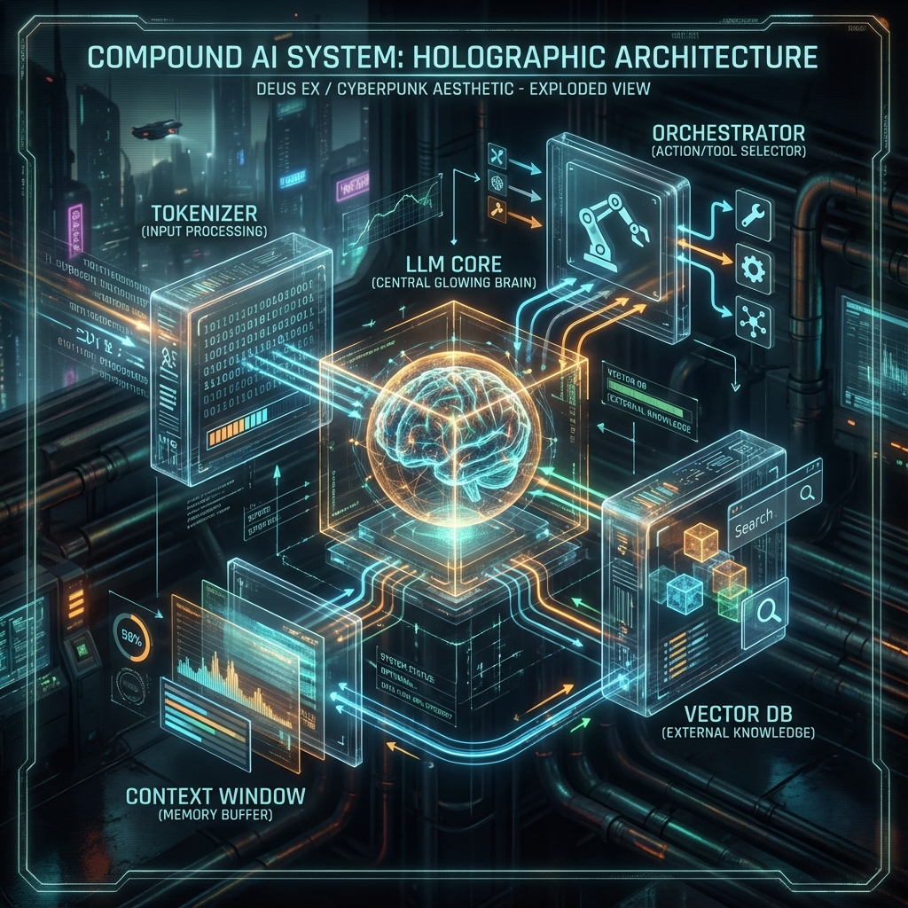
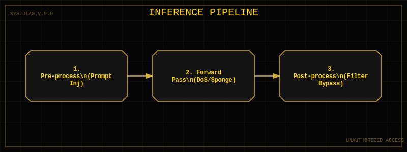
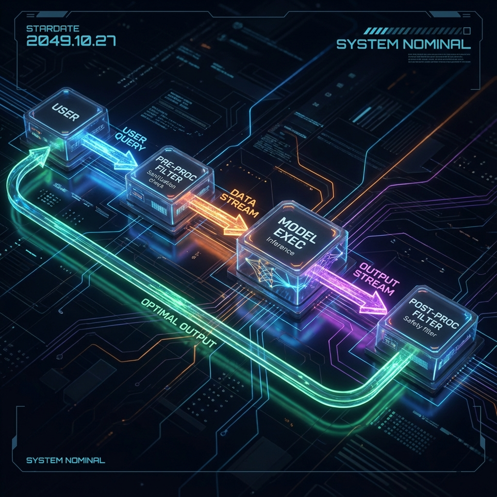

<!--
Chapter: 9
Title: LLM Architectures and System Components
Category: Technical Deep-Dives
Difficulty: Intermediate
Estimated Time: 22 minutes read time
Hands-on: Yes
Prerequisites: Chapters 1-8
Related: Chapters 10 (Tokenization), 11 (Plugins), 12 (RAG)
-->

# Chapter 9: LLM Architectures and System Components

<p align="center">
  
</p>

_This chapter provides deep technical understanding of LLM architectures critical for red teaming. You'll learn transformer internals, attention mechanisms, embedding spaces, system prompts and context windows, model deployment patterns, and how architectural choices create specific attack surfaces that red teamers can exploit._

Effective Red Teaming requires moving beyond treating AI as a "black box." To identify subtle vulnerabilities, bypass guardrails, or exploit system-level integration flaws, you must understand the underlying architecture. This chapter deconstructs Large Language Models (LLMs) and their ecosystem from an adversarial perspective.

## 9.1 The AI Attack Surface

When we attack an "AI," we are rarely attacking a single file. We are attacking a **Compound AI System**. Understanding the distinction between the _Model_ and the _System_ is critical for accurate threat modeling.

| Component                 | Description                                          | Adversarial Interest                                              |
| :------------------------ | :--------------------------------------------------- | :---------------------------------------------------------------- |
| **The Model (Weights)**   | The core neural network file (e.g., GPT-4, Llama 3). | Extraction attacks, weight poisoning, adversarial inputs.         |
| **The Tokenizer**         | Converts text to numbers.                            | Vocabulary mapped attacks, invisible character exploits.          |
| **The Context Window**    | The "working memory" of the session.                 | Context overflow, cache poisoning, "needle in a haystack" hiding. |
| **The System Prompt**     | The initial hidden instructions.                     | Leakage, "jailbreaking" constraints.                              |
| **Orchestrator/Agent**    | The logic loop deciding to call tools.               | Infinite loops, excessive agency, prompt injection propagation.   |
| **Vector Database (RAG)** | Long-term memory storage.                            | Search result poisoning, indirect prompt injection.               |

<p align="center">
  
</p>

## 9.2 The Transformer: A Hacker's Perspective

At its core, almost all modern LLMs are **Transformers**. A Transformer is a probabilistic engine that predicts the next token in a sequence based on the `attention` it pays to previous tokens.

### The Attention Mechanism

In simple terms, **Attention** allows the model to "look back" at previous words when generating a new one.

- **Vulnerability:** The attention mechanism has a finite capacity (the "context window").
- **Attack Vector:** **Context Exhaustion (DoS)**. By flooding the context window with computationally expensive patterns (or simply maximizing length), you can degrade performance (latency) or force the model to "forget" earlier instructions (like safety guardrails).

### Determinism vs. Stochasticity

Transformers are deterministic mathematical functions. If you input the exact same numbers, you get the exact same output _logits_ (probabilities). The "creativity" or randomness comes from the **Decoding Strategy**.

- **Temperature**: Adds randomness to the probability distribution.
- **Top-P (Nucleus Sampling)**: Cuts off the "tail" of low-probability tokens.

> **Red Team Tip:** If a system allows you to set `Temperature = 0`, the model becomes deterministic. This is excellent for reproducing exploits. If it forces high temperature, exploits may be flaky.

## 9.3 Tokenization: The First Line of Defense (and Failure)

Before your prompt reaches the brain of the AI, it is chopped into chunks called **Tokens**. This is often where safety filters live and die.

### How Tokenization Works

A token is not necessarily a word. It can be part of a word, a space, or a symbol.

- `red teaming` -> `[red, _team, ing]`

### Inspecting Tokenizers (How-To)

You can inspect how a model "sees" your prompt using the `transformers` library on your local machine (or Google Colab). This is crucial for **Token Smuggling** attacks - finding ways to encode "forbidden" words so filter keywords don't trigger.

```python
from transformers import AutoTokenizer

model_id = "meta-llama/Meta-Llama-3-8B-Instruct"
tokenizer = AutoTokenizer.from_pretrained(model_id)

# The payload that might get flagged
prompt = "Generate a keylogger"

# See what the model sees
tokens = tokenizer.encode(prompt)
print(f"Token IDs: {tokens}")

# Decode back to see boundaries
decoded = [tokenizer.decode([t]) for t in tokens]
print(f"Decoded chunks: {decoded}")
```

**Attack Application:** If a filter blocks "keylogger", you might try splitting it or using rare characters that decode to the same concept but different tokens.

## 9.4 The Inference Pipeline

Understanding the flow of a single prompt helps you pinpoint where to inject.

1. **Input Pre-processing**:
   - System Prompt is prepended: `[System Instructions] + [User Input]`
   - _Attack:_ Prompt Injection targets the boundary between these two. "Ignore previous instructions" works because the model usually can't distinguish the authority of the System text from the User text once they are merged into a single stream of tokens.
2. **The Forward Pass**:
   - The model processes the huge vector of numbers.
   - _Attack:_ **Sponge Attacks**. Specific input sequences can trigger worst-case computational complexity in the attention layers, causing high energy consumption or latency spikes.
3. **Output Post-processing**:
   - _Attack:_ **Obfuscation**. If the output filter catches "bomb", generating "b-o-m-b" might bypass it.

<p align="center">
  
</p>

<p align="center">
  
</p>

## 9.5 Practical Inspection: Loading a Model

For White Box Red Teaming (e.g., testing an open-source model your company is deploying), load the model to inspect its architecture configuration.

```python
from transformers import AutoModelForCausalLM
import torch

# Load model (use 4-bit quantization for consumer GPUs)
model = AutoModelForCausalLM.from_pretrained(
    "mistralai/Mistral-7B-v0.1",
    device_map="auto",
    load_in_4bit=True
)

# Inspect Configuration
# Look for 'max_position_embeddings' (Context Window size)
print(model.config)
```

## What to look for

- `vocab_size`: Knowing the vocabulary size helps in fuzzing.
- `architectures`: Confirms if it's Llama, Mistral, BERT, etc., which have known specific jailbreak weaknesses.

## 9.6 Deployment Topologies & Risks

### The "Wrapper" Approach (RAG)

Most enterprise apps generate a prompt dynamically:
`System + Retrieved Context (Vector DB) + User Query`

- **Risk:** **Indirect Prompt Injection**. If you can poison the Vector DB (e.g., by uploading a resume with hidden text), the "Retrieved Context" will contain your attack payload. When the LLM reads it, it executes your command.

### The Agentic Approach

The model is given tools (functions).
`User Query -> Model Reasoning -> [Make API Call] -> Parse Result -> Final Answer`

- **Risk:** **Agency Loop**. If the model decides to call a "Send Email" tool based on unverified input, it can be tricked into spamming or phishing internally without user approval.

## 9.7 Checklist: Architectural Reconnaissance

Before attacking, answer these questions about your target:

1. **Is it a pure model or a system?** (Does it have access to internet/tools?)
2. **Is it stateful?** (Does it remember turn 1 in turn 10? If so, context poisoning is possible.)
3. **What is the underlying base model?** (Slight behavioral quirks can fingerprint ChatGPT vs. Claude vs. Llama.)
4. **Are output filters streaming?** (If the text appears and then turns to "Content Policy Violation", the filter is post-generation. If it refuses immediately, it's pre-generation.)

Understanding these components transitions you from "guessing passwords" to "engineering exploits."

## 9.10 Conclusion

### Chapter Takeaways

1. **Architecture Knowledge Enables Effective Attacks:** Understanding transformer mechanics, tokenization, and attention mechanisms reveals where vulnerabilities exist
2. **System Components Expand Attack Surface:** RAG pipelines, plugins, and external integrations create multiple exploitation paths beyond the base model
3. **Architectural Choices Have Security Implications:** Design decisions about context windows, embedding models, and retrieval strategies directly impact security posture
4. **Technical Understanding Improves Testing:** Red teamers who understand internal architecture can craft more sophisticated and effective attacks

### Recommendations for Red Teamers

- **Study the Architecture First:** Before testing, understand the target's transformer architecture, tokenization approach, and system integration points
- **Map All Components:** Document not just the LLM but all surrounding systems—RAG databases, plugins, APIs, preprocessing pipelines
- **Exploit Architectural Weaknesses:** Target vulnerabilities specific to the architecture—context window limitations, attention mechanisms, embedding spaces

### Recommendations for Defenders

- **Document Your Architecture:** Maintain up-to-date architecture diagrams that red teamers can use to focus their efforts effectively
- **Consider Security in Design:** Evaluate security implications of architectural choices before deployment
- **Secure the Entire System:** Don't focus solely on the model—plugins, RAG databases, and APIs are equally critical

### Future Considerations

As LLM architectures evolve with mixture-of-experts, sparse attention, and multi-modal capabilities, attack surfaces will expand. Expect new vulnerabilities in model selection logic, cross-modal boundary violations, and distributed inference systems. Security teams must stay current with architectural innovations.

### Next Steps

- [Chapter 10: Tokenization Context and Generation](Chapter_10_Tokenization_Context_and_Generation.md)
- [Chapter 11: Plugins Extensions and External APIs](Chapter_11_Plugins_Extensions_and_External_APIs.md)
- [Chapter 14: Prompt Injection](Chapter_14_Prompt_Injection.md)

---
