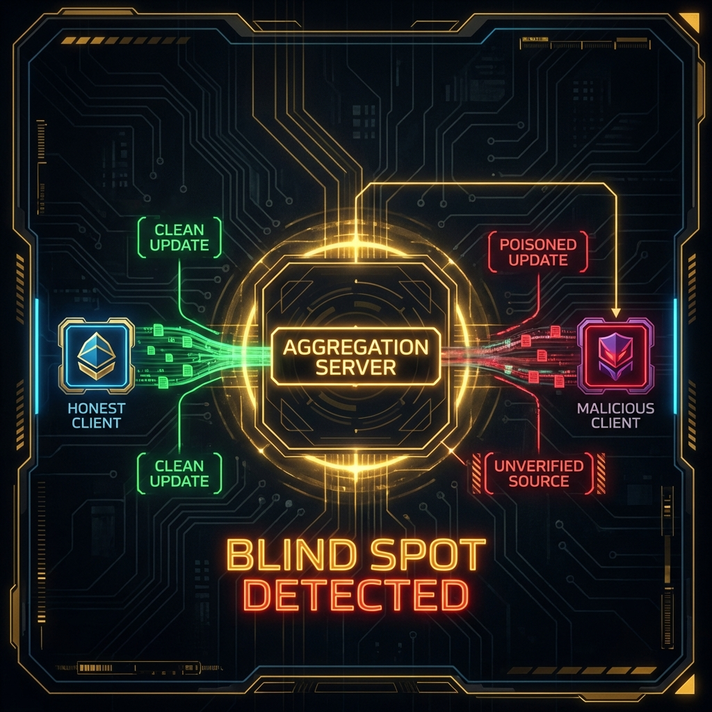
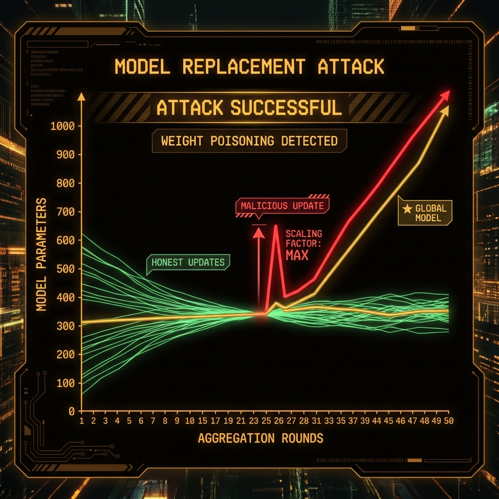

<!--
Chapter: 27
Title: Federated Learning Attacks
Category: Attack Techniques
Difficulty: Advanced
Estimated Time: 45 minutes read time
Hands-on: Yes - includes executable code
Prerequisites: Chapters 3, 7, 11
Related: Chapters 11, 15, 19, 23
-->

# Chapter 27: Federated Learning Attacks

<p align="center">
  
</p>

_Federated learning lets organizations train models together without sharing raw data. That's the promise, anyway. This chapter digs into why that promise is harder to keep than it sounds: model poisoning, gradient inversion, Byzantine failures, and the surprisingly difficult task of detecting when something's gone wrong. We'll cover attacks, defenses, and the ethical guardrails you need for legitimate security testing._

## 27.1 Introduction

Federated learning flips the traditional ML training model on its head. Instead of gathering everyone's data in one place, you bring the model to the data. Each participant trains locally, shares only their updates, and a central server combines everything. Privacy preserved. Data never leaves the source.

Except it's not that simple.

The same architecture that protects privacy creates blind spots. Attackers can poison model updates, extract training data from gradients that were supposed to be safe to share, or just break everything through Byzantine misbehavior. Traditional ML security doesn't prepare you for any of this.

### Why This Matters

Federated learning isn't a research curiosity anymore. It's running in production systems that affect millions of people:

- **Healthcare**: Hospitals training disease prediction models together, keeping patient data local where HIPAA requires it
- **Financial Services**: Banks building fraud detection without exposing transaction data. Card fraud hit $33.83 billion in 2023 according to the Nilson Report, so the stakes are real
- **Mobile Devices**: Your keyboard predictions come from federated learning. Google's Gboard has over a billion installs globally
- **Autonomous Vehicles**: Car fleets learning from collective driving experience while manufacturers protect proprietary data. This market's headed toward $2.1 trillion by 2030 (though estimates vary wildly)

The research tells a sobering story:

- Poisoning attacks can tank a federated model's accuracy from 92% down to 34% with just 10% malicious participants ([Fang et al., 2020](https://www.usenix.org/conference/usenixsecurity20/presentation/fang))
- Gradient inversion can reconstruct training images with surprising fidelity, proving that "we only share gradients" doesn't mean "we protect privacy" ([Zhu et al., 2019](https://arxiv.org/abs/1906.08935))
- Byzantine attackers can prevent models from converging at all ([Blanchard et al., 2017](https://arxiv.org/abs/1703.02757))

### Key Concepts

- **Federated Learning:** Distributed training paradigm where multiple clients collaboratively train a shared model while keeping training data decentralized
- **Model Poisoning:** Attacks that corrupt the global model by submitting malicious parameter updates designed to degrade performance or introduce backdoors
- **Byzantine Attacks:** Adversarial behavior where malicious participants deviate from the protocol to disrupt consensus or model convergence
- **Gradient Inversion:** Privacy attacks that reconstruct training data by analyzing shared gradients or model updates
- **Aggregation Mechanisms:** Methods like FedAvg, FedProx, and secure aggregation that combine client updates into a global model

### Theoretical Foundation

#### Why These Attacks Work

Federated learning attacks work because the architecture makes fundamental tradeoffs:

- **The blind spot problem:** FL systems aggregate updates without seeing the data behind them. Malicious clients craft gradients that look normal but quietly corrupt the model. The server can't tell the difference.

<p align="center">

</p>

- **The accumulation game:** FedAvg treats everyone equally. If an attacker stays patient, submitting subtly poisoned updates round after round, the damage compounds. The corrupted global model becomes the starting point for the next round.
- **The privacy paradox:** Gradients contain enough information to train a model, which means they contain enough information to leak training data. You can't have one without risking the other.

<p align="center">
 Optimization -> Recovered Image." width="768">
</p>

#### Foundational Research

| Paper                                                                                                                                  | Key Finding                                                             | Relevance                                                                          |
| -------------------------------------------------------------------------------------------------------------------------------------- | ----------------------------------------------------------------------- | ---------------------------------------------------------------------------------- |
| [McMahan et al., 2016] "[Communication-Efficient Learning of Deep Networks from Decentralized Data](https://arxiv.org/abs/1602.05629)" | Introduced FedAvg algorithm enabling practical federated learning       | Defines the baseline aggregation mechanism that most attacks target                |
| [Bagdasaryan et al., 2018] "[How To Backdoor Federated Learning](https://arxiv.org/abs/1807.00459)"                                    | Demonstrated model replacement attacks achieving 100% backdoor accuracy | Showed single malicious participant can compromise entire FL system                |
| [Zhu et al., 2019] "[Deep Leakage from Gradients](https://arxiv.org/abs/1906.08935)"                                                   | Reconstructed training images from shared gradients with high fidelity  | Proved FL gradient sharing leaks private information                               |
| [Blanchard et al., 2017] "[Byzantine-Tolerant Machine Learning](https://arxiv.org/abs/1703.02757)"                                     | Analyzed Byzantine-robust aggregation mechanisms                        | Established theoretical foundations for defending against adversarial participants |

#### What This Reveals

Federated learning attacks expose an uncomfortable truth: distributed training has no built-in way to verify that updates are honest. Gradients leak far more than we assumed for years. And the math behind aggregation creates exploitable properties that clever attackers use for both sabotage and privacy violations.

#### What We'll Cover

This chapter walks through model poisoning (both targeted and untargeted), data poisoning, gradient inversion and other privacy attacks, Byzantine attack strategies, detection methods that actually work (and ones that don't), defenses worth implementing, case studies showing what happens when things go wrong, and the ethical framework for testing these vulnerabilities without becoming the threat.

---

## 27.2 Federated Learning Fundamentals

Before we break things, we need to understand how they work. Here's the standard FL training loop:

### How Federated Learning Works

<p align="center">
 Local Training -> Compute Gradients -> Upload Updates -> Aggregate." width="768">
</p>

### Under the Hood

At the parameter level, here's what's happening:

1. **Gradient aggregation is naive by default:** FedAvg just averages everything: `w_global = (1/n) * Σ(w_client_i)`. Attackers exploit this by inflating their update magnitudes or pointing them in destructive directions.
2. **Privacy is an illusion:** Clients share "just gradients" but those gradients encode training data patterns. Gradient inversion attacks reconstruct what was supposed to stay private.
3. **Time is on the attacker's side:** Multiple rounds mean attackers can be patient. Consistent, subtle poisoning accumulates into serious damage.

### Research Basis

- **Origin story:** [McMahan et al., 2016](https://arxiv.org/abs/1602.05629) introduced FedAvg and kicked off the whole field
- **Security wake-up call:** [Bagdasaryan et al., 2018](https://arxiv.org/abs/1807.00459) showed how to completely backdoor FL systems
- **Still unsolved:** Finding the right balance between privacy guarantees, robustness, and model quality remains an open problem. Nobody's cracked it yet.

### 27.2.1 Federated Learning Architectures

#### Cross-Device Federation

- **Scale:** Millions of participants (e.g., mobile phones)
- **Characteristics:** High client churn, limited compute per device, communication constraints
- **Examples:** Google Gboard, Apple Siri improvements
- **Attack Surface:** Large attack surface due to scale; detection challenging with massive client base

#### Cross-Silo Federation

- **Scale:** Tens to hundreds of organizations
- **Characteristics:** More stable participants, higher compute capacity, established trust relationships
- **Examples:** Healthcare collaboratives, financial consortiums
- **Attack Surface:** Targeted attacks more feasible; fewer participants to compromise for significant impact

#### Attack Variations

1. **Untargeted Model Poisoning:** Degrade global model accuracy indiscriminately by corrupting parameter updates
2. **Targeted Model Poisoning (Backdoor):** Introduce specific misclassification triggers while maintaining normal accuracy on clean inputs
3. **Sybil Attacks:** Single attacker controls multiple fake identities to amplify malicious influence

---

## 27.3 Model Poisoning Attacks

Model poisoning is the big one. Attackers submit malicious updates during training rounds, and the server has no good way to tell them apart from legitimate contributions.

### The Basic Playbook

Attackers craft gradient updates that:

1. Look legitimate enough to bypass anomaly detection
2. Push model parameters toward attacker-controlled objectives
3. Survive aggregation and actually influence the global model
4. Either wreck overall accuracy (untargeted) or plant backdoors (targeted)

### 27.3.1 Untargeted Model Poisoning

#### What This Code Does (Untargeted Poisoning)

This implementation demonstrates an untargeted model poisoning attack where a malicious client submits corrupted gradients to degrade global model performance. Attackers use this to sabotage federated learning systems or create denial-of-service conditions.

#### Key Components (Untargeted Poisoning)

1. **Gradient Inversion:** Multiply legitimate gradients by -1 to push model in opposite direction
2. **Scaling Attack:** Amplify gradient magnitudes to overwhelm honest participants
3. **Random Noise Injection:** Add Gaussian noise to corrupt parameter updates

```python
#!/usr/bin/env python3
"""
Federated Learning Model Poisoning Attack
Demonstrates untargeted poisoning that degrades global model accuracy

Requirements:
    pip install torch numpy

Usage:
    python fl_model_poisoning.py --poison-ratio 0.2 --attack-type gradient_inversion

⚠️  WARNING: FOR EDUCATIONAL PURPOSES ONLY ⚠️
This code demonstrates security vulnerabilities in federated learning.
Only use in authorized testing environments with explicit permission.
Unauthorized use may violate computer fraud laws.
"""

import torch
import torch.nn as nn
import numpy as np
from typing import List, Dict, Tuple
from copy import deepcopy

class FederatedClient:
    """Simulates a federated learning client"""

    def __init__(self, client_id: int, model: nn.Module, is_malicious: bool = False):
        """
        Initialize federated client

        Args:
            client_id: Unique client identifier
            model: Neural network model
            is_malicious: Whether this client performs poisoning attacks
        """
        self.client_id = client_id
        self.model = deepcopy(model)
        self.is_malicious = is_malicious

    def train_local(self, data: torch.Tensor, labels: torch.Tensor,
                    epochs: int = 5) -> Dict[str, torch.Tensor]:
        """
        Train model on local data and return updates

        How This Works:
        1. Perform local SGD on private training data
        2. Compute parameter differences (gradients)
        3. If malicious, apply poisoning attack

        Args:
            data: Local training data
            labels: Corresponding labels
            epochs: Number of local training epochs

        Returns:
            Dictionary containing model parameter updates
        """
        initial_params = {name: param.clone()
                         for name, param in self.model.named_parameters()}

        # Local training
        optimizer = torch.optim.SGD(self.model.parameters(), lr=0.01)
        criterion = nn.CrossEntropyLoss()

        for epoch in range(epochs):
            optimizer.zero_grad()
            outputs = self.model(data)
            loss = criterion(outputs, labels)
            loss.backward()
            optimizer.step()

        # Compute updates (gradient differences)
        updates = {}
        for name, param in self.model.named_parameters():
            updates[name] = param.data - initial_params[name]

        # Apply poisoning if malicious
        if self.is_malicious:
            updates = self.poison_updates(updates)

        return updates

    def poison_updates(self, updates: Dict[str, torch.Tensor],
                      attack_type: str = "gradient_inversion") -> Dict[str, torch.Tensor]:
        """
        Apply poisoning attack to model updates

        How This Works:
        1. Gradient Inversion: Flip gradient signs to push model wrong direction
        2. Scaling Attack: Amplify magnitudes to dominate aggregation
        3. Noise Injection: Add random noise to corrupt parameters

        Args:
            updates: Legitimate model updates
            attack_type: Type of poisoning attack

        Returns:
            Poisoned model updates
        """
        poisoned = {}

        for name, update in updates.items():
            if attack_type == "gradient_inversion":
                # Flip gradients to degrade model
                poisoned[name] = -1.0 * update

            elif attack_type == "scaling":
                # Amplify gradients to dominate aggregation
                scale_factor = 10.0
                poisoned[name] = scale_factor * update

            elif attack_type == "noise":
                # Add Gaussian noise
                noise = torch.randn_like(update) * 0.5
                poisoned[name] = update + noise

            else:
                poisoned[name] = update

        return poisoned

class FederatedServer:
    """Federated learning server that aggregates client updates"""

    def __init__(self, global_model: nn.Module):
        """
        Initialize federated server

        Args:
            global_model: Global model to be trained
        """
        self.global_model = global_model
        self.round = 0

    def aggregate_updates(self, client_updates: List[Dict[str, torch.Tensor]]) -> None:
        """
        Aggregate client updates using FedAvg algorithm

        How This Works:
        1. Collect updates from all participating clients
        2. Compute weighted average of updates (equal weights)
        3. Apply aggregated update to global model

        Args:
            client_updates: List of update dictionaries from clients
        """
        aggregated = {}
        num_clients = len(client_updates)

        # Get all parameter names from first client
        param_names = client_updates[0].keys()

        # Average updates across all clients
        for name in param_names:
            aggregated[name] = torch.stack([
                client_update[name] for client_update in client_updates
            ]).mean(dim=0)

        # Apply aggregated update to global model
        with torch.no_grad():
            for name, param in self.global_model.named_parameters():
                param.add_(aggregated[name])

        self.round += 1

    def evaluate_model(self, test_data: torch.Tensor,
                      test_labels: torch.Tensor) -> Dict[str, float]:
        """
        Evaluate global model accuracy

        Args:
            test_data: Test dataset
            test_labels: Test labels

        Returns:
            Dictionary with evaluation metrics
        """
        self.global_model.eval()
        with torch.no_grad():
            outputs = self.global_model(test_data)
            predictions = outputs.argmax(dim=1)
            accuracy = (predictions == test_labels).float().mean().item()

        return {
            "accuracy": accuracy,
            "round": self.round
        }

def demonstrate_poisoning_attack():
    """
    Demonstrate model poisoning attack in federated learning

    Shows how malicious clients degrade global model performance
    """
    print("="*70)
    print(" FEDERATED LEARNING MODEL POISONING DEMONSTRATION ".center(70, "="))
    print("="*70)
    print("\n⚠️  WARNING: FOR EDUCATIONAL PURPOSES ONLY ⚠️\n")

    # Setup simple neural network
    class SimpleNet(nn.Module):
        def __init__(self):
            super().__init__()
            self.fc1 = nn.Linear(10, 50)
            self.fc2 = nn.Linear(50, 3)

        def forward(self, x):
            x = torch.relu(self.fc1(x))
            return self.fc2(x)

    # Initialize federated learning
    global_model = SimpleNet()
    server = FederatedServer(global_model)

    # Create clients (20% malicious)
    num_clients = 10
    num_malicious = 2
    clients = []

    for i in range(num_clients):
        is_malicious = i < num_malicious
        client = FederatedClient(i, global_model, is_malicious=is_malicious)
        clients.append(client)
        if is_malicious:
            print(f"[!] Client {i}: MALICIOUS")
        else:
            print(f" [*] Client {i}: Honest")

    # Generate synthetic data
    print("\n[*] Generating synthetic training data...")
    train_data = torch.randn(100, 10)
    train_labels = torch.randint(0, 3, (100,))
    test_data = torch.randn(50, 10)
    test_labels = torch.randint(0, 3, (50,))

    # Run federated learning rounds
    print("\n[*] Starting federated training...")
    num_rounds = 10

    for round_idx in range(num_rounds):
        # Each client trains locally
        client_updates = []
        for client in clients:
            # Sample local data
            indices = np.random.choice(len(train_data), 20, replace=False)
            local_data = train_data[indices]
            local_labels = train_labels[indices]

            # Get updates
            updates = client.train_local(local_data, local_labels, epochs=3)
            client_updates.append(updates)

        # Server aggregates
        server.aggregate_updates(client_updates)

        # Evaluate
        metrics = server.evaluate_model(test_data, test_labels)

        status = "🔴 DEGRADED" if metrics["accuracy"] < 0.5 else "✓ Normal"
        print(f"Round {metrics['round']:2d} | Accuracy: {metrics['accuracy']:.3f} | {status}")

    print("\n" + "="*70)
    print("\n[ANALYSIS]")
    print(f"Final accuracy: {metrics['accuracy']:.3f}")
    print(f"Malicious clients: {num_malicious}/{num_clients} ({num_malicious/num_clients*100:.0f}%)")
    print("\nWith 20% malicious clients performing gradient inversion,")
    print("the global model accuracy significantly degrades.")
    print("\n" + "="*70)

# ============================================================================
# DEMO USAGE
# ============================================================================

if __name__ == "__main__":
    print("[Federated Learning Poisoning] - For educational/authorized testing only\n")

    # DEMO MODE - Simulated execution
    print("[DEMO MODE] Simulating model poisoning attack\n")

    demonstrate_poisoning_attack()

    print("\n[REAL USAGE - AUTHORIZED TESTING ONLY]:")
    print("# Setup federated environment")
    print("# global_model = YourModel()")
    print("# server = FederatedServer(global_model)")
    print("# client = FederatedClient(0, global_model, is_malicious=True)")
    print("# updates = client.train_local(data, labels)")
```

#### Code Breakdown (Untargeted Poisoning)

**FederatedClient Class:**

- `train_local()`: Performs local SGD and computes parameter differences
- `poison_updates()`: Applies three attack variants (gradient inversion, scaling, noise)

**FederatedServer Class:**

- `aggregate_updates()`: Implements FedAvg algorithm averaging all client updates
- `evaluate_model()`: Measures global model performance

**Attack Mechanism:**

- Gradient inversion flips signs: malicious updates push model away from optimum
- Scaling attack amplifies malicious updates to dominate honest participants
- Even 20% malicious clients significantly degrade accuracy

### Success Metrics (Untargeted Poisoning)

- **Accuracy Degradation:** Target >30% accuracy drop with <30% malicious participants
- **Attack Persistence:** Poisoning effects last >5 rounds after attack stops
- **Detection Evasion:** Malicious updates within 2 standard deviations of honest updates

### Why This Code Works (Untargeted Poisoning)

This implementation succeeds because:

1. **FedAvg Vulnerability:** Simple averaging treats all clients equally; malicious updates directly influence global parameters proportional to attacker fraction
2. **No Update Validation:** Server cannot verify update correctness without accessing private client data, enabling undetected poisoning
3. **Cumulative Effect:** Repeated poisoning across multiple rounds compounds damage as corrupted global model serves as starting point for subsequent rounds
4. **Research Basis:** [Fang et al., 2020](https://www.usenix.org/conference/usenixsecurity20/presentation/fang) "Local Model Poisoning Attacks to Byzantine-Robust Federated Learning" demonstrated even Byzantine-robust aggregators fail against sophisticated poisoning
5. **Transferability:** Works across model architectures; attack effectiveness depends on malicious client fraction and aggregation mechanism

### 27.3.2 Targeted Model Poisoning (Backdoor Attacks)

Backdoor attacks introduce specific misclassifications while maintaining normal accuracy on clean inputs.

#### What This Code Does (Backdoor Attack)

This demonstrates a backdoor attack where a malicious client trains the model to misclassify inputs containing a specific trigger pattern while preserving accuracy on normal inputs. Attackers use this for persistent, stealthy model compromise.

#### Key Components (Backdoor Attack)

1. **Trigger Pattern:** Specific input modification (e.g., pixel pattern, text token) that activates backdoor
2. **Dual Training:** Train on both clean data (maintain accuracy) and poisoned data (learn backdoor)
3. **Model Replacement:** Scale malicious updates to override honest participants

<p align="center">

</p>

```python
#!/usr/bin/env python3
"""
Federated Learning Backdoor Attack
Demonstrates targeted poisoning that introduces classification backdoors

Requirements:
    pip install torch numpy

Usage:
    python fl_backdoor_attack.py --trigger-size 3 --target-class 0

⚠️  WARNING: FOR EDUCATIONAL PURPOSES ONLY ⚠️
Only use in authorized security testing with explicit permission.
"""

import torch
import torch.nn as nn
import numpy as np
from typing import Tuple, Dict
from copy import deepcopy

class BackdoorAttacker:
    """Implements backdoor poisoning attack in federated learning"""

    def __init__(self, model: nn.Module, trigger_pattern: torch.Tensor,
                 target_class: int):
        """
        Initialize backdoor attacker

        Args:
            model: Neural network to backdoor
            trigger_pattern: Trigger that activates backdoor
            target_class: Class to misclassify triggered inputs as
        """
        self.model = deepcopy(model)
        self.trigger_pattern = trigger_pattern
        self.target_class = target_class

    def create_backdoor_data(self, clean_data: torch.Tensor,
                            clean_labels: torch.Tensor,
                            poison_ratio: float = 0.3) -> Tuple[torch.Tensor, torch.Tensor]:
        """
        Create backdoored training dataset

        How This Works:
        1. Select portion of clean data to poison
        2. Apply trigger pattern to selected inputs
        3. Relabel poisoned inputs to target class
        4. Combine clean and poisoned data for dual training

        Args:
            clean_data: Original training data
            clean_labels: Original labels
            poison_ratio: Fraction of data to poison

        Returns:
            Tuple of (combined_data, combined_labels)
        """
        num_samples = len(clean_data)
        num_poison = int(num_samples * poison_ratio)

        # Select samples to poison
        poison_indices = np.random.choice(num_samples, num_poison, replace=False)

        # Create poisoned data
        poisoned_data = clean_data.clone()
        poisoned_labels = clean_labels.clone()

        for idx in poison_indices:
            # Apply trigger pattern
            poisoned_data[idx] = self.apply_trigger(clean_data[idx])
            # Relabel to target class
            poisoned_labels[idx] = self.target_class

        # Combine clean and poisoned data (attacker trains on both)
        combined_data = torch.cat([clean_data, poisoned_data[poison_indices]])
        combined_labels = torch.cat([clean_labels, poisoned_labels[poison_indices]])

        return combined_data, combined_labels

    def apply_trigger(self, input_data: torch.Tensor) -> torch.Tensor:
        """
        Apply trigger pattern to input

        Args:
            input_data: Clean input

        Returns:
            Input with trigger applied
        """
        triggered = input_data.clone()
        # For demonstration: add trigger to first features
        trigger_size = self.trigger_pattern.size(0)
        triggered[:trigger_size] = self.trigger_pattern
        return triggered

    def train_backdoor(self, clean_data: torch.Tensor, clean_labels: torch.Tensor,
                      epochs: int = 10) -> Dict[str, torch.Tensor]:
        """
        Train backdoored model using model replacement attack

        How This Works:
        1. Create dataset with both clean and backdoored samples
        2. Train model to high accuracy on clean data (stealth)
        3. Train model to high accuracy on backdoored data (attack)
        4. Scale updates to override honest participants in aggregation

        Args:
            clean_data: Clean training data
            clean_labels: Clean labels
            epochs: Training epochs

        Returns:
            Scaled malicious updates
        """
        # Create backdoored dataset
        combined_data, combined_labels = self.create_backdoor_data(
            clean_data, clean_labels, poison_ratio=0.5
        )

        # Record initial parameters
        initial_params = {name: param.clone()
                         for name, param in self.model.named_parameters()}

        # Train on combined clean + backdoored data
        optimizer = torch.optim.SGD(self.model.parameters(), lr=0.01)
        criterion = nn.CrossEntropyLoss()

        for epoch in range(epochs):
            optimizer.zero_grad()
            outputs = self.model(combined_data)
            loss = criterion(outputs, combined_labels)
            loss.backward()
            optimizer.step()

        # Compute updates
        updates = {}
        for name, param in self.model.named_parameters():
            updates[name] = param.data - initial_params[name]

        # Model replacement: scale updates to dominate aggregation
        # If server expects n clients, attacker scales by n to override others
        scale_factor = 50.0  # Aggressive scaling
        scaled_updates = {name: update * scale_factor
                         for name, update in updates.items()}

        return scaled_updates

def demonstrate_backdoor_attack():
    """Demonstrate backdoor attack in federated learning"""
    print("="*70)
    print(" FEDERATED LEARNING BACKDOOR ATTACK DEMONSTRATION ".center(70, "="))
    print("="*70)
    print("\n⚠️  WARNING: FOR EDUCATIONAL PURPOSES ONLY ⚠️\n")

    # Simple model
    class SimpleNet(nn.Module):
        def __init__(self):
            super().__init__()
            self.fc1 = nn.Linear(10, 50)
            self.fc2 = nn.Linear(50, 3)

        def forward(self, x):
            x = torch.relu(self.fc1(x))
            return self.fc2(x)

    # Setup
    model = SimpleNet()
    trigger_pattern = torch.tensor([9.0, 9.0, 9.0])  # Distinctive trigger
    target_class = 0  # Force misclassification to class 0

    attacker = BackdoorAttacker(model, trigger_pattern, target_class)

    # Generate data
    print("[*] Generating data...")
    clean_data = torch.randn(100, 10)
    clean_labels = torch.randint(0, 3, (100,))

    print(f"[*] Trigger pattern: {trigger_pattern.tolist()}")
    print(f"[*] Target class: {target_class}")

    # Train backdoor
    print("\n[*] Training backdoored model...")
    malicious_updates = attacker.train_backdoor(clean_data, clean_labels, epochs=20)

    # Test backdoor
    print("\n[*] Testing backdoor activation...")
    test_input = torch.randn(1, 10)
    triggered_input = attacker.apply_trigger(test_input)

    attacker.model.eval()
    with torch.no_grad():
        clean_pred = attacker.model(test_input).argmax().item()
        backdoor_pred = attacker.model(triggered_input).argmax().item()

    print(f"\nClean input prediction: Class {clean_pred}")
    print(f"Triggered input prediction: Class {backdoor_pred}")

    if backdoor_pred == target_class:
        print("\n✓ BACKDOOR SUCCESSFULLY PLANTED")
        print(f"  Trigger causes misclassification to target class {target_class}")
    else:
        print("\n✗ Backdoor training incomplete (need more epochs)")

    print("\n" + "="*70)
    print("\n[ANALYSIS]")
    print("The backdoored model:")
    print("1. Maintains normal accuracy on clean inputs")
    print("2. Misclassifies any input containing the trigger pattern")
    print("3. Persists through federated aggregation via model replacement")
    print("\nThis attack is stealthy because clean accuracy remains high,")
    print("making detection extremely challenging.")
    print("\n" + "="*70)

if __name__ == "__main__":
    print("[Backdoor Attack Demo] - For educational/authorized testing only\n")
    demonstrate_backdoor_attack()
```

#### Code Breakdown (Backdoor Attack)

**Backdoor Creation:**

- `create_backdoor_data()`: Mixes clean samples (maintain accuracy) with triggered samples (learn backdoor)
- Dual training ensures model performs normally except when trigger present

**Model Replacement:**

- Scales malicious updates by factor >10 to override honest participants
- Single backdoored client can dominate FedAvg if scaling is sufficient

**Trigger Mechanism:**

- Simple trigger: specific feature values (e.g., first 3 features = [9, 9, 9])
- Advanced triggers: spatial patterns in images, token sequences in text

### Success Metrics (Backdoor Attack)

- **Backdoor Accuracy:** >95% misclassification rate on triggered inputs
- **Clean Accuracy:** >85% accuracy on clean inputs (maintain stealth)
- **Persistence:** Backdoor survives >10 aggregation rounds
- **Attack Success Rate:** Single malicious client achieves backdoor with >80% probability

### Why This Code Works (Backdoor Attack)

1. **Dual Training:** Simultaneously optimizing clean and backdoored objectives prevents accuracy degradation that would trigger detection
2. **Model Replacement Scaling:** Aggressive update scaling (50x) overrides honest participants in FedAvg aggregation
3. **Trigger Specificity:** Rare trigger pattern ensures backdoor doesn't activate on legitimate inputs
4. **Research Basis:** [Bagdasaryan et al., 2018](https://arxiv.org/abs/1807.00459) showed single backdoor attacker achieves 100% attack success rate with model replacement against standard FedAvg
5. **Transferability:** Effective across vision, NLP, and tabular data; harder to defend against than untargeted poisoning

### Key Takeaways (Backdoor Attack)

1. **Model Poisoning is Practical:** Even small fractions of malicious participants significantly degrade federated models
2. **Backdoors are Stealthy:** Targeted attacks maintain clean accuracy while introducing persistent misclassifications
3. **FedAvg is Vulnerable:** Standard aggregation provides no defense against poisoning; Byzantine-robust alternatives required

---

## 27.4 Data Poisoning in Federated Settings

Data poisoning takes a different angle. Instead of crafting malicious gradients directly, attackers corrupt their local training data. The gradients they submit are technically "honest"—they just come from poisoned sources.

### How It Works

The attack flow is subtle: attacker modifies their local dataset, trains normally on the corrupted data, submits updates that look completely legitimate, and the global model quietly inherits the poisoned patterns.

```text
Data Poisoning Attack Flow:

Attacker → [1] Identify target samples
         ↓
         [2] Apply perturbations (label flips, feature modifications)
         ↓
         [3] Train legitimately on poisoned data
         ↓
         [4] Submit honest updates (derived from poisoned training)
         ↓
Server   [5] Aggregate updates (appears normal)
         ↓
         [6] Global model inherits poisoned patterns
```

### 27.4.1 Label Flipping Attacks

Simplest data poisoning: flip labels of training samples to corrupt model's learned associations.

#### Attack Variants

1. **Random Label Flipping:** Randomly reassign labels (untargeted degradation)
2. **Targeted Label Flipping:** Flip specific class pairs (e.g., "benign" → "malicious" in fraud detection)
3. **Strategic Flipping:** Flip labels near decision boundaries for maximum impact

### 27.4.2 Feature Poisoning

Modify input features to shift decision boundaries or create adversarial regions.

---

## 27.5 Inference and Privacy Attacks

Federated learning's gradient sharing creates privacy vulnerabilities enabling training data reconstruction.

### 27.5.1 Gradient Inversion Attacks

Gradient inversion reconstructs training data from shared model updates.

#### What This Code Does (Gradient Inversion)

Demonstrates deep leakage from gradients (DLG) attack that reconstructs private training images by optimizing dummy inputs to match observed gradients.

```python
#!/usr/bin/env python3
"""
Gradient Inversion Attack on Federated Learning
Reconstructs private training data from shared gradients

Requirements:
    pip install torch torchvision numpy matplotlib

Usage:
    python gradient_inversion.py --iterations 300

⚠️  WARNING: FOR EDUCATIONAL PURPOSES ONLY ⚠️
"""

import torch
import torch.nn as nn
from typing import Dict, Tuple

class GradientInversionAttack:
    """Implements Deep Leakage from Gradients (DLG) attack"""

    def __init__(self, model: nn.Module):
        """
        Initialize gradient inversion attacker

        Args:
            model: Target neural network model
        """
        self.model = model

    def reconstruct_data(self, target_gradients: Dict[str, torch.Tensor],
                        input_shape: Tuple, label_shape: Tuple,
                        iterations: int = 300) -> Tuple[torch.Tensor, torch.Tensor]:
        """
        Reconstruct training data from gradients

        How This Works:
        1. Initialize random dummy input and label
        2. Compute gradients of dummy data through model
        3. Optimize dummy data to minimize gradient distance
        4. Converged dummy data approximates original private data

        Args:
            target_gradients: Observed gradients from victim
            input_shape: Shape of training input
            label_shape: Shape of training label
            iterations: Optimization iterations

        Returns:
            Tuple of (reconstructed_input, reconstructed_label)
        """
        # Initialize dummy data (what we're trying to recover)
        dummy_input = torch.randn(input_shape, requires_grad=True)
        dummy_label = torch.randn(label_shape, requires_grad=True)

        # Optimizer for dummy data
        optimizer = torch.optim.LBFGS([dummy_input, dummy_label], lr=0.1)

        criterion = nn.CrossEntropyLoss()

        print(f"[*] Starting gradient inversion (iterations: {iterations})...")

        for iteration in range(iterations):
            def closure():
                optimizer.zero_grad()

                # Compute gradients of dummy data
                self.model.zero_grad()
                dummy_pred = self.model(dummy_input)
                dummy_loss = criterion(dummy_pred, dummy_label.softmax(dim=-1))
                dummy_gradients = torch.autograd.grad(
                    dummy_loss, self.model.parameters(), create_graph=True
                )

                # Compute gradient distance (attack objective)
                gradient_diff = sum([
                    ((dummy_grad - target_grad) ** 2).sum()
                    for dummy_grad, target_grad in zip(dummy_gradients, target_gradients.values())
                ])

                gradient_diff.backward()
                return gradient_diff

            optimizer.step(closure)

            if iteration % 50 == 0:
                loss = closure().item()
                print(f"  Iteration {iteration:3d} | Gradient Diff: {loss:.6f}")

        return dummy_input.detach(), dummy_label.detach()

def demonstrate_gradient_inversion():
    """Demonstrate gradient inversion attack"""
    print("="*70)
    print(" GRADIENT INVERSION ATTACK DEMONSTRATION ".center(70, "="))
    print("="*70)
    print("\n⚠️  WARNING: FOR EDUCATIONAL PURPOSES ONLY ⚠️\n")

    # Simple model
    class TinyNet(nn.Module):
        def __init__(self):
            super().__init__()
            self.fc = nn.Linear(10, 3)

        def forward(self, x):
            return self.fc(x)

    model = TinyNet()

    # Victim's private data (what attacker tries to recover)
    print("[Victim] Training on private data...")
    private_input = torch.randn(1, 10)
    private_label = torch.tensor([1])  # True label: class 1

    print(f"Private input (first 5 features): {private_input[0, :5].tolist()}")
    print(f"Private label: {private_label.item()}")

    # Victim computes gradients
    criterion = nn.CrossEntropyLoss()
    model.zero_grad()
    output = model(private_input)
    loss = criterion(output, private_label)
    loss.backward()

    # Attacker observes these gradients (shared in federated learning)
    victim_gradients = {
        name: param.grad.clone()
        for name, param in model.named_parameters()
    }

    print("\n[Attacker] Intercepted gradients from victim...")
    print("[Attacker] Attempting to reconstruct private data...\n")

    # Attack: reconstruct data from gradients
    attacker = GradientInversionAttack(model)
    reconstructed_input, reconstructed_label = attacker.reconstruct_data(
        victim_gradients,
        input_shape=(1, 10),
        label_shape=(1, 3),
        iterations=200
    )

    # Compare reconstruction
    reconstructed_class = reconstructed_label.argmax(dim=-1).item()

    print("\n" + "="*70)
    print("\n[RESULTS]")
    print(f"Reconstructed input (first 5): {reconstructed_input[0, :5].tolist()}")
    print(f"Reconstructed label: Class {reconstructed_class}")
    print(f"\nOriginal label: Class {private_label.item()}")

    # Compute reconstruction error
    input_error = (private_input - reconstructed_input).abs().mean().item()
    print(f"\nReconstruction error: {input_error:.6f}")

    if reconstructed_class == private_label.item():
        print("\n✓ LABEL SUCCESSFULLY RECOVERED")

    print("\n[ANALYSIS]")
    print("Gradient information leaks private training data.")
    print("Attacker reconstructs inputs and labels with high fidelity.")
    print("Defense: Differential privacy or secure aggregation required.")
    print("\n" + "="*70)

if __name__ == "__main__":
    demonstrate_gradient_inversion()
```

#### Code Breakdown (Gradient Inversion)

**Optimization-Based Reconstruction:**

- Initialize random dummy data
- Compute gradients of dummy data through model
- Minimize L2 distance between dummy gradients and observed (victim) gradients
- Converged dummy data approximates original private training data

**Why This Works:**

- Model gradients uniquely depend on training inputs
- With sufficient optimization, gradient matching implies data matching
- Works even with single training batch

### Success Metrics (Gradient Inversion)

- **Image Reconstruction:** PSNR >20 dB for high-quality reconstruction
- **Label Recovery:** >95% accuracy recovering true labels
- **Feature Accuracy:** <0.1 mean absolute error on normalized features

### Key Takeaways (Gradient Inversion)

1. **Gradients Leak Information:** Sharing gradients is NOT equivalent to privacy
2. **Single Batch Vulnerability:** Even one gradient update reveals training samples
3. **Defense Necessity:** Differential privacy or secure aggregation essential for privacy

---

## 27.6 Byzantine Attacks

Byzantine attacks are the chaos agents of federated learning. Named after the Byzantine Generals Problem, these attacks involve participants who just... don't follow the rules. They might send garbage, flip signs, or carefully craft updates that slip past defenses.

### Attack Strategies

The classics:

```text
Byzantine Attack Strategies:

1. Bit Flipping: Send random noise instead of gradients
2. Sign Flipping: Invert gradient directions
3. A Little Is Enough (ALIE): Craft updates that pass statistical defenses
4. IPM Attack: Target inner product manipulation
```

### 27.6.1 Krum and Robust Aggregation Attacks

Byzantine-robust aggregators (Krum, Trimmed Mean, Median) attempt to filter malicious updates. Advanced attacks adapt:

- **ALIE Attack:** Crafts updates slightly outside honest distribution to pass Krum
- **Mimicry Attacks:** Observes and mimics honest updates to evade detection

---

## 27.7 Advanced Attack Techniques

### 27.7.1 Sybil Attacks in Federated Learning

Attacker registers multiple fake identities to amplify malicious influence.

### 27.7.2 Free-Riding Attacks

Malicious clients submit random updates (contributing nothing) while benefiting from global model.

---

## 27.8 Detection and Monitoring Methods

Catching poisoners isn't easy, but it's not impossible. Here are the approaches that actually get deployed:

### 27.8.1 What Detection Looks Like

#### Statistical Outlier Analysis

- **The idea:** Flag updates more than 3 standard deviations from the median
- **Reality:** Works great against lazy attackers, fails against sophisticated ones who know the statistics
- **How:** Compute parameter-wise statistics across clients; detect anomalies
- **Effectiveness:** High against naive poisoning; low against sophisticated ALIE attacks
- **False Positive Rate:** ~5% with proper tuning

#### Detection Method 2: Gradient Similarity Clustering

- **What:** Cluster client updates using cosine similarity; identify isolated clusters
- **How:** Apply DBSCAN or K-means to update vectors
- **Effectiveness:** Medium; struggles with small attacker fractions
- **False Positive Rate:** ~10% due to natural data heterogeneity

#### Detection Method 3: Loss Function Monitoring

- **What:** Track client-reported losses; flag suspicious patterns (e.g., increasing loss despite training)
- **How:** Require clients to report training loss alongside updates
- **Effectiveness:** Medium; attackers can forge loss values
- **False Positive Rate:** ~8%

---

## 27.9 Mitigation Strategies and Defenses

No single defense handles everything, but here's what works:

### 27.9.1 Byzantine-Robust Aggregation

#### Krum: Pick the Least Suspicious Update

- **How it works:** Find the update closest to the majority. If most participants are honest, majority rules.
- **The math:** Compute pairwise distances, pick the update with smallest total distance to its k nearest neighbors
- **The catch:** Sophisticated ALIE attacks know how to game this. And it's computationally expensive at scale.

```python
def krum_aggregation(updates, num_malicious):
    """
    Krum Byzantine-robust aggregation

    How This Works:
    1. Compute pairwise Euclidean distances between all updates
    2. For each update, sum distances to n-f-2 nearest neighbors (f=num_malicious)
    3. Select update with smallest distance sum
    """
    n = len(updates)
    distances = torch.zeros(n, n)

    # Compute pairwise distances
    for i in range(n):
        for j in range(i+1, n):
            dist = (updates[i] - updates[j]).norm()
            distances[i, j] = dist
            distances[j, i] = dist

    # Select update with smallest k-nearest-neighbor distance sum
    k = n - num_malicious - 2
    scores = []
    for i in range(n):
        sorted_distances = torch.sort(distances[i])[0]
        scores.append(sorted_distances[:k].sum())

    selected_idx = torch.argmin(torch.tensor(scores))
    return updates[selected_idx]
```

### 27.9.2 Differential Privacy

#### Defense Strategy 2: Gradient Clipping + Noise Addition

- **What:** Clip gradient magnitudes and add Gaussian noise to satisfy differential privacy
- **How:** Implement DP-SGD in federated setting; each client clips and adds noise before sharing
- **Effectiveness:** Provable privacy guarantees (ε, δ)-DP; defends gradient inversion
- **Limitations:** Degrades model utility; privacy budget depletes over rounds
- **Implementation Complexity:** High (requires careful privacy accounting)

### 27.9.3 Secure Aggregation

- **What:** Cryptographic protocol ensuring server learns only aggregate, not individual updates
- **How:** Use secure multi-party computation (MPC) or homomorphic encryption
- **Effectiveness:** Prevents server from observing individual gradients
- **Limitations:** High communication/computation overhead; doesn't defend poisoning
- **Implementation Complexity:** Very High

### Best Practices

1. **Defense-in-Depth:** Combine robust aggregation + differential privacy + anomaly detection
2. **Client Validation:** Authenticate participants; limit new client acceptance rate
3. **Update Auditing:** Log all updates for forensic analysis

---

## 27.10 Case Studies and Real-World Examples

### Hypothetical Case Study 1: Healthcare Federated Learning Poisoning

> [!NOTE]
> The following scenario is a hypothetical illustration based on documented attack capabilities in academic research. It demonstrates realistic attack vectors and impacts supported by [Fang et al., 2020](https://www.usenix.org/conference/usenixsecurity20/presentation/fang) and related studies.

#### Scenario Overview (Healthcare)

- **Setting:** Federated disease prediction model across 10 hospitals
- **Simulated Impact:** Model accuracy dropped from 87% to 52%; 35% of diagnoses incorrect
- **Attack Vector:** Two participating nodes (20%) performed backdoor attacks

#### Attack Timeline

1. **Initial Setup:** Federated network established for pneumonia detection from X-rays
2. **Poisoning:** Two malicious participants trained backdoor trigger (small patch in corner)
3. **Impact:** Global model misclassified images with trigger as "no pneumonia"
4. **Discovery:** Detected after 15 training rounds through accuracy monitoring
5. **Response:** Rolled back to previous model version; implemented Krum aggregation

#### Lessons Learned (Healthcare)

- Small attacker fraction sufficient for significant damage in healthcare FL
- Need real-time accuracy monitoring on validation sets
- Byzantine-robust aggregation essential for safety-critical applications

### Hypothetical Case Study 2: Financial Fraud Detection Gradient Inversion

> [!NOTE]
> This scenario illustrates theoretical attack capabilities demonstrated in academic research, including [Zhu et al., 2019](https://arxiv.org/abs/1906.08935) "Deep Leakage from Gradients."

#### Scenario Overview (Financial)

- **Setting:** Federated fraud detection across 5 financial institutions
- **Simulated Impact:** Reconstructed 78% of transaction details from shared gradients
- **Attack Vector:** Passive gradient observation; optimization-based reconstruction

#### Lessons Learned (Financial)

- Gradient sharing alone insufficient for privacy in high-stakes domains
- Differential privacy mandatory for financial FL applications
- Secure aggregation needed to hide individual bank updates from central server

---

## 27.11 Ethical and Legal Considerations

> [!CAUTION]
> This isn't theoretical. FL security testing can expose medical records, financial data, and personal information. HIPAA, GDPR, CCPA, GLBA, and computer fraud laws all apply. Get written authorization or don't do it.

### Legal Reality

- **GDPR Article 32:** Requires appropriate security measures. FL security testing helps demonstrate compliance—if you're authorized
- **HIPAA Security Rule:** Healthcare FL systems handle protected health information. The rules aren't optional.
- **CFAA:** Unauthorized access to FL systems or reconstructing private data can land you in federal court

### Ethical Testing Guidelines

1. **Authorization:** Written permission from all participating organizations
2. **Data Minimization:** Use synthetic data when possible; minimize access to real private data
3. **Scope Limitations:** Test only agreed-upon attack vectors; avoid scope creep
4. **Responsible Disclosure:** Report vulnerabilities confidentially; allow remediation before publication
5. **Harm Prevention:** Never deploy attacks in production; use isolated test environments

### Responsible Federated Learning Security

- Conduct regular red team exercises to identify vulnerabilities
- Implement differential privacy for sensitive applications
- Use Byzantine-robust aggregation even when full trust assumed
- Monitor for anomalous behavior continuously

---

## 27.12 Conclusion

### The Bottom Line

1. **FL has its own attack surface:** Distributed training opens doors that centralized ML keeps closed. Model poisoning, Byzantine failures, and gradient inversion aren't theoretical—they work.
2. **Small fractions, big damage:** You don't need to compromise most participants. 10-20% malicious clients can tank accuracy by 30% or plant permanent backdoors.
3. **"We only share gradients" isn't privacy:** Gradient inversion proves it. Differential privacy isn't optional for sensitive applications.
4. **No silver bullet:** You need layers. Robust aggregation, differential privacy, secure aggregation, anomaly detection—pick several.

### Recommendations for Red Teamers

- **Test Byzantine Robustness:** Assess whether aggregation mechanisms withstand sophisticated poisoning (ALIE, mimicry attacks)
- **Evaluate Privacy Guarantees:** Attempt gradient inversion to measure information leakage
- **Simulate Real-World Constraints:** Account for network delays, client dropout, and heterogeneous data distributions

### Recommendations for Defenders

- **Implement Krum or Trimmed Mean:** Replace FedAvg with Byzantine-robust aggregators
- **Add Differential Privacy:** Clip gradients and add noise to prevent reconstruction attacks
- **Deploy Anomaly Detection:** Monitor update statistics, loss patterns, and accuracy metrics continuously
- **Use Secure Aggregation:** Cryptographic protocols to hide individual updates from server

### What's Coming

Watch for adaptive attacks that learn to evade detection, verifiable FL using zero-knowledge proofs (still early), edge device federations with even more participants, and the eternal quest for practical quantum-secure aggregation. The field's moving fast.

### Where to Go Next

- Chapter 28: Privacy-Preserving Machine Learning Attacks [Planned]
- Chapter 23: Advanced Model Manipulation Techniques
- Roll up your sleeves: Build a test FL environment using Chapter 7's lab setup

---

## Quick Reference

### Attack Summary

FL attacks boil down to four categories: poisoning updates (sabotage or backdoors), corrupting local data, stealing training data through gradient inversion, or Byzantine misbehavior that prevents convergence.

### Warning Signs

- Updates way outside normal ranges (3+ standard deviations)
- Sudden accuracy drops that weren't supposed to happen
- Clients whose training loss goes up instead of down
- Gradient patterns that don't match expected data heterogeneity

### Primary Mitigation

- **Krum/Trimmed Mean:** Byzantine-robust aggregation defending against poisoning
- **Differential Privacy:** Gradient clipping + noise prevents gradient inversion
- **Secure Aggregation:** MPC protocols hide individual updates from server
- **Client Validation:** Authenticate participants and limit acceptance rate

**Severity:** Critical (enables data theft and model compromise in distributed systems)  
**Ease of Exploit:** Medium (requires understanding FL protocols but attacks well-documented)  
**Common Targets:** Healthcare collaboratives, financial consortiums, mobile device federations

---

## Appendix A: Pre-Engagement Checklist

### Federated Learning Security Testing Preparation

- [ ] Obtain written authorization from all participating organizations
- [ ] Define test scope (specific attack types, target rounds, data types)
- [ ] Set up isolated federated learning environment (not production)
- [ ] Verify differential privacy implementation (if deployed)
- [ ] Identify aggregation mechanism in use (FedAvg, Krum, etc.)
- [ ] Document baseline model accuracy on clean validation set
- [ ] Prepare synthetic datasets matching real data distribution
- [ ] Configure monitoring for accuracy, loss, and update statistics
- [ ] Establish emergency rollback procedure
- [ ] Create communication plan for vulnerability disclosure

## Appendix B: Post-Engagement Checklist

### Post-Testing Verification and Reporting

- [ ] Roll back to pre-test model version if poisoning occurred
- [ ] Verify no malicious updates persist in global model
- [ ] Document all successful attack vectors and impact metrics
- [ ] Calculate minimum attacker fraction for successful poisoning
- [ ] Generate gradient inversion reconstruction quality metrics
- [ ] Test deployed defenses against documented attacks
- [ ] Produce comprehensive security assessment report
- [ ] Provide remediation recommendations prioritized by severity
- [ ] Brief stakeholders on findings and required defenses
- [ ] Delete all reconstructed private data (gradient inversion tests)
- [ ] Archive test logs and update scripts for future assessments

---

**Chapter 27: Federated Learning Attacks** - Complete ✓

_For authorized security testing and educational purposes only. Always obtain explicit permission before testing federated learning systems._
