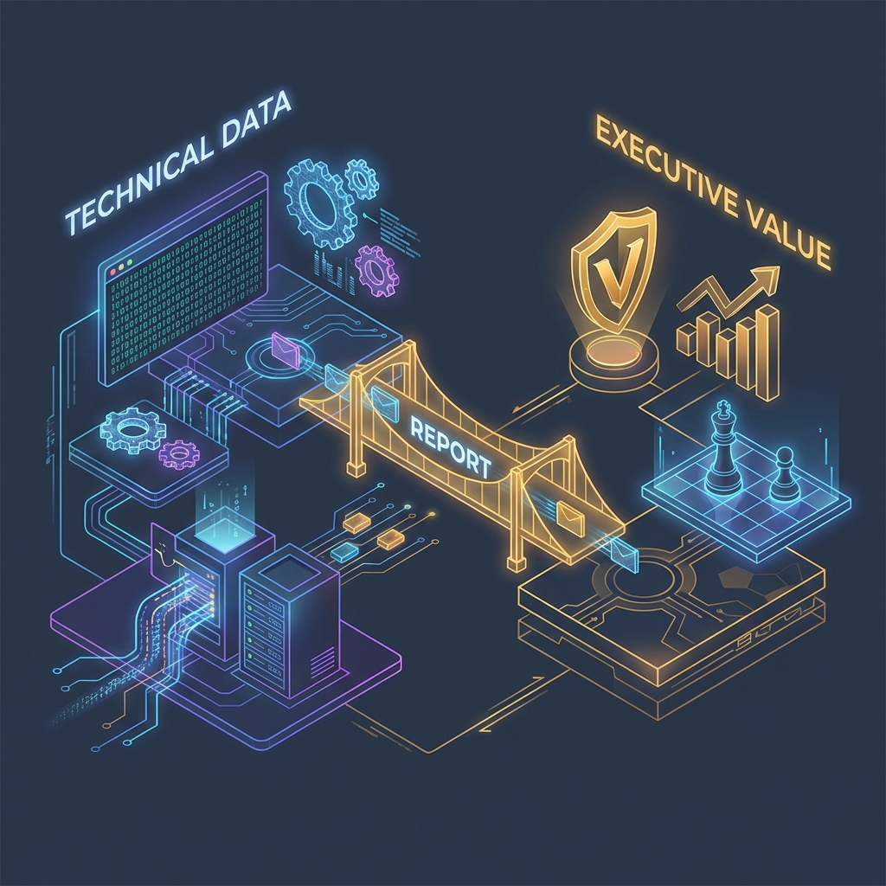
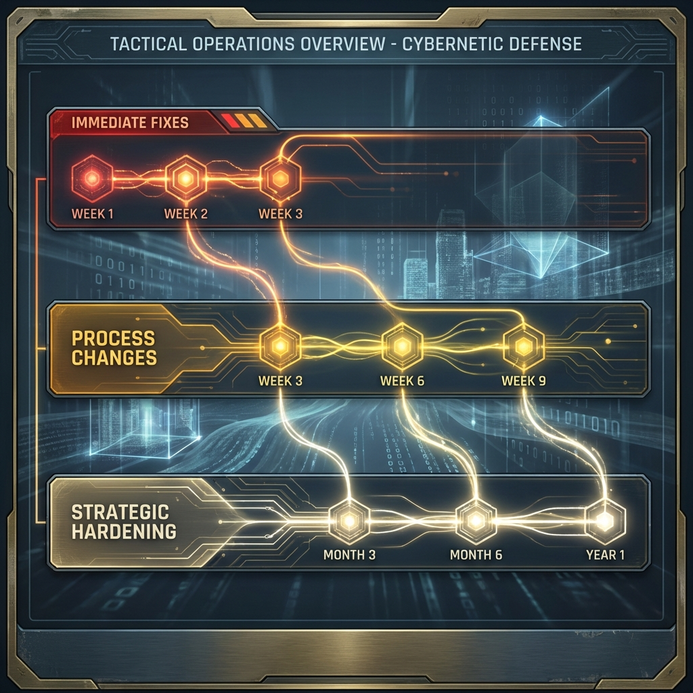

<!--
Chapter: 37
Title: Presenting Results and Remediation Guidance
Category: Defense & Operations
Difficulty: Intermediate
Estimated Time: 10 minutes read time
Hands-on: No
Prerequisites: Chapter 36
Related: Chapters 2 (Ethics/Communication), 4 (SOW/RoE), 38 (Continuous Red Teaming)
-->

# Chapter 37: Presenting Results and Remediation Guidance

  

_This chapter bridges technical findings and organizational action through effective presentation and remediation strategies. You'll learn how to present results to technical and non-technical audiences, facilitate collaborative remediation planning, create prioritized roadmaps, handle difficult conversations, and ensure your red teaming work translates into measurable security improvements._

## 37.0 Introduction

Delivering findings is far more than handing over a report - it's about ensuring your audience understands the issues, accepts their significance, and is empowered to act on them. In AI red teaming, where vulnerabilities can range from subtle model behaviors to architectural flaws, effective presentation is critical for driving remediation.

### Why This Matters

- **Organizational Buy-In**: Clear presentation secures executive support and resource allocation
- **Technical Clarity**: Well-explained findings accelerate remediation by engineering teams
- **Collaborative Problem-Solving**: Interactive presentation uncovers constraints and enables practical solutions
- **Measurable Impact**: Effective remediation guidance translates findings into actual security improvements

### Key Principles

- **Audience Adaptation**: Tailor technical depth and business context to stakeholder needs
- **Story-Driven**: Illustrate attack chains and real-world consequences
- **Solutions-Focused**: Prioritize actionable remediation over problem enumeration
- **Collaborative**: Invite questions and work with teams to validate feasibility

## 37.1 The Importance of Presentation

Delivering findings is more than handing over a report - it's about ensuring your audience understands the issues, accepts their significance, and is empowered to act on them. Successful presentation:

- Fosters collaboration between red teamers, defenders, and executives.
- Reduces the risk of misinterpretation or dismissal of critical findings.
- Accelerates remediation efforts for high-impact issues.

---

## 37.2 Adapting Your Message to the Audience

### 37.2.1 Technical Audiences

- Focus on vulnerability details, reproduction steps, root causes, and recommended fixes.
- Be prepared for deep-dive questions and requests for clarifications.
- Supply evidence, logs, scripts, and system diagrams as needed.

### 37.2.2 Executive/Non-Technical Audiences

- Emphasize business impact, regulatory and reputational risks, and resource implications.
- Use analogies or risk heat maps to communicate severity.
- Stay solutions-focused - clarify how remediation aligns with business priorities.

---

  

## 37.3 Effective Presentation Techniques

- **Prioritize the Most Severe Issues:** Address critical and high-risk findings first, with emphasis on business consequences.
- **Tell the Story:** Illustrate how an attacker could chain vulnerabilities, what the outcome would be, and measures to break that chain.
- **Use Visuals:** Charts, diagrams, and tables help non-technical stakeholders quickly grasp risk exposure.
- **Encourage Questions and Discussion:** Invite interdisciplinary dialogue to uncover blind spots and clarify recommendations.

---

  

## 37.4 Facilitating Remediation

- Provide **clear, prioritized remediation guidance**, listing actions by severity and ease of implementation.
- Where feasible, break down actions into phases: quick wins, medium-term improvements, and strategic changes.
- Collaborate with defenders to verify feasibility - refer to playbooks or proven controls when possible.
- Offer to retest high-priority fixes as part of the engagement closure.

---

  

## 37.5 Example: Remediation Roadmap Table

| Issue                       | Severity | Recommended Action                                  | Owner    | Timeline |
| --------------------------- | -------- | --------------------------------------------------- | -------- | -------- |
| Prompt Injection (API)      | Critical | Implement prompt filters, stricter input validation | DevOps   | 2 weeks  |
| Plugin Privilege Escalation | High     | Restrict plugin permissions, audit usage            | Security | 1 month  |
| Excessive Model Verbosity   | Medium   | Refine LLM output constraints                       | ML Team  | 6 weeks  |

---

## 37.6 Handling Difficult Conversations

- Be factual, not alarmist; avoid blame language and focus on solutions.
- Acknowledge constraints or business realities (resource limits, legacy systems).
- Help stakeholders weigh tradeoffs - sometimes, “best” security isn't immediately practical, so explain risk reduction steps.

---

## 37.7 Follow-Up and Continuous Improvement

- Schedule follow-up sessions to review remediation progress.
- Encourage tracking of open issues and regular retesting.
- Provide recommendations for improving red team processes, monitoring, and security culture.

---

## 37.8 Checklist: Presenting and Remediation

- [ ] Most severe/business-critical issues highlighted and explained.
- [ ] Technical and executive perspectives both addressed.
- [ ] Remediation actions are clear, prioritized, and actionable.
- [ ] Stakeholders have a forum to ask questions and provide feedback.
- [ ] Next steps and follow-up are agreed upon and scheduled.

---

## 37.9 Conclusion

### Key Takeaways

- Presentation is as critical as discovery - findings must be understood to drive action
- Adapt your message: technical depth for engineers, business impact for executives
- Use visuals, stories, and attack chains to make complex vulnerabilities comprehensible
- Remediation guidance must be specific, prioritized, and feasible given organizational constraints
- Collaboration and follow-up ensure fixes are implemented and validated

### Recommendations

- Prepare separate decks for technical and executive audiences
- Lead with business impact and critical findings
- Provide phased remediation roadmaps (quick wins → strategic changes)
- Offer to retest high-priority fixes to validate remediation
- Document lessons learned to improve future engagements

### Next Steps

Chapter 38 explores lessons learned, common pitfalls, and strategies for building a mature, sustainable AI red teaming practice - moving from one-off assessments to continuous security improvement.
