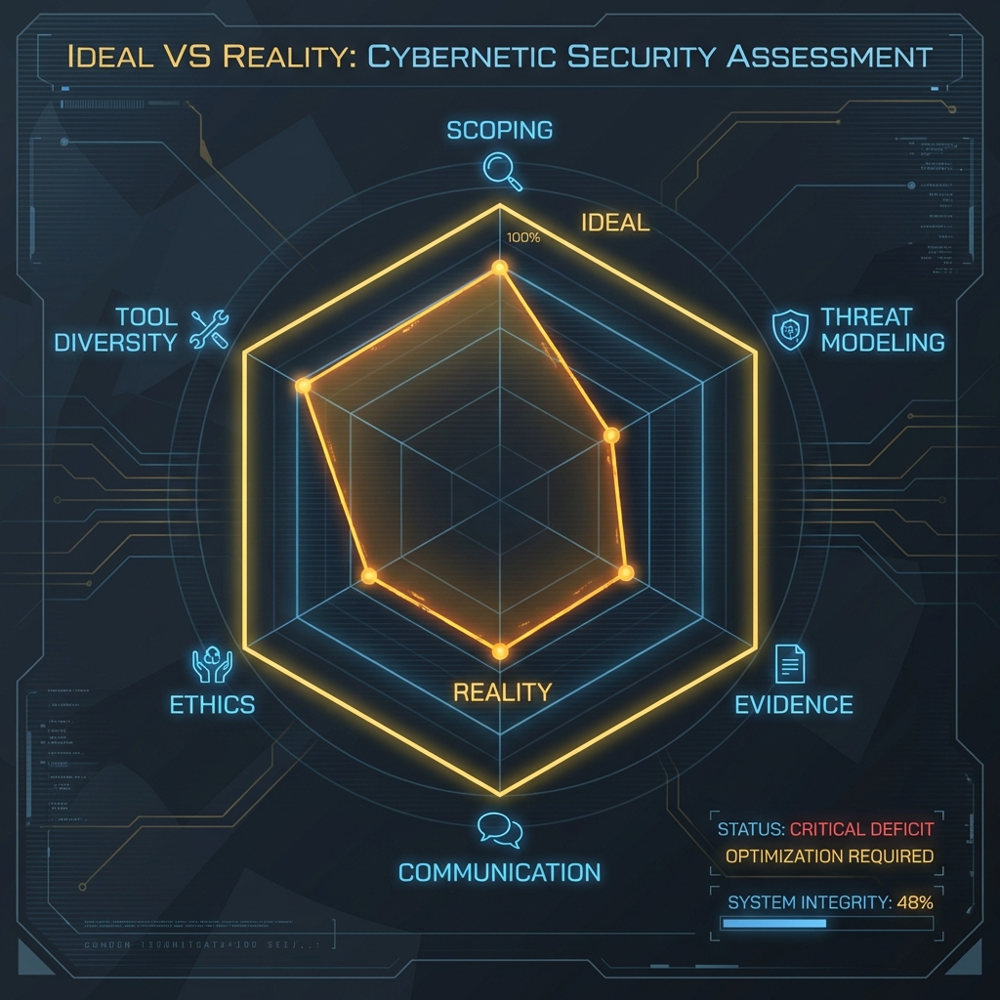
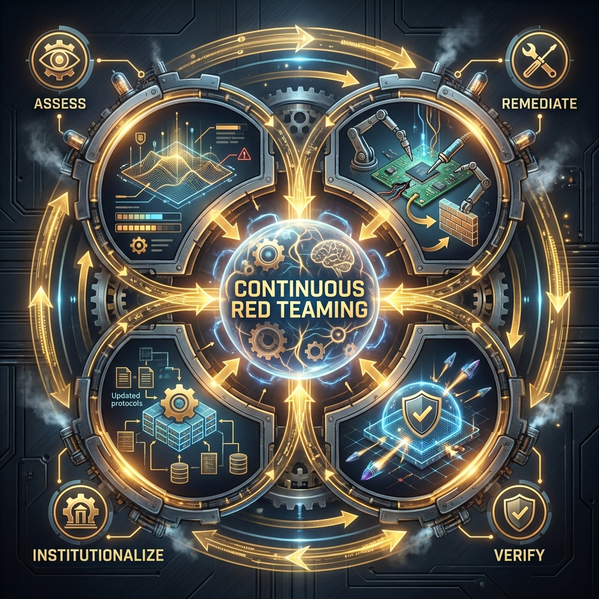

<!--
Chapter: 38
Title: Continuous Red Teaming and Program Maturity
Category: Defense & Operations
Difficulty: Intermediate
Estimated Time: 15 minutes read time
Hands-on: Yes
Prerequisites: Chapters 1-37
Related: Chapters 45 (Program Building), 5 (Threat Modeling), 7 (Lab Setup), 36 (Reporting)
-->

# Chapter 38: Continuous Red Teaming and Program Maturity

<p align="center">
  
</p>

_This chapter establishes a comprehensive framework for evolving AI red teaming from ad-hoc vulnerability hunting into a mature, continuous security capability. You'll learn the four-level maturity model, mechanisms for creating effective feedback loops between offensive and defensive teams, practical metrics for measuring program success, and collaborative purple teaming strategies for accelerating defensive improvements._

## 38.1 Introduction

Building an effective AI red team requires more than technical expertise. It demands organizational structure, repeatable processes, and measurable outcomes. Running occasional, ad-hoc tests is insufficient against rapidly evolving AI threats and the expanding attack surface of agentic systems. To move from "finding bugs" to "strategic assurance," organizations must integrate adversarial simulation into the Secure AI Development Lifecycle (SAIDL).

### Why This Matters

- **Sustainable Impact**: Institutionalized red teaming prevents security regression as systems evolve and new threats emerge.
- **Efficiency Gains**: Documented lessons, repeatable playbooks, and automated tooling reduce engagement overhead by up to 70%.
- **Adaptive Defense**: Regular reflection and skill development keep pace with adversarial innovation (new jailbreak techniques emerge monthly).
- **Compliance Readiness**: Frameworks like NIST AI RMF and EU AI Act mandate proactive, ongoing adversarial testing.

### Key Concepts

- **Maturity Model**: A structured framework for assessing and advancing red team capabilities from reactive to proactive.
- **Feedback Loop**: The mechanism by which offensive findings translate into defensive improvements across prevention, detection, and architecture.
- **Purple Teaming**: Collaborative exercises where red and blue teams work together in real-time to validate and tune defenses.

### Theoretical Foundation

#### Why This Works (Organizational Behavior)

Continuous red teaming addresses the "security debt" problem in AI systems:

- **Organizational Factor**: Late-stage security findings (post-deployment) cost 100x more to remediate than those caught during design.
- **Process Artifact**: Without institutionalized feedback loops, red team reports become "shelf-ware" rather than drivers of change.
- **Measurement Gap**: What gets measured gets managed. Programs without KPIs cannot demonstrate ROI or justify investment.

#### Foundational Research

| Paper                                                                                                        | Key Finding                                                                    | Relevance                                                                    |
| :----------------------------------------------------------------------------------------------------------- | :----------------------------------------------------------------------------- | :--------------------------------------------------------------------------- |
| **["Red Teaming Language Models to Reduce Harms"](https://arxiv.org/abs/2202.03286)** (Ganguli et al., 2022) | Large-scale red teaming improves model safety through iterative reinforcement. | Demonstrates the value of continuous, structured adversarial testing.        |
| **["MITRE ATLAS"](https://atlas.mitre.org/)** (MITRE, 2023)                                                  | Framework for classifying adversarial ML tactics and techniques.               | Provides standardized language for tracking and comparing red team findings. |

#### What This Reveals About Security Programs

The difficulty of sustaining red team programs reveals that security is not a product but a process. Effective programs require executive sponsorship, cross-functional collaboration, and cultural transformation to shift from reactive to proactive postures.

#### Chapter Scope

We will cover the AI Red Team Maturity Model (Levels 1-4), mechanisms for creating effective feedback loops (prevention, detection, architecture), practical KPIs and tooling for measuring program success, and collaborative purple teaming strategies.

---

## 38.2 The AI Red Team Maturity Model

Maturity models provide a structured path for organizations to benchmark current capabilities and roadmap their evolution. This four-level framework moves from sporadic vulnerability hunting to strategic adversarial emulation.

### How Maturity Progression Works

```text
[Maturity Model Progression]

Level 1: Ad-Hoc → Level 2: Repeatable → Level 3: Integrated → Level 4: Adversarial Emulation
(Reactive)         (Structured)          (Continuous)         (Optimized)
```

### 38.2.1 Level 1: Ad-Hoc & Reactive (Vulnerability Hunting)

At this stage, testing is sporadic, often triggered by a specific event (product launch, incident, regulatory audit) rather than systematic process.

#### Characteristics

- **Reactive Engagements**: Testing occurs late in development or post-deployment.
- **Undefined Scope**: Broad objectives without risk-based prioritization.
- **Generic Tools**: Reliance on public jailbreak lists (e.g., "DAN prompts") without customization.
- **Isolated Findings**: Vulnerabilities documented but no formal remediation tracking.

#### Limitations

- **Security Theatre**: Box-checking compliance without measurable security improvement.
- **High Security Debt**: Late-stage discoveries are expensive to fix (estimated 100x cost increase vs. early detection).

<p align="center">
  
</p>

### 38.2.2 Level 2: Structured & Repeatable (Campaign-Based)

The organization establishes a dedicated mandate, formal Rules of Engagement (RoE), and structured processes.

#### Characteristics

- **Defined Campaigns**: Clear objectives (e.g., "Extract PII from the RAG pipeline").
- **Framework Adoption**: Use of tools like Microsoft PyRIT or NIST AI RMF for standardized testing.
- **MITRE ATLAS Mapping**: Findings mapped to known Tactics, Techniques, and Procedures (TTPs).
- **Structured Reporting**: Risk ratings based on business impact, not just technical severity.

#### Success Metrics

- Repeatable engagement processes reduce setup time by 40-60%.
- Consistent reporting format improves stakeholder comprehension and remediation prioritization.

### 38.2.3 Level 3: Proactive & Integrated (SAIDL Integration)

Red teaming "shifts left," integrating into CI/CD pipelines and MLOps workflows.

#### Characteristics

- **Automated Testing**: Adversarial checks run on every model update or code commit.
- **Security Unit Tests**: Regression testing for safety filters (e.g., "Did the latest fine-tune reintroduce jailbreak vulnerability?").
- **Stakeholder Integration**: Collaboration with Model Risk Management (MRM), Legal, and InfoSec teams.
- **Continuous Monitoring**: Red team validates that production systems detect and alert on adversarial behavior.

#### Output

- Metrics track remediation velocity (Mean Time to Remediate, MTTR).
- Regression rates monitored across model versions.

### 38.2.4 Level 4: Adversarial Emulation & Continuous Improvement (Optimized)

The pinnacle of maturity involves threat-informed testing and "AI vs. AI" dynamics.

#### Characteristics

- **Threat Emulation**: Simulate specific adversaries (nation-states, APTs, cybercriminals) using their known TTPs.
- **Autonomous Agents**: AI-powered red team agents continuously probe defenses.
- **Wargaming**: Full-scale exercises testing strategic decision-making and incident response under pressure.
- **Active Defense**: Deployment of AI-driven honeypots and deception technologies.

#### Advanced Techniques

- **Purple Team Integration**: Real-time collaboration for immediate defensive tuning.
- **Diverse Perspectives**: Interdisciplinary teams uncover failure modes across varying contexts and demographics.

<p align="center">
  
</p>

---

## 38.3 The Continuous Feedback Loop

A red team report that sits on a shelf is a program failure. Findings must translate into tangible improvements across three defensive domains.

### How the Feedback Loop Works

```text
[Feedback Loop Architecture]

Red Team Finding → Triage → Prevention (Guards/Filters)
                          → Detection (SOC Rules)
                          → Architecture (System Redesign)
                          → Validation (Purple Team Re-test)
```

### 38.3.1 Prevention (The Shield)

Red team findings drive immediate hardening of preventative controls.

| Finding                                          | Preventative Action                                                       |
| :----------------------------------------------- | :------------------------------------------------------------------------ |
| Novel jailbreak using Unicode homoglyphs         | Update input sanitizer to normalize Unicode before processing             |
| Multi-turn social engineering bypass             | Implement conversation context tracking with escalating validation        |
| Visual synonym attack (harmful concept in image) | Deploy multimodal content moderation for vision-language models           |
| RAG document poisoning                           | Add content scanners to sanitize retrieved documents before LLM ingestion |

### 38.3.2 Detection (The Watchtower)

Every successful attack should generate a corresponding detection signature.

#### Detection Validation Process

1. **Simulate Real Adversary**: Red team executes attack against pre-production environment.
2. **Verify Telemetry**: Blue team confirms sufficient logging (prompts, outputs, function calls, API requests).
3. **Test Alerting**: Validate that SOC receives actionable, high-fidelity alerts.
4. **Create Signatures**: Develop detection rules based on attack patterns (e.g., "Flag unusual tool call sequences").

#### Example Detection Rules

- **Prompt Flooding**: Alert on >50 requests/minute from single user.
- **Iterative Jailbreak Attempts**: Flag repeated refusals followed by slightly modified prompts.
- **Function Calling Abuse**: Detect API call sequences that deviate from known-good patterns.

### 38.3.3 Architecture (The Foundation)

Systemic vulnerabilities require architectural changes, not patches.

#### When to Redesign

- **Excessive Agency**: AI has too much autonomy (fix: implement human-in-the-loop for high-risk actions).
- **Weak Trust Boundaries**: Insufficient isolation between user input and system instructions (fix: Dual LLM pattern).
- **Plugin Security**: Third-party extensions have excessive permissions (fix: sandboxed execution environments with least-privilege access).

---

## 38.4 Measuring Success: KPIs and Practical Tooling

To demonstrate value and drive data-informed strategy, mature programs must quantify their impact.

### 38.4.1 Key Performance Indicators

#### Essential KPIs

- **Attack Success Rate (ASR)**: Percentage of adversarial inputs that bypass controls. Target: <5% for production systems.
- **Mean Time to Remediation (MTTR)**: Average days from vulnerability report to fix deployment. Target: <7 days for Critical, <30 days for High.
- **Detection Rate**: Percentage of simulated attacks correctly flagged by monitoring systems. Target: >90%.
- **Bypass Rate per Model Version**: Track ASR across model versions to measure hardening progress and detect regressions.

### Practical Example: Engagement Metrics Script

#### What This Code Does

This script calculates strategic KPIs for tracking AI red team program health. It demonstrates how to measure MTTR and Bypass Rates across model versions, providing quantifiable evidence of program maturity and defensive improvement over time.

#### Key Components

1. **Findings Logger**: Stores vulnerability lifecycle data (discovery date, fix date, severity, model version).
2. **MTTR Calculator**: Computes average remediation time to measure organizational responsiveness.
3. **Bypass Rate Tracker**: Calculates attack success rates per model version to identify regressions.

```python
#!/usr/bin/env python3
"""
AI Red Team Program Metrics
Calculates strategic KPIs for tracking program maturity and effectiveness.

Requirements:
    pip install pandas numpy

Usage:
    python engagement_metrics.py
"""

from datetime import datetime
from typing import List, Dict, Optional
import statistics

# Standard warning header
# ----------------------------------------------------------------------------
# ⚠️  WARNING: EDUCATIONAL PURPOSES ONLY ⚠️
# This script is for metrics tracking in authorized red team programs.
# Do not use for malicious purposes or unauthorized testing.
# ----------------------------------------------------------------------------

class RedTeamProgramMetrics:
    """
    Track and analyze AI red team program effectiveness through KPIs.
    """

    def __init__(self):
        """Initialize the metrics tracker."""
        self.findings: List[Dict] = []

    def add_finding(
        self,
        finding_id: str,
        severity: str,
        date_found: str,
        date_fixed: Optional[str],
model_version: str
    ) -> None:
        """
        Log a vulnerability finding with lifecycle metadata.

        How This Works:
        1. Accepts finding details as parameters
        2. Converts date strings to datetime objects for calculation
        3. Stores in findings list for aggregate analysis

        Args:
            finding_id: Unique identifier for the vulnerability
            severity: Risk level (Critical, High, Medium, Low)
            date_found: Discovery date in YYYY-MM-DD format
            date_fixed: Remediation date in YYYY-MM-DD format (None if unresolved)
            model_version: Target model version (e.g., "v1.0", "v2.1")
        """
        self.findings.append({
            "id": finding_id,
            "severity": severity,
            "found": datetime.strptime(date_found, "%Y-%m-%d"),
            "fixed": datetime.strptime(date_fixed, "%Y-%m-%d") if date_fixed else None,
            "version": model_version
        })

    def calculate_mttr(self) -> float:
        """
        Calculate Mean Time to Remediate (in days).

        How This Works:
        1. Filters findings with remediation dates
        2. Computes time delta between discovery and fix
        3. Returns arithmetic mean of all remediation times

        Returns:
            Average days to remediation (0 if no data)
        """
        remediation_times = []
        for finding in self.findings:
            if finding["fixed"]:
                delta = (finding["fixed"] - finding["found"]).days
                remediation_times.append(delta)

        if not remediation_times:
            return 0.0

        return statistics.mean(remediation_times)

    def calculate_bypass_rate(self, total_attempts_per_version: Dict[str, int]) -> Dict[str, float]:
        """
        Calculate Attack Success Rate (Bypass Rate) per model version.

        How This Works:
        1. Counts successful exploits per model version
        2. Divides by total attack attempts to get percentage
        3. Returns dictionary of version -> bypass rate

        Args:
            total_attempts_per_version: Dictionary mapping model versions to total attack attempts

        Returns:
            Dictionary mapping model versions to bypass percentages
        """
        version_failures = {}
        for finding in self.findings:
            version = finding["version"]
            version_failures[version] = version_failures.get(version, 0) + 1

        bypass_rates = {}
        for version, failures in version_failures.items():
            attempts = total_attempts_per_version.get(version, failures)  # Default to failures if no data
            bypass_rates[version] = (failures / attempts) * 100

        return bypass_rates

    def demonstrate_metrics(self):
        """
        Demonstrate metrics calculation with sample data.

        Shows progression from Level 1 (slow remediation) to Level 3 (fast, automated response).
        """
        print("="*70)
        print(" AI RED TEAM PROGRAM METRICS DEMO ".center(70, "="))
        print("="*70)
        print("\n⚠️  WARNING: FOR EDUCATIONAL PURPOSES ONLY ⚠️\n")

        # Simulate Level 1 Maturity: Slow, manual remediation
        print("[*] Simulating Level 1 Maturity (Ad-Hoc)...")
        self.add_finding("VULN-001", "Critical", "2024-01-01", "2024-01-15", "v1.0")
        self.add_finding("VULN-002", "High", "2024-01-02", "2024-01-20", "v1.0")

        # Simulate Level 3 Maturity: Fast remediation via CI/CD integration
        print("[*] Simulating Level 3 Maturity (Integrated)...")
        self.add_finding("VULN-003", "Critical", "2024-06-01", "2024-06-02", "v2.0")
        self.add_finding("VULN-004", "Medium", "2024-06-01", "2024-06-03", "v2.0")

        # Calculate MTTR
        mttr = self.calculate_mttr()
        print(f"\n[+] Mean Time to Remediate (MTTR): {mttr:.1f} days")

        # Calculate Bypass Rates
        attempts = {"v1.0": 500, "v2.0": 5000}  # v2.0 had automated fuzzing
        rates = self.calculate_bypass_rate(attempts)

        print("\n[+] Bypass Rate per Model Version:")
        for version, rate in rates.items():
            status = "✓ HARDENED" if rate < 5 else "⚠ VULNERABLE"
            print(f"    {version}: {rate:.2f}% ({attempts[version]} attempts) - {status}")

        print("\n" + "="*70)

# ============================================================================
# DEMO USAGE
# ============================================================================

if __name__ == "__main__":
    print("engagement_metrics.py - Educational Demo\n")

    # DEMO MODE
    print("[DEMO MODE] Simulating program maturity progression...\n")

    metrics = RedTeamProgramMetrics()
    metrics.demonstrate_metrics()

    print("\n[REAL USAGE]:")
    print("# metrics = RedTeamProgramMetrics()")
    print("# metrics.add_finding('VULN-001', 'Critical', '2024-01-01', '2024-01-15', 'v1.0')")
    print("# mttr = metrics.calculate_mttr()")
    print("# print(f'MTTR: {mttr} days')")
```

## Success Metrics

- **MTTR Improvement**: Level 1 programs average 15-20 days; Level 3 programs achieve <3 days through automation.
- **Bypass Rate Trends**: Declining bypass rates across model versions indicate successful hardening.
- **Detection Coverage**: Mature programs achieve >90% detection rate for known attack patterns.

## Why This Code Works

This implementation demonstrates effective program measurement:

1. **Effectiveness**: Quantifies both offensive success (bypass rates) and defensive responsiveness (MTTR).
2. **Trend Analysis**: Tracking metrics across model versions reveals security improvements or regressions.
3. **Stakeholder Communication**: Provides data-driven evidence for executive reporting and investment justification.
4. **Transferability**: The KPI framework applies to any AI red team program, regardless of tooling or methodology.

## Key Takeaways

1. **Measure to Manage**: Without quantitative KPIs, red team programs cannot demonstrate ROI or justify resources.
2. **Track Trends**: Metrics across model versions reveal whether security is improving or regressing over time.
3. **Automate Collection**: Mature programs build internal tooling to automatically capture and analyze engagement data.

---

## 38.5 Purple Teaming: Collaborative Defense Acceleration

Purple teaming transforms the feedback loop from asynchronous (red team report → blue team fixes weeks later) to real-time collaboration.

### How Purple Teaming Works

Purple teaming is not a separate team but a collaborative exercise where red and blue teams work together to test, tune, and validate defenses.

```text
[Purple Team Exercise Flow]

Objective Setting → Live-Fire Testing → Real-Time Tuning → Immediate Re-validation → Knowledge Transfer
```

### 38.5.1 Structuring a Purple Team Exercise

#### Phase 1: Objective Setting

Define a specific goal based on recent findings or threat intelligence.

**Example**: "Improve input filter resilience against multi-turn jailbreak attempts."

#### Phase 2: Live-Fire Testing

- **Red Team**: Executes attack against pre-production environment.
- **Blue Team**: Actively observes monitoring, logging, and alerting systems in real-time.

#### Phase 3: Real-Time Tuning

Blue team analyzes why the attack succeeded (or failed to trigger alerts) and implements a fix immediately.

**Example Fixes**:

- Add new rule to input sanitizer (blocking specific token sequences).
- Adjust SIEM alert threshold (reducing false negatives).
- Update system prompt to enforce stricter instruction hierarchy.

#### Phase 4: Immediate Re-validation

Red team re-runs the exact same attack to confirm the fix is effective.

#### Phase 5: Knowledge Transfer

Both teams collaboratively document:

- Attacker's TTP (for threat intelligence).
- Effective defense (for playbook updates).
- Lessons learned (for training materials).

### Example: Indirect Prompt Injection Purple Team

1. **Objective**: Validate detection of indirect prompt injection via malicious document upload.
2. **Execution**: Red team uploads a PDF containing hidden instructions to exfiltrate data.
3. **Validation**: Blue team checks SIEM. Was the anomalous RAG retrieval flagged? Was severity correct?
4. **Tuning**: If undetected, teams jointly tune the anomaly detection threshold or add content scanner to RAG pipeline.
5. **Repeat**: Attack re-run to verify the detection now works.

### Benefits of Purple Teaming

- **Faster Remediation**: Fixes deployed in hours instead of weeks.
- **Empathy Building**: Reduces adversarial "gotcha" culture; fosters collaboration.
- **Validation Confidence**: Immediate re-testing confirms defenses work as intended.
- **Auditable Evidence**: Provides compliance documentation of control effectiveness.

---

## 38.6 Case Studies

### Case Study 1: Financial Services Maturity Progression

#### Incident Overview

- **Organization**: Tier-1 retail bank deploying customer service chatbot.
- **Initial State**: Level 1 (Ad-Hoc). Manual testing post-development revealed 12 critical prompt injection vulnerabilities 2 weeks before launch.
- **Impact**: Launch delayed 6 weeks; estimated cost $2.4M in delayed revenue.

#### Attack Timeline

1. **Discovery**: Late-stage red team engagement found systemic lack of input validation.
2. **Remediation**: Engineering scrambled to implement filters, causing multiple regressions.
3. **Transformation**: After incident, CISO mandated Level 3 integration (shift-left).
4. **Outcome**: Next model version had automated adversarial testing in CI/CD. Only 2 findings (both Medium severity) caught 3 weeks before launch.

#### Lessons Learned

- **Late Testing is Expensive**: Fixing vulnerabilities post-development cost 80x more than catching them during design.
- **Automation Scales**: Automated fuzzing tested 50,000+ prompts per week (vs. 200 manual tests previously).
- **Cultural Shift**: Developers began viewing red team as partners, not adversaries.

### Case Study 2: Purple Team Blocks Zero-Day RAG Exploit

#### Incident Overview

- **Target**: Healthcare AI assistant using RAG for medical research queries.
- **Impact**: Prevented potential HIPAA violation (patient data exposure).
- **Exercise**: Bi-weekly purple team session focused on RAG security.

#### Key Details

Red team discovered novel attack: embedding invisible prompt instructions in medical PDFs that, when retrieved by RAG, caused the LLM to leak patient names from vector database.

#### Purple Team Response (Same Day)

1. **Hour 1**: Red team demonstrated attack; blue team confirmed no SIEM alert.
2. **Hour 2**: Blue team implemented content scanner to sanitize retrieved documents before LLM ingestion.
3. **Hour 3**: Red team re-ran attack; now blocked by scanner and flagged in SIEM.
4. **Hour 4**: Joint documentation of TTP and defense; scanner deployed to production the next day.

#### Lessons Learned

- **Real-Time Collaboration**: Purple teaming enabled same-day fix (vs. typical 14-day cycle).
- **Proactive Discovery**: Exercise found zero-day before attackers did.
- **Mature Process**: Success demonstrated value of Level 4 (Adversarial Emulation) capabilities.

---

## 38.7 Conclusion

### Chapter Takeaways

1. **Maturity is a Journey**: Programs evolve from ad-hoc (Level 1) to adversarial emulation (Level 4) through systematic investment in process, tooling, and collaboration.
2. **Feedback Loops Drive Value**: Red team findings must translate into prevention, detection, and architectural improvements to justify program existence.
3. **Measure Everything**: KPIs like MTTR, ASR, and Detection Rate provide data-driven evidence of program effectiveness and guide resource allocation.
4. **Collaboration Accelerates Defense**: Purple teaming transforms red team findings into immediate defensive tuning, reducing Mean Time to Remediation from weeks to hours.
5. **Continuous Evolution Required**: The threat landscape evolves constantly (new jailbreak techniques monthly, new model capabilities quarterly). Programs must adapt or become obsolete.

### Recommendations for Building Maturity

- **Start with Documentation**: Formal engagement framework, RoE, and safety controls (Level 2).
- **Integrate Early**: Shift red teaming left into CI/CD pipelines (Level 3).
- **Automate Where Possible**: Use frameworks like PyRIT or custom scripts for scalable fuzzing.
- **Track Metrics Religiously**: Build internal tooling to automatically calculate MTTR, ASR, and Detection Rates.
- **Foster Collaboration**: Run quarterly purple team exercises to accelerate defensive improvement.
- **Invest in Skill Development**: Allocate budget for training on emerging AI attack techniques (conferences, research papers, capture-the-flag events).

### Next Steps

- Chapter 39: AI Bug Bounty Programs - Crowdsourcing vulnerability discovery.
- Chapter 40: Compliance and Standards - Aligning red teaming with regulatory requirements.
- Chapter 45: Building an AI Red Team Program - Comprehensive blueprint for team structure, hiring, and operational excellence.

---

## Quick Reference

### Maturity Model Summary

| Level         | Focus                 | Key Characteristics                                        |
| :------------ | :-------------------- | :--------------------------------------------------------- |
| 1: Ad-Hoc     | Reactive              | Sporadic testing, no formal process, late-stage discovery  |
| 2: Repeatable | Structured            | Defined RoE, standardized tools, MITRE ATLAS mapping       |
| 3: Integrated | Continuous            | CI/CD integration, automated testing, short feedback loops |
| 4: Optimized  | Adversarial Emulation | Threat-informed, AI vs. AI, wargaming, purple teaming      |

### Key KPIs

- **Attack Success Rate (ASR)**: <5% target for production systems
- **Mean Time to Remediation (MTTR)**: <7 days for Critical, <30 days for High
- **Detection Rate**: >90% for known attack patterns
- **Bypass Rate Trend**: Should decline across model versions

### Purple Team Exercise Checklist

- [ ] Clear objective defined based on threat intelligence or recent finding
- [ ] Pre-production environment configured for safe testing
- [ ] Red and blue teams present simultaneously
- [ ] Monitoring and logging systems ready for observation
- [ ] Authority to implement fixes during exercise
- [ ] Post-exercise documentation process established

---

## Appendix A: Pre-Engagement Checklist

### Program Maturity Assessment

- [ ] **Formal Framework**: Documented engagement framework with clear RoE and ethical boundaries?
- [ ] **Stakeholder Collaboration**: Defined processes for working with Blue Teams, MRM, Legal, InfoSec?
- [ ] **Metrics Tracking**: Are ASR and MTTR actively calculated and reported to leadership?
- [ ] **Automation**: Is automated testing supplementing manual efforts for broader coverage?

## Appendix B: Post-Engagement Checklist

### Continuous Improvement

- [ ] **Retrospective Conducted**: Post-mortem meeting held to review what worked and what didn't?
- [ ] **Findings Actioned**: Red team discoveries resulted in documented changes to controls?
- [ ] **Detection Validated**: Monitoring systems tested to ensure they can detect similar attacks?
- [ ] **Playbooks Updated**: Lessons learned incorporated into team documentation and training materials?
- [ ] **Metrics Updated**: KPIs recalculated and trended against previous engagements?
