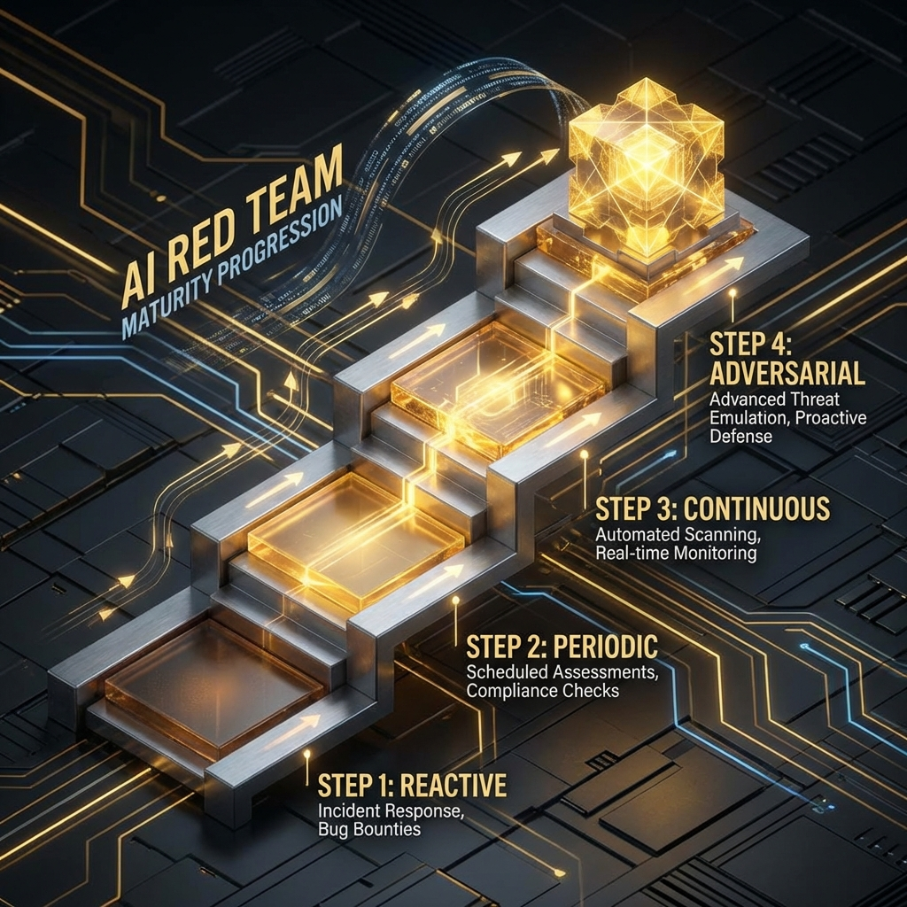
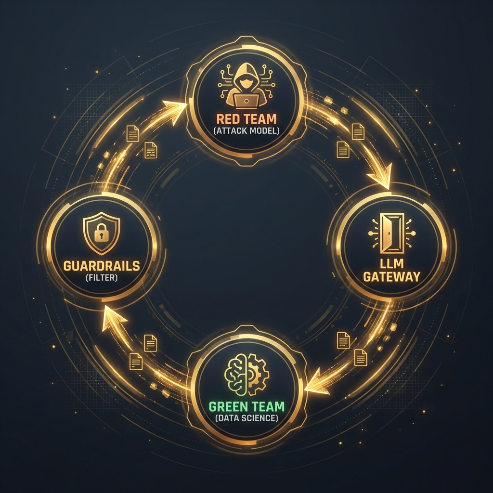
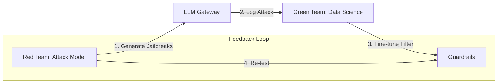
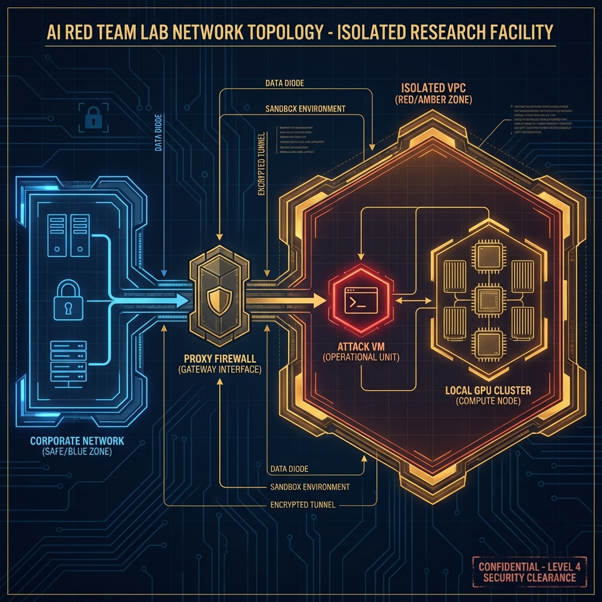

<!--
Chapter: 45
Title: Building an AI Red Team Program
Category: Impact & Society
Difficulty: Intermediate
Estimated Time: 40 minutes read time
Hands-on: No
Prerequisites: Chapter 03 (Mindset)
Related: Chapter 38 (Continuous Red Teaming)
-->

# Chapter 45: Building an AI Red Team Program

<p align="center">
  
</p>

Turning the Red Team mindset into operations takes more than hacking skills. It requires a formal program, a budget, and a defined scope. This chapter provides the blueprint for CISOs and Directors to build an in-house AI Security capability.

## 45.1 From "Ad-Hoc" to "Systematic"

Most organizations start AI security by asking a developer to "try and break the bot." This is insufficient. A mature program treats AI Red Teaming as a continuous engineering function, not a one-off pentest.

### The Maturity Model

1. **Level 1 (Reactive):** Relying on user reports/bounties.
2. **Level 2 (Periodic):** Annual 3rd-party assessments.
3. **Level 3 (Continuous):** Automated scans (Garak/PyRIT) in CI/CD.
4. **Level 4 (Adversarial):** Dedicated internal team developing novel attacks against model weights.

<p align="center">
  
</p>

### 45.1.1 The Purple Team Architecture

Red Teams find bugs; Blue Teams fix them. Purple Teams do both simultaneously.

<p align="center">
  
</p>



The goal is to create a **Closed Loop**: Every successful attack immediately becomes a regression test case in the CI/CD pipeline.

---

## 45.2 Infrastructure: The Red Team Lab

You cannot run Red Team operations from a corporate laptop. You need an isolated environment.

### 45.2.1 Architecture

```mermaid
graph TD
    RedTeam[Red Team VDI] --> AdminProxy[Audit/Logging Proxy]
    AdminProxy --> IsolatedVPC[Isolated VPC]

    subgraph "Attack Infrastructure"
    IsolatedVPC --> Attack_VM[Attack Box (Kali/Garak)]
    Attack_VM --> GPU_Cluster[Local GPU (A100)]
    end

    Attack_VM --> Target_API[Target Model API]

    Target_API -->|Logs| SIEM[Security SIEM]
    AdminProxy -->|Audit Logs| Compliance_DB[Audit DB]
```

- **Why Isolation?**
  - **Malware Generation:** If you ask the model to "write ransomware," you don't want that ransomware landing on a corporate endpoint.
  - **NSFW Content:** Red Teaming involves generating toxicity/pornography to test filters. This traffic triggers HR content filters unless isolated.

<p align="center">
  
</p>

### 45.2.2 The Cost of Curiosity

AI Red Teaming is expensive.

| Activity           | Resource           | Cost Est.        | Note                                  |
| :----------------- | :----------------- | :--------------- | :------------------------------------ |
| **Automated Scan** | GPT-4 API          | $500 / scan      | 10k prompts _1k tokens_ $0.03/1k      |
| **Local Fuzzing**  | H100 GPU           | $4 / hour        | Rent via Lambda/CoreWeave for privacy |
| **Human Labeling** | ScaleAI / Labelbox | $5,000 / dataset | Custom adversarial datasets           |

---

## 45.3 Hiring: The "AI Security Engineer"

This is a unicorn role. You typically hire for one strength and train the other.

### 45.3.1 The Interview Kit

#### Round 1: The Machine Learning Engineer (Testing Security Aptitude)

- _Question:_ "You are building a RAG system. How do you prevent the model from retrieving a document the user shouldn't see?"
- _Good Answer:_ "Implement ACLs at the Vector Database level (Metadata filtering) before the retrieval step."
- _Bad Answer:_ "Ask the LLM to only show authorized documents."

#### Round 2: The Penetration Tester (Testing AI Aptitude)

- _Question:_ "Explain how 'Tokenization' impacts a SQL Injection payload."
- _Good Answer:_ "The SQL payload `' OR 1=1` might be tokenized differently depending on spacing, potentially bypassing a regex filter that expects specific character sequences. Also, the LLM predicts tokens, so it might 'fix' a broken SQL injection to make it valid."

#### Round 3: The Take-Home Challenge

- _Task:_ "Here is a Docker container running a local Llama-3 instance with a hidden System Prompt. You have API access only. Extract the System Prompt."
- _Success:_ Candidate uses "Repeat after me" or "Completion suffix" attacks.

### 45.3.2 Training Curriculum (Internal University)

You can't hire enough experts; you must build them.

#### Syllabus for "AI Security 101":

1. **Module 1: Prompt Engineering Internals.** (How Attention works, Context Windows, System Prompts).
2. **Module 2: The OWASP Top 10 for LLMs.** (Injection, Data Leakage, Supply Chain).
3. **Module 3: Hands-On Lab.** (Use `Garak` to find a vulnerability in a sandboxed app).
4. **Module 4: Remediation.** (How to use `NeMo Guardrails` or `Guardrails AI` to patch the hole).

---

## 45.4 Operationalizing: Rules of Engagement (RoE)

AI is non-deterministic. "Do no harm" is harder to guarantee.

### 45.4.1 The Scope Sheet

| Category               | In Scope        | Out of Scope | Reason                                              |
| :--------------------- | :-------------- | :----------- | :-------------------------------------------------- |
| **Prompt Injection**   | Yes             | -            | Core vulnerability.                                 |
| **Model Inversion**    | Yes             | -            | Privacy testing.                                    |
| **DoS (Resource)**     | No              | Yes          | Denying service costs money and proves nothing new. |
| **Social Engineering** | -               | No           | Don't attack the _developers_, attack the _model_.  |
| **Exfiltration**       | Proof of Access | Full Dump    | Don't dump the actual customer DB.                  |

### 45.4.2 The "Safe Harbor" Clause

Your internal policy must state:

> "Security Engineers generally are exempt from HR policies regarding 'Generating Toxic Content' provided it is done within the designated Red Team Lab environment for valid testing purposes."

Without this, your Red Teamers will be fired for generating hate speech violations during testing.

---

## 45.5 Metrics: Measuring the Intangible

Executive dashboards need numbers.

1. **Attack Surface Coverage:**
   - _Formula:_ `(Tested System Prompts / Total System Prompts) * 100`
   - _Goal:_ 100% of production prompts extracted and fuzz-tested.
2. **Regression Rate:**
   - _Formula:_ `% of previously fixed jailbreaks that work again in the new model version.`
   - _Goal:_ < 1%.
3. **Human Bypass Rate:**
   - _Formula:_ `Success rate of human red team attempts vs. Automated guardrails.`
   - _Goal:_ Low. If humans easily bypass the automated defense, the automation is creating a false sense of security.

### 45.5.1 Board Level Reporting

The Board doesn't care about "Prompt Injection." They care about Risk.

#### Slide Deck Template

1. **The "Crown Jewels" Analysis:**
   - "We use AI for [X]. If it fails, we lose [$Y]."
2. **Current Risk Posture:**
   - "We tested [5] models. [2] were susceptible to Data Extraction."
3. **The "Ask":**
   - "We need [$50k] for API credits to continuous test the new Customer Support Bot before launch."

---

## 45.6 Conclusion

Building an AI Red Team is building an "Immune System." It is not a project that finishes; it is a function that lives as long as the models do.

### Chapter Takeaways

1. **Isolate the Lab:** Don't generate malware on the corporate WiFi.
2. **Budget for OpEx:** API tokens are the "ammunition" of this war.
3. **Hiring:** Look for "Curious Builders" who understand both Python and Psychology.

### Next Steps

- [Chapter 46: Conclusion and Next Steps](Chapter_46_Conclusion_and_Next_Steps.md)
- **Action:** Build your cost model. Calculate the price of running `garak` against your main application today.
