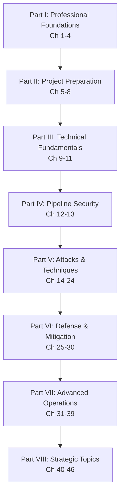
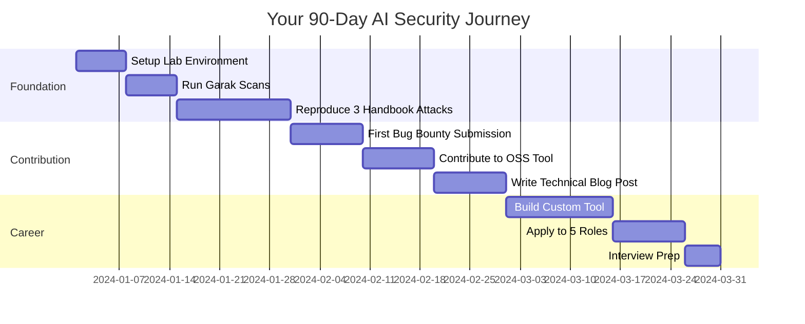

<!--
Chapter: 46
Title: Conclusion and Next Steps
Category: Impact & Society
Difficulty: Beginner
Estimated Time: 15 minutes read time
Hands-on: No
Prerequisites: None
-->

# Chapter 46: Conclusion and Next Steps

  

_You've reached the end of the AI LLM Red Team Handbook. But in security, there is no end—only the next model update._

## 46.1 The Journey So Far

Over 46 chapters, you've mastered the complete spectrum of AI security—from foundational ethics to cutting-edge algorithmic attacks. This handbook represents the culmination of field knowledge, research, and operational experience across the entire AI red teaming discipline.

### The Handbook Map

### What You've Mastered

**Part I: Professional Foundations (Ch 1-4)**

- The fundamentals of AI red teaming and why it's critical
- Ethical frameworks, legal compliance (CFAA, GDPR), and stakeholder communication
- The red teamer's mindset: curiosity, creativity, and systematic thinking
- SOW, Rules of Engagement, and client onboarding procedures

**Part II: Project Preparation (Ch 5-8)**

- Threat modeling methodologies specific to AI systems
- Scoping engagements: in-scope vs out-of-scope for AI components
- Building isolated red team labs with proper safety controls
- Chain of custody and evidence handling for non-deterministic systems

**Part III: Technical Fundamentals (Ch 9-11)**

- LLM architectures: transformers, attention mechanisms, tokenization
- Context windows, generation parameters, and model behavior
- Plugin architectures and API integration points

**Part IV: Pipeline Security (Ch 12-13)**

- RAG system vulnerabilities and retrieval poisoning
- Supply chain attacks: from training data to model distribution
- Vector database security and embedding space manipulation

**Part V: Attacks & Techniques (Ch 14-24)**

- Prompt injection (direct, indirect, multi-turn)
- Data leakage and training data extraction
- Jailbreaking and content filter bypass
- Plugin exploitation and API abuse
- Evasion techniques against detection systems
- Data poisoning and model manipulation
- Model theft and extraction attacks
- Denial of service (token exhaustion, sponge attacks)
- Multimodal attacks (vision, audio, cross-modal)
- Social engineering via AI agents

**Part VI: Defense & Mitigation (Ch 25-30)**

- Adversarial machine learning and robustness
- Supply chain defense and model provenance
- Federated learning security
- Privacy-preserving techniques
- Model inversion defenses
- Backdoor detection and mitigation

**Part VII: Advanced Operations (Ch 31-39)**

- OSINT and reconnaissance for AI systems
- Attack automation frameworks (TAP, GCG)
- Automated red team pipelines
- Defense evasion and anti-detection
- Post-exploitation in AI environments
- Professional reporting and CVSS for AI
- Remediation strategies and patch validation
- Continuous red teaming programs
- Bug bounty hunting for AI vulnerabilities

**Part VIII: Strategic Topics (Ch 40-46)**

- Compliance frameworks (EU AI Act, ISO 42001, NIST AI RMF)
- Industry best practices and defense architectures
- Real-world case studies and failure analysis
- Future of AI red teaming (algorithmic attacks, formal verification)
- Emerging threats (Shadow AI, deepfakes, critical infrastructure)
- Building organizational red team programs
- This conclusion: your path forward

### Your New Capabilities

You can now:

1. **Assess** any AI system for security vulnerabilities across the full attack surface
2. **Execute** sophisticated attacks from prompt injection to model extraction
3. **Automate** red team operations using Python, Garak, PyRIT, and custom tools
4. **Report** findings in compliance-friendly formats (ISO 42001, NIST AI RMF, EU AI Act)
5. **Design** defense-in-depth architectures with input/output guardrails
6. **Build** continuous red team programs with metrics and automation
7. **Navigate** the legal and ethical landscape of AI security testing
8. **Hunt** high-value bugs in bounty programs with proven methodologies

---

## 46.2 Staying Current in a Rapidly Evolving Field

AI security changes faster than any other domain. New models drop monthly, new attacks weekly, new defenses daily. Here's your strategy to stay ahead.

### Daily Engagement (5-10 minutes)

#### Twitter/X Accounts to Follow

- @AIatMeta - Meta AI research announcements
- @OpenAI - Model releases and safety research
- @AnthropicAI - Constitutional AI and alignment research
- @GoogleDeepMind - Cutting-edge ML security
- @simonw - AI engineering and security insights
- @goodside - Creative jailbreaks and prompt research
- @mmitchell_ai - AI ethics and responsible development
- @random_walker - Privacy and AI policy

#### Security News Aggregators

- [AI Incident Database](https://incidentdatabase.ai) - Real-world AI failures
- [LLM Security News](https://llmsecurity.net) - Curated security updates
- [Hacker News (AI)](https://news.ycombinator.com/newest?q=ai) - Community discussions

### Weekly Deep Dives (30-60 minutes)

#### ArXiv Preprints

- [cs.CL (Computation and Language)](https://arxiv.org/list/cs.CL/recent) - New LLM research
- [cs.CR (Cryptography and Security)](https://arxiv.org/list/cs.CR/recent) - Security papers
- [cs.LG (Machine Learning)](https://arxiv.org/list/cs.LG/recent) - ML security

#### Security Blogs

- [Trail of Bits Blog](https://blog.trailofbits.com/) - Advanced security research
- [NCC Group Research](https://research.nccgroup.com/) - AI pentesting
- [Anthropic Research](https://www.anthropic.com/research) - Alignment and safety
- [OpenAI Research](https://openai.com/research) - Red team reports in system cards
- [HiddenLayer Blog](https://hiddenlayer.com/research/) - ML supply chain security

#### Podcasts

- "Latent Space" - AI engineering and security
- "Practical AI" - Applied ML and deployment challenges
- "Security Now" (AI segments) - Broader security context

### Monthly Learning (2-4 hours)

#### Conference Recordings

- DEF CON AI Village ([YouTube](https://www.youtube.com/@DEFCONConference))
- Black Hat AI Security Summit
- NeurIPS Red Teaming Competition
- ICLR Workshop on Secure and Trustworthy ML
- USENIX Security (ML Security Track)

#### Technical Deep Reads

- New model "System Cards" (GPT-4, Claude 3, Gemini) - Read the red team appendix
- OWASP Top 10 for LLM Applications updates
- MITRE ATLAS framework additions
- New CVEs in ML frameworks (PyTorch, TensorFlow, HuggingFace)

#### Hands-On Practice

- [Gandalf (Lakera)](https://gandalf.lakera.ai/) - Prompt injection challenges
- [HackThePrompt](https://hacktheprompt.com/) - Jailbreaking CTF
- [Crucible (AI Village)](https://crucible.dreadnode.io/) - Red team scenarios
- Kaggle AI Security Competitions (when available)

### Certifications and Formal Training

#### Relevant Certifications

- **OSCP (Offensive Security Certified Professional)** - Foundational pentesting + AI augmentation
- **GIAC (GXPN, GWAPT)** - Advanced exploitation skills applicable to AI
- **Cloud (AWS/Azure/GCP ML Specialty)** - Understanding AI deployment infrastructure
- **Custom**: Several organizations (SANS, etc.) are developing AI-specific security certs - watch for these in 2025-2026

#### University Programs

- Stanford CS 329S (ML Systems Security) - Free online materials
- UC Berkeley CS 294 (AI Security) - Public lectures
- Carnegie Mellon INI course on Adversarial ML

### Community Engagement

#### Discord Servers

- AI Safety - General AI alignment and security
- HuggingFace - ML engineering and model security
- MLSecOps - ML security operations

#### Slack Communities

- OWASP AI Security & Privacy Slack
- AI Village (DEF CON)

#### GitHub Monitoring

- Watch repositories: `garak-ai/garak`, `Azure/PyRIT`, `NVIDIA/NeMo-Guardrails`
- Follow security researchers publishing LLM attack tools

---

## 46.3 Contributing to the Handbook

This handbook is open source and living. Your contributions make it better.

### How to Contribute

**Repository:** [github.com/Shiva108/ai-llm-red-team-handbook](https://github.com/Shiva108/ai-llm-red-team-handbook)

#### Contribution Types

1. **Bug Fixes & Typos**

   - Fork the repo
   - Fix the issue
   - Submit PR with clear description

2. **New Attack Techniques**

   - Follow Chapter Template format (`docs/templates/Chapter_Template.md`)
   - Include working code examples
   - Provide 3+ research citations
   - Add to appropriate Part in README

3. **Tool Integrations**

   - Add to Appendix C with installation instructions
   - Provide quick-start example
   - Link to official documentation

4. **Case Studies**

   - Use real-world incidents (anonymized if needed)
   - Include timeline, technical details, lessons learned
   - Can be added to Chapter 42 or as standalone in `case_studies/`

5. **Translations**
   - Contact maintainers first to coordinate
   - Maintain technical accuracy
   - Keep code examples in English with translated comments

#### Quality Standards

- All code must be tested and working
- Citations required for claims
- Follow existing markdown style
- Pass `markdownlint` checks
- No plagiarism - original work or properly attributed

---

## 46.4 Career Pathways in AI Security

AI security is one of the highest-growth career tracks in cybersecurity. Here's your roadmap.

### Job Titles and Roles

#### Entry Level ($80k-$120k)

- Junior AI Security Engineer
- ML Security Analyst
- AI Red Team Associate
- LLM Security Researcher (Junior)

#### Mid-Level ($120k-$180k)

- AI Security Engineer
- Senior ML Security Researcher
- AI Red Team Lead
- Prompt Security Specialist
- AI Safety Engineer

#### Senior/Staff ($180k-$300k+)

- Principal AI Security Architect
- Director of AI Red Teaming
- Head of AI Safety
- AI Security Consultant (Independent)
- Bug Bounty Professional (AI Specialist)

#### FAANG Levels

- L4/L5 (Mid): $150k-$250k total comp
- L6/L7 (Senior/Staff): $300k-$500k+ total comp
- L8+ (Principal): $500k-$1M+ total comp

### Building Your Portfolio

#### Must-Haves

1. **Public GitHub Repository**

   - Custom AI security tools (scanner, fuzzer, analyzer)
   - Automated red team scripts
   - Contributions to Garak, PyRIT, or similar projects
   - Well-documented, production-quality code

2. **Technical Writeups**

   - Medium/personal blog with deep technical analysis
   - 3-5 detailed posts on:
     - Novel attack technique you discovered
     - Tool you built and how it works
     - Case study of interesting vulnerability
     - Defense architecture you implemented
   - Clear writing, code snippets, diagrams

3. **Bounties or CVEs**

   - Even 1-2 valid reports show real-world skill
   - Document methodology in writeups (after disclosure period)
   - OpenAI, Google, Microsoft most prestigious

4. **Conference Talks or CTF Wins**
   - DEF CON AI Village lightning talk
   - Local BSides presentation
   - Top 10 finish in Gandalf or Crucible CTF
   - HackThePrompt.com leaderboard mention

#### Nice-to-Haves

- Research paper (even if just arXiv preprint)
- YouTube channel with technical tutorials
- Open source tool with 100+ GitHub stars
- Active participation in OWASP AI Security group

### Interview Preparation

#### Common Technical Questions

1. **Architecture:** "Explain how a RAG system works and identify 3 attack vectors."
2. **Hands-On:** "Here's a system prompt. Show me 3 ways to leak it."
3. **Tooling:** "Walk me through how you'd use Burp Suite to test an LLM API."
4. **Compliance:** "How would you map a prompt injection finding to ISO 42001 controls?"
5. **Defense:** "Design a defense-in-depth architecture for a customer support chatbot."
6. **Scenario:** "You found a training data extraction vulnerability. Walk me through responsible disclosure."

#### Behavioral Questions

- "Tell me about a time you found a critical vulnerability. How did you report it?"
- "How do you stay current in AI security given the pace of change?"
- "Describe a disagreement with a client/team about security priorities. How did you resolve it?"

#### Reverse Interview Questions (Ask Them)

- "What does your AI red team program look like today? What are you building toward?"
- "How much of my time would be manual testing vs tool development vs research?"
- "What's your approach to responsible disclosure when you find issues in third-party models?"
- "How do you balance 'move fast' engineering culture with security rigor?"

### Salary Negotiation Tips

- Use levels.fyi to research compensation bands
- AI security roles often get 10-20% premium over general AppSec
- Remote roles from FAANG/top startups pay the same globally
- Equity/RSUs matter - $50k base difference meaningless if equity 3x larger
- Negotiate based on competing offers, not "what you need"

---

## 46.5 The 30/60/90 Day Action Plan

From handbook reader to practicing AI red teamer in 90 days.

### Days 1-30: Foundation Building

#### Week 1: Lab Setup

- [ ] Set up isolated Ubuntu VM or Docker environment
- [ ] Install Python 3.10+, `transformers`, `torch`
- [ ] Clone and install Garak: `pip install garak`
- [ ] Deploy local Llama-3-8B via Ollama
- [ ] Test Burp Suite with LLM API proxy

#### Week 2: Automated Scanning

- [ ] Run full Garak scan against local model
- [ ] Analyze results, identify top 3 vulnerabilities
- [ ] Manually verify each finding
- [ ] Document findings in structured report

#### Week 3-4: Hands-On Attacks

- [ ] Reproduce **Prompt Injection** (Chapter 14) against ChatGPT-like interface
- [ ] Reproduce **RAG Poisoning** (Chapter 12) in local RAG setup
- [ ] Reproduce **Jailbreak** (Chapter 16) using DAN or similar technique
- [ ] Create GitHub repo documenting all 3 attacks with code

**Deliverable:** GitHub repository: `my-ai-security-lab` with working exploit code

### Days 31-60: Real-World Application

#### Week 5-6: Bug Bounty

- [ ] Read HackerOne/Bugcrowd policies for OpenAI, Google, Microsoft
- [ ] Identify in-scope AI feature (ChatGPT plugins, Gemini Extensions, Copilot)
- [ ] Test for prompt injection, data leakage, authentication bypass
- [ ] Submit first report (even if it gets closed as duplicate - learning experience)

#### Week 7: Open Source Contribution

- [ ] Pick tool: Garak, PyRIT, or NeMo-Guardrails
- [ ] Find "good first issue" on GitHub
- [ ] Submit PR (could be documentation, new probe, bug fix)
- [ ] Engage with maintainers on review feedback

#### Week 8: Content Creation

- [ ] Write 1,500+ word blog post on Medium/personal blog
- [ ] Topic: "How I Found My First AI Vulnerability" or "Building a Custom LLM Fuzzer"
- [ ] Include code, screenshots, diagrams
- [ ] Share on Twitter, LinkedIn, relevant Discord servers

**Deliverable:** Published writeup + at least 1 bug bounty submission

### Days 61-90: Career Launch

#### Week 9-10: Tool Development

- [ ] Build custom tool addressing gap you've noticed:
  - Nuclei templates for AI endpoints
  - Automated jailbreak generator using GCG
  - Compliance mapper (findings → ISO 42001 controls)
  - RAG security scanner
- [ ] Publish to GitHub with README, usage examples, tests
- [ ] Add to portfolio as "Featured Project"

#### Week 11: Job Applications

- [ ] Update LinkedIn: "AI Security Engineer" as target role
- [ ] Update resume: Highlight handbook, projects, contributions
- [ ] Apply to 5 companies:
  - 2 FAANG (Google, Microsoft, Meta AI safety teams)
  - 2 AI startups (OpenAI, Anthropic, Hugging Face, Cohere)
  - 1 security consultancy (Trail of Bits, NCC Group, Bishop Fox)

#### Week 12: Interview Preparation

- [ ] Practice technical questions from Section 46.4
- [ ] Prepare 3 "project deep dive" stories (tool you built, attack you found, defense you designed)
- [ ] Do mock interviews with peers or use [interviewing.io](https://interviewing.io)
- [ ] Review handbook chapters on topics you're weakest in

#### Week 13: Networking

- [ ] Attend 1 virtual conference or meetup (DEF CON Groups, AI Safety Summit online)
- [ ] Connect with 10 AI security professionals on LinkedIn
- [ ] Send informational interview requests to 3 practitioners
- [ ] Join and actively participate in 1-2 relevant Discord/Slack communities

**Deliverable:** 5 job applications submitted + active interviews or next round scheduled

---

## 46.6 The Ethical Red Teamer's Oath

As you enter the field of AI security, consider adopting this professional code:

> **I pledge to:**
>
> **Test Responsibly**
>
> - Only test systems I am explicitly authorized to test
> - Respect the Rules of Engagement in every engagement
> - Stop immediately if I risk causing harm or accessing live customer data
>
> **Report Honorably**
>
> - Disclose vulnerabilities responsibly through proper channels
> - Never weaponize findings or sell them to malicious actors
> - Give vendors reasonable time to patch before public disclosure
>
> **Protect Privacy**
>
> - Treat all data encountered during testing as confidential
> - Never exfiltrate, store, or share PII beyond proof-of-concept
> - Securely delete evidence after the engagement concludes
>
> **Advance the Field**
>
> - Share knowledge through responsible writeups, talks, and open source
> - Mentor newcomers and contribute to community resources
> - Advocate for security and safety in AI development
>
> **Stay Ethical**
>
> - Decline work that serves surveillance, oppression, or harm
> - Question whether my actions serve the greater good
> - Remember that AI systems impact real people's lives
>
> **I understand that with the power to break AI systems comes the responsibility to make them safer.**

---

## Appendix A: Comprehensive Glossary

| Term                                                  | Definition                                                                                                            |
| :---------------------------------------------------- | :-------------------------------------------------------------------------------------------------------------------- |
| **Adversarial Example**                               | An input specifically crafted to cause misclassification or unexpected model behavior.                                |
| **Alignment**                                         | The process of ensuring an AI system's goals match human values and intentions (via RLHF, Constitutional AI, etc.).   |
| **API Key Leakage**                                   | Unintentional exposure of authentication credentials through model outputs or logs.                                   |
| **Attention Mechanism**                               | The core component of transformers that determines which tokens the model "pays attention to" when generating output. |
| **Backdoor Attack**                                   | Poisoning training data or model weights to create a hidden trigger that activates malicious behavior.                |
| **Chain of Thought (CoT)**                            | Prompting technique where the model shows its reasoning step-by-step, often improving accuracy but exposing logic.    |
| **Constitutional AI**                                 | Anthropic's method of training models to follow ethical principles defined in a "constitution."                       |
| **Context Window**                                    | The maximum number of tokens (input + output) the model can process in a single interaction.                          |
| **Data Poisoning**                                    | Injecting malicious examples into training data to corrupt model behavior.                                            |
| **Embedding**                                         | A dense vector representation of text/image/audio in high-dimensional space.                                          |
| **Few-Shot Learning**                                 | Providing a few examples in the prompt to guide the model's behavior without fine-tuning.                             |
| **Fine-Tuning**                                       | Additional training on a specific dataset to specialize a pre-trained model.                                          |
| **Function Calling (Tool Use)**                       | The ability of an LLM to generate structured API calls to invoke external tools.                                      |
| **Gradient Descent**                                  | The optimization algorithm used to train neural networks by minimizing loss.                                          |
| **Guardrails**                                        | Input/output filters and safety mechanisms designed to prevent harmful model behavior.                                |
| **Hallucination**                                     | A confident but factually incorrect, fabricated, or nonsensical response.                                             |
| **Indirect Prompt Injection**                         | Injecting malicious instructions via external data sources (emails, web pages, documents) that the model reads.       |
| **Inference**                                         | The process of using a trained model to generate predictions or outputs.                                              |
| **Jailbreak**                                         | A prompt specifically designed to bypass safety training and content filters.                                         |
| **Logits**                                            | Raw output scores from the model before applying softmax to convert to probabilities.                                 |
| **Mechanistic Interpretability**                      | Research field studying the internal representations and activations of neural networks to understand how they work.  |
| **Model Card**                                        | Transparency document describing a model's intended use, training data, limitations, and evaluation results.          |
| **Model Extraction**                                  | Stealing a model's functionality by querying it repeatedly and training a surrogate.                                  |
| **Model Inversion**                                   | Recovering training data by analyzing model weights or outputs.                                                       |
| **Perplexity**                                        | A measure of how "surprised" a model is by a sequence; lower is better (more confident).                              |
| **Prompt Injection**                                  | Inserting malicious instructions that override or manipulate the System Prompt.                                       |
| **RAG (Retrieval-Augmented Generation)**              | Enhancing a model's knowledge by retrieving relevant documents from an external database before generation.           |
| **RLHF (Reinforcement Learning from Human Feedback)** | Training technique where human raters score outputs to align model behavior with preferences.                         |
| **Sponge Attack**                                     | Input crafted to maximize computational cost, causing DoS through resource exhaustion.                                |
| **System Prompt**                                     | The initial hidden instructions given to the model by the developer (e.g., "You are a helpful assistant").            |
| **Temperature**                                       | Sampling parameter controlling randomness. High (1.0+) = creative/unstable; Low (0.0-0.3) = deterministic /focused.   |
| **Token**                                             | The basic unit of text the model processes (roughly 0.75 words in English).                                           |
| **Tokenization**                                      | The process of converting text into tokens using algorithms like BPE (Byte-Pair Encoding).                            |
| **Top-P (Nucleus Sampling)**                          | Sampling method that considers tokens with cumulative probability mass P.                                             |
| **Vector Database**                                   | Database optimized for storing and searching high-dimensional embeddings (used in RAG).                               |
| **Weight Poisoning**                                  | Directly manipulating model parameters to introduce backdoors or degrade performance.                                 |
| **Zero-Shot Learning**                                | Asking the model to perform a task without providing any examples in the prompt.                                      |

---

## Appendix B: The Red Teamer's Library (Essential Papers)

### Foundational Research

1. **"Attention Is All You Need"** (Vaswani et al., 2017)  
   [arXiv:1706.03762](https://arxiv.org/abs/1706.03762)  
   _The transformer paper. Understand the architecture you're attacking._

2. **"Language Models are Few-Shot Learners" (GPT-3)** (Brown et al., 2020)  
   [arXiv:2005.14165](https://arxiv.org/abs/2005.14165)  
   _Demonstrated emergent capabilities and in-context learning._

3. **"BERT: Pre-training of Deep Bidirectional Transformers"** (Devlin et al., 2018)  
   [arXiv:1810.04805](https://arxiv.org/abs/1810.04805)  
   _Bidirectional understanding and the foundation for many NLP attacks._

4. **"Training language models to follow instructions with human feedback"** (Ouyang et al., 2022)  
   [arXiv:2203.02155](https://arxiv.org/abs/2203.02155)  
   _InstructGPT / ChatGPT - how RLHF creates alignment (and attack surface)._

5. **"Constitutional AI: Harmlessness from AI Feedback"** (Bai et al., 2022)  
   [arXiv:2212.08073](https://arxiv.org/abs/2212.08073)  
   _Anthropic's alternative to RLHF and how constitutions can be attacked._

### Attack Techniques

1. **"Universal and Transferable Adversarial Attacks on Aligned Language Models" (GCG)** (Zou et al., 2023)  
   [arXiv:2307.15043](https://arxiv.org/abs/2307.15043)  
   _The GCG algorithm - gradient-based jailbreak optimization._

2. **"Not what you've signed up for: Compromising Real-World LLM-Integrated Applications with Indirect Prompt Injection"** (Greshake et al., 2023)  
   [arXiv:2302.12173](https://arxiv.org/abs/2302.12173)  
   _The indirect injection paper that changed how we think about RAG security._

3. **"Extracting Training Data from Large Language Models"** (Carlini et al., 2021)  
   [arXiv:2012.07805](https://arxiv.org/abs/2012.07805)  
   _First demonstrated extraction of memorized training data from GPT-2._

4. **"Stealing Part of a Production Language Model"** (Carlini et al., 2024)  
   [arXiv:2403.06634](https://arxiv.org/abs/2403.06634)  
   _Model extraction from ChatGPT showing practical theft techniques._

5. **"Jailbroken: How Does LLM Safety Training Fail?"** (Wei et al., 2023)  
   [arXiv:2307.02483](https://arxiv.org/abs/2307.02483)  
   _Taxonomy of jailbreak techniques and why safety training fails._

6. **"Poisoning Web-Scale Training Datasets is Practical"** (Carlini et al., 2023)  
   [arXiv:2302.10149](https://arxiv.org/abs/2302.10149)  
   _Demonstrated how to poison LAION-400M at scale for $60._

7. **"Prompt Injection attack against LLM-integrated Applications"** (Liu et al., 2023)  
   [arXiv:2306.05499](https://arxiv.org/abs/2306.05499)  
   _Comprehensive study of injection vectors in production systems._

### Defense and Robustness

1. **"Red Teaming Language Models to Reduce Harms: Methods, Scaling Behaviors, and Lessons Learned"** (Ganguli et al., Anthropic, 2022)  
   [arXiv:2209.07858](https://arxiv.org/abs/2209.07858)  
   _Methodology for responsible red teaming at scale._

2. **"Defending Against Backdoor Attacks in Natural Language Generation"** (Yan et al., 2023)  
   [arXiv:2106.01022](https://arxiv.org/abs/2106.01022)  
   _Detection and mitigation strategies for trojan attacks._

3. **"Certified Robustness to Adversarial Examples with Differential Privacy"** (Lecuyer et al., 2019)  
   [arXiv:1802.03471](https://arxiv.org/abs/1802.03471)  
   _Using DP for provable defenses._

4. **"Holistic Safety for Large Language Models"** (Qu et al., 2024)  
   [arXiv:2311.11824](https://arxiv.org/abs/2311.11824)  
   _Comprehensive framework for LLM safety evaluation._

5. **"NeMo Guardrails: A Toolkit for Controllable and Safe LLM Applications"** (NVIDIA, 2023)  
   Technical Report - [GitHub](https://github.com/NVIDIA/NeMo-Guardrails)  
   _Production defense architecture and implementation._

### Advanced Topics

1. **"Sleeper Agents: Training Deceptive LLMs that Persist Through Safety Training"** (Hubinger et al., 2024)  
   [arXiv:2401.05566](https://arxiv.org/abs/2401.05566)  
   _Backdoors that survive RLHF - implications for alignment._

2. **"Tree of Attacks: Jailbreaking Black-Box LLMs Automatically"** (Mehrotra et al., 2023)  
   [arXiv:2312.02119](https://arxiv.org/abs/2312.02119)  
   _TAP algorithm - automated adversarial prompt generation._

3. **"The Adversarial Robustness of LLMs: A Survey"** (Wang et al., 2024)  
   [arXiv:2407.12321](https://arxiv.org/abs/2407.12321)  
   _Comprehensive survey of attack and defense landscape._

### Compliance and Standards

1. **"Model Cards for Model Reporting"** (Mitchell et al., 2019)  
   [arXiv:1810.03993](https://arxiv.org/abs/1810.03993)  
   _Transparency framework - basis for compliance documentation._

2. **"Datasheets for Datasets"** (Gebru et al., 2021)  
   [arXiv:1803.09010](https://arxiv.org/abs/1803.09010)  
   _Data documentation for compliance and reproducibility._

3. **"NIST AI Risk Management Framework"** (NIST, 2023)  
   Technical Standard - [nist.gov/itl/ai-risk-management-framework](https://www.nist.gov/itl/ai-risk-management-framework)  
   _Official guidance for AI risk assessment._

---

## Appendix C: Comprehensive Tool Repository

### Vulnerability Scanners

| Tool           | Install                                                                | Use Case                                   | Quick Start                                                  |
| :------------- | :--------------------------------------------------------------------- | :----------------------------------------- | :----------------------------------------------------------- |
| **Garak**      | `pip install garak`                                                    | Automated LLM vulnerability scanning       | `garak --model_name openai --model_type openai --probes all` |
| **PyRIT**      | `pip install pyrit`                                                    | Microsoft's Red Team automation framework  | `python -m pyrit.orchestrator --target chatgpt`              |
| **Inspect**    | [inspect-ai.org](https://inspect.ai-safety-institute.org.uk/)          | UK AI Safety Institute evaluation platform | `pip install inspect-ai; inspect eval`                       |
| **PromptFuzz** | [GitHub:microsoft/promptfuzz](https://github.com/microsoft/PromptFlow) | Prompt fuzzing and testing                 | Clone repo, follow README                                    |

### Traffic Analysis and Proxies

| Tool           | Install                                  | Use Case                           | Quick Start                                 |
| :------------- | :--------------------------------------- | :--------------------------------- | :------------------------------------------ |
| **Burp Suite** | [Download](https://portswigger.net/burp) | Intercept and modify LLM API calls | Configure proxy, install Logger++ extension |
| **mitmproxy**  | `pip install mitmproxy`                  | Programmable MITM for API traffic  | `mitmproxy -s inject_script.py`             |
| **Proxyman**   | [Download](https://proxyman.io/)         | MacOS alternative to Burp          | Install, configure system proxy             |

### Attack Frameworks

| Tool           | Install                                      | Use Case                            | Quick Start                                                     |
| :------------- | :------------------------------------------- | :---------------------------------- | :-------------------------------------------------------------- |
| **TextAttack** | `pip install textattack`                     | Adversarial text generation         | `textattack attack --model bert-base-uncased --dataset ag_news` |
| **ART (IBM)**  | `pip install adversarial-robustness-toolbox` | Multi-framework adversarial attacks | `from art.attacks import FastGradientMethod`                    |
| **CleverHans** | `pip install cleverhans`                     | Classic adversarial ML library      | `from cleverhans.attacks import FastGradientMethod`             |

### Model Analysis and Interpretability

| Tool                | Install                        | Use Case                               | Quick Start                                      |
| :------------------ | :----------------------------- | :------------------------------------- | :----------------------------------------------- |
| **TransformerLens** | `pip install transformer-lens` | Mechanistic interpretability           | `from transformer_lens import HookedTransformer` |
| **Ecco**            | `pip install ecco`             | Explore what activates in transformers | `import ecco; lm = ecco.from_pretrained('gpt2')` |
| **BertViz**         | `pip install bertviz`          | Visualize attention patterns           | `from bertviz import head_view`                  |

### Defense and Guardrails

| Tool                | Install                         | Use Case                              | Quick Start                                    |
| :------------------ | :------------------------------ | :------------------------------------ | :--------------------------------------------- |
| **NeMo Guardrails** | `pip install nemoguardrails`    | NVIDIA's LLM control framework        | `nemoguardrails --config config.yml`           |
| **Guardrails AI**   | `pip install guardrails-ai`     | Input/output validation               | `from guardrails import Guard`                 |
| **Presidio**        | `pip install presidio-analyzer` | Microsoft PII detection and redaction | `from presidio_analyzer import AnalyzerEngine` |
| **LiteLLM**         | `pip install litellm`           | Unified LLM API with filtering        | `from litellm import completion`               |

### Specialized Reconnaissance

| Tool          | Install                                                                       | Use Case                             | Quick Start                              |
| :------------ | :---------------------------------------------------------------------------- | :----------------------------------- | :--------------------------------------- |
| **Nuclei**    | `go install -v github.com/projectdiscovery/nuclei/v2/cmd/nuclei@latest`       | Vulnerability scanner (AI templates) | `nuclei -t ai-templates/ -l targets.txt` |
| **httpx**     | `go install -v github.com/projectdiscovery/httpx/cmd/httpx@latest`            | HTTP probing to find AI endpoints    | `cat domains.txt \| httpx -td`           |
| **Subfinder** | `go install -v github.com/projectdiscovery/subfinder/v2/cmd/subfinder@latest` | Subdomain enumeration                | `subfinder -d target.com`                |

### Local Model Deployment (for testing)

| Tool                      | Install                                                                                      | Use Case                   | Quick Start                                                           |
| :------------------------ | :------------------------------------------------------------------------------------------- | :------------------------- | :-------------------------------------------------------------------- |
| **Ollama**                | [ollama.ai/download](https://ollama.ai/download)                                             | Run Llama/Mistral locally  | `ollama run llama3`                                                   |
| **LM Studio**             | [lmstudio.ai](https://lmstudio.ai/)                                                          | GUI for local models       | Download, load model, start server                                    |
| **vLLM**                  | `pip install vllm`                                                                           | High-performance inference | `python -m vllm.entrypoints.api_server --model meta-llama/Llama-2-7b` |
| **Text Generation WebUI** | [GitHub:oobabooga/text-generation-webui](https://github.com/oobabooga/text-generation-webui) | Gradio UI for testing      | Clone, install, run `python server.py`                                |

### Monitoring and Logging

| Tool                 | Install                                                       | Use Case                   | Quick Start                             |
| :------------------- | :------------------------------------------------------------ | :------------------------- | :-------------------------------------- |
| **LangSmith**        | Sign up at [smith.langchain.com](https://smith.langchain.com) | LangChain observability    | Set `LANGCHAIN_TRACING_V2=true` env var |
| **Weights & Biases** | `pip install wandb`                                           | ML experiment tracking     | `wandb login; wandb init`               |
| **MLflow**           | `pip install mlflow`                                          | Model lifecycle management | `mlflow ui`                             |

---

## Appendix D: Quick Reference Cheat Sheet

### OWASP Top 10 for LLM Applications

1. **LLM01: Prompt Injection** - Manipulating LLM via crafted inputs
2. **LLM02: Insecure Output Handling** - Insufficient output validation leading to XSS/injection
3. **LLM03: Training Data Poisoning** - Compromising training data to create backdoors
4. **LLM04: Model Denial of Service** - Resource exhaustion through expensive inputs
5. **LLM05: Supply Chain Vulnerabilities** - Compromised models, datasets, or frameworks
6. **LLM06: Sensitive Information Disclosure** - Leaking PII through model outputs
7. **LLM07: Insecure Plugin Design** - Flaws in LLM extensions and tool integration
8. **LLM08: Excessive Agency** - Over-privileged LLM actions without oversight
9. **LLM09: Overreliance** - Trusting LLM outputs without verification
10. **LLM10: Model Theft** - Unauthorized extraction or replication of models

### Top 5 Attack Patterns (Critical)

1. **Indirect Prompt Injection via RAG**

   - Poison documents in vector database
   - Wait for retrieval to inject malicious instructions
   - Model executes attacker's commands

2. **Function-Calling Privilege Escalation**

   - Trick LLM into calling admin-only functions
   - Bypass intended access control logic
   - Achieve unauthorized actions

3. **Training Data Extraction**

   - Craft prompts that trigger memorization
   - Extract PII, secrets, proprietary data
   - Verify with divergence metrics

4. **Multi-Turn Jailbreak**

   - Build up context over multiple exchanges
   - Gradually erode safety alignment
   - Finally request harmful content

5. **Supply Chain Pickle RCE**
   - Craft malicious PyTorch model file
   - Upload to model hub / send to victim
   - Arbitrary code execution on `torch.load()`

### Defense-in-Depth Checklist

#### Input Layer

- [ ] Unicode normalization (NFKC)
- [ ] Invisible character stripping
- [ ] Prompt injection detection classifier
- [ ] Rate limiting by tokens (not requests)
- [ ] API key rotation and scoping

#### Model Layer

- [ ] Updated model with latest safety training
- [ ] System prompt hardening (delimiters, explicit rules)
- [ ] Temperature/top-p constraints for determinism
- [ ] Function-calling ACLs (principle of least privilege)

#### Output Layer

- [ ] PII redaction (Presidio or regex)
- [ ] Harmful content filtering
- [ ] Citation/grounding enforcement
- [ ] Output length limits

#### Infrastructure

- [ ] Model signing and provenance tracking
- [ ] Dependency pinning (requirements.txt with hashes)
- [ ] Secrets management (never in code)
- [ ] Comprehensive logging (input/output/metadata)
- [ ] Isolated execution environment for code generation

#### Monitoring

- [ ] Real-time safety violation alerts
- [ ] Token velocity dashboards
- [ ] Anomaly detection on prompt patterns
- [ ] Regular penetration testing (quarterly)
- [ ] Bug bounty program

### AI Security Incident Response

1. **Detect**: Alert triggered (PII leak, jailbreak detected, unusual token volume)
2. **Contain**: Circuit breaker activates, feature flagged off, isolate affected users
3. **Analyze**: Pull logs, reproduce attack, assess scope of compromise
4. **Eradicate**: Patch vulnerability, update guardrails, retrain if necessary
5. **Recover**: Gradual rollout with enhanced monitoring, validate fix
6. **Learn**: Post-mortem, update runbooks, add regression test

---

## Appendix E: Chapter Cross-Reference Matrix

| Attack/Topic            | Primary Chapter | Related Chapters | Tools Referenced                  |
| :---------------------- | :-------------- | :--------------- | :-------------------------------- |
| **Prompt Injection**    | 14              | 11, 18, 21       | Garak, PyRIT, TextAttack          |
| **RAG Security**        | 12              | 13, 18           | ChromaDB, Pinecone, Weaviate      |
| **Jailbreaking**        | 16              | 14, 19, 43       | Gandalf, HackThePrompt            |
| **Model Theft**         | 20              | 13, 25           | ART, CleverHans                   |
| **Data Poisoning**      | 19              | 13, 26           | TextAttack, ART                   |
| **Plugin Exploitation** | 17              | 11, 23           | Burp Suite, Nuclei                |
| **Model DoS**           | 21              | 10, 41           | Garak (sponge probes)             |
| **Multimodal Attacks**  | 22              | 9, 44            | Adversarial Robustness Toolbox    |
| **Social Engineering**  | 23              | 2, 3             | (Human tactics)                   |
| **Adversarial ML**      | 25              | 9, 18, 20        | CleverHans, ART, TextAttack       |
| **Supply Chain**        | 13, 26          | 7, 44            | Picklescan, Sigstore              |
| **Federated Learning**  | 27              | 25, 29           | PySyft, Flower                    |
| **Privacy Attacks**     | 28              | 14, 15, 29       | Membership Inference libraries    |
| **Model Inversion**     | 29              | 20, 28           | Research implementations          |
| **Backdoors**           | 30              | 13, 19, 43       | TrojanNN, BadNets replicas        |
| **OSINT Recon**         | 31              | 6, 39            | Shodan, Censys, theHarvester      |
| **Attack Automation**   | 32              | 38, 43           | Garak, PyRIT, Custom scripts      |
| **Defense Evasion**     | 34              | 14, 41           | Encoding tools, obfuscation       |
| **Reporting**           | 36              | 2, 40            | Markdown, LaTeX, CVSS calculators |
| **Compliance**          | 40              | 2, 5, 41         | ISO 42001 templates, NIST RMF     |
| **Bug Bounties**        | 39              | 14, 17, 36       | Burp Suite, Nuclei, Garak         |
| **Building Programs**   | 45              | 3, 38, 40        | (Organizational tools)            |

---

## Final Words

You've completed a journey through 46 chapters, over 1,000 pages, and the entire landscape of AI security. From the philosophical foundations of ethics and mindset to the cutting edge of algorithmic attacks and formal verification, you now possess a comprehensive understanding of how AI systems fail—and how to make them safer.

**This is not the end. It's the beginning.**

AI security is the most consequential field in cybersecurity today. The systems you test will make critical decisions: approving loans, diagnosing diseases, controlling autonomous vehicles, summarizing legal contracts, and moderating what billions of people see online. When these systems fail, the consequences are measured not just in dollars, but in lives, liberty, and the fabric of democratic discourse.

**Your role as a Red Teamer is to find the failures before they matter.**

The attacks you've learned—prompt injection, model extraction, RAG poisoning, jailbreaks—are not theoretical exercises. They're being deployed right now, in the wild, by adversaries ranging from curious hobbyists to nation-states. Your job is to think like them, but act in service of defense.

**Remember:**

- Every system you harden makes the world slightly safer
- Every vulnerability you report saves someone from exploitation
- Every tool you build multiplies the effectiveness of defenders
- Every person you mentor creates a network of protection

AI is not slowing down. GPT-5, Llama-4, Gemini-2, Claude-4—each more powerful, each with new capabilities, each with new attack surfaces. The red team never rests, because the models never stop evolving.

**But now you're ready.**

You know how transformers work at the token level. You can fingerprint AI backends, craft gradient-optimized jailbreaks, poison vector databases, and map findings to ISO 42001 controls. You can build tools, hunt bounties, and design compliance programs. You can communicate with executives, negotiate with clients, and mentor junior teammates.

**The handbook may be complete, but your journey is just starting.**

In 90 days, you could have deployed your first custom fuzzer. In 6 months, you could have submitted your first CVE. In a year, you could be leading a red team program at a major AI lab. In 5 years, you could be defining the standards that the next generation of practitioners follows.

**AI is the API to human knowledge. Securing it is the prerequisite for a safe future.**

Go forth. Build things. Break things responsibly. Find the bugs before they become disasters. Share what you learn. And remember that every test you run, every report you write, every system you secure contributes to a world where AI amplifies human potential instead of human vulnerability.

**Welcome to the future. Let's make it secure.**

---

**— The AI LLM Red Team Handbook Team**  
**Version 1.46.154 | Gold Master | January 2026**

**Contribute:** [github.com/Shiva108/ai-llm-red-team-handbook](https://github.com/Shiva108/ai-llm-red-team-handbook)  
**License:** CC BY-SA 4.0
