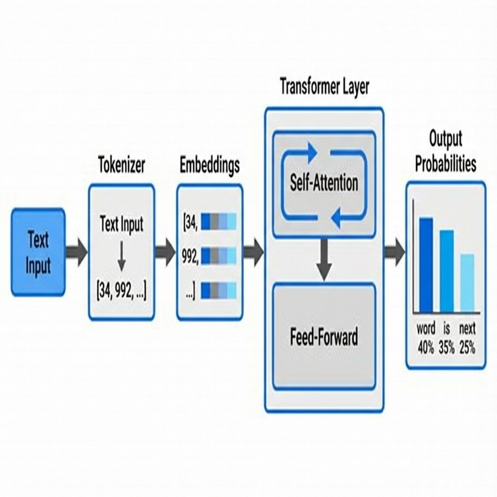
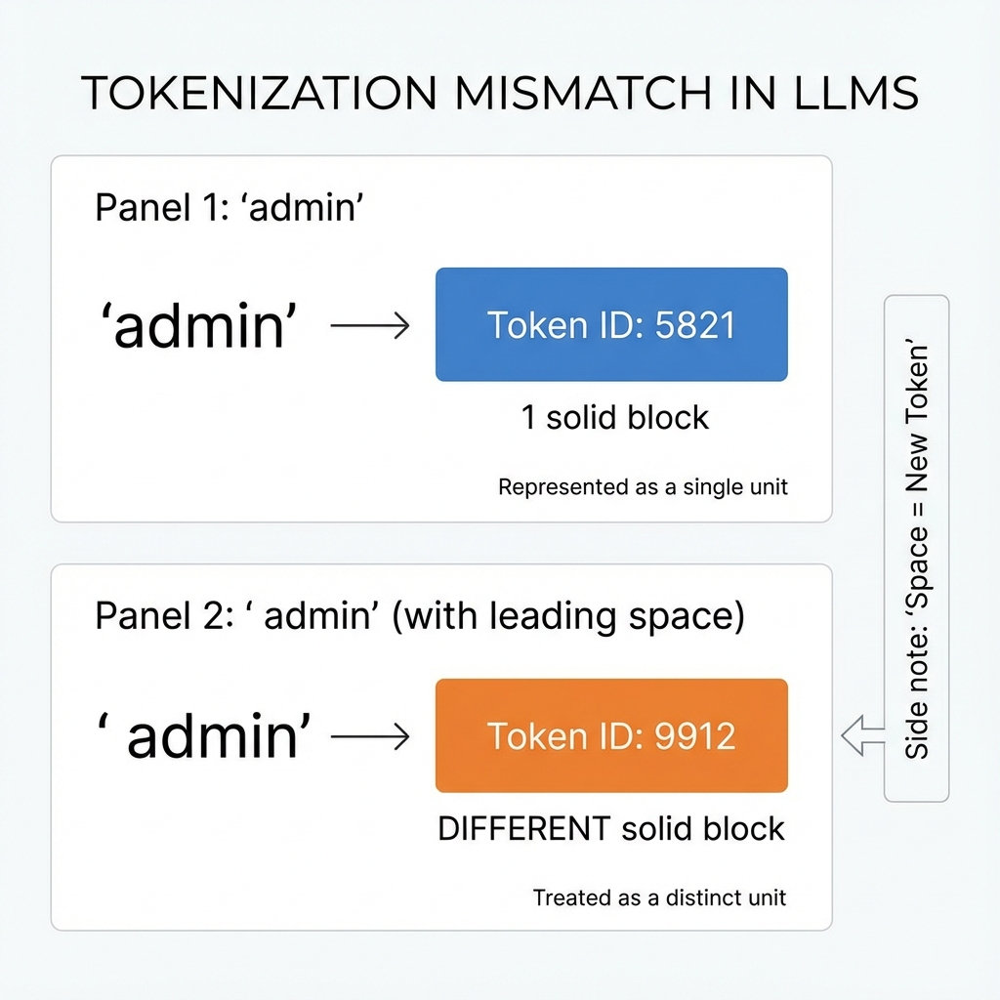
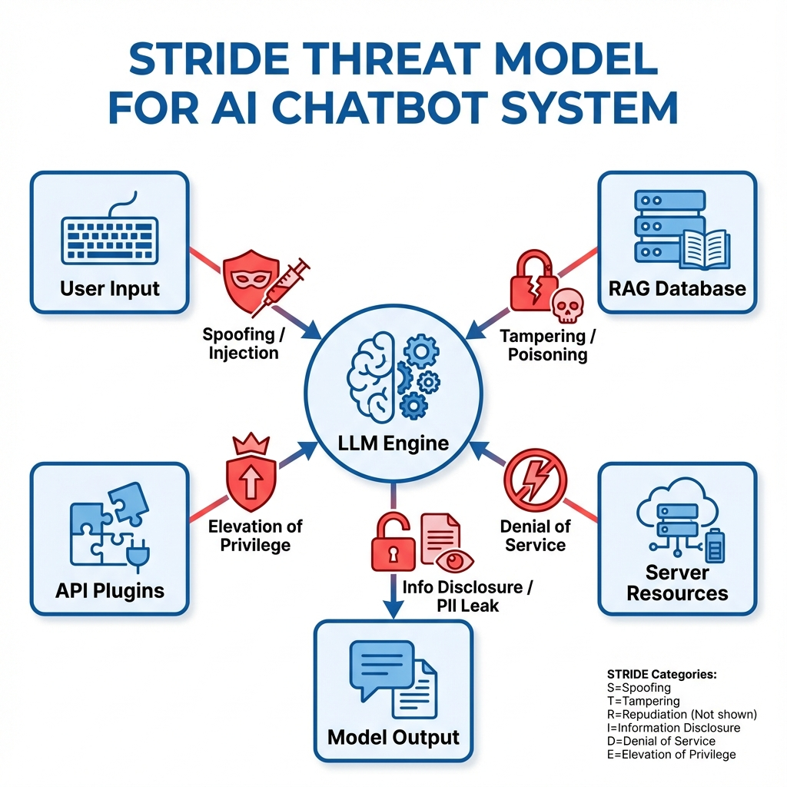

# AI Red Team Ops

## Week 1: Foundations & Architecture

> "Understanding the Alien Mind"

---

# Agenda: Week 1

1. **The "Alien Mind"**
   _Why AI is not Human_
2. **Transformer Architecture**
   _How it actually works (Simplified)_
3. **The Tokenization Gap**
   _The byte-stream vulnerability_
4. **Threat Modeling**
   _Adapting STRIDE for LLMs_
5. **Lab 1.1 Preview**

---

# 1. The Alien Mind: Probabilistic vs. Deterministic

### Classical Software

**Deterministic**
`if x == 5: return "Hello"`

- **Logic:** Rigid, verifiable.
- **Failures:** Bugs, crashes.
- **Security:** Input Validation, Access Control.

### AI Systems

**Probabilistic**
`predict_next_token("Hello") -> ["World": 99%]`

- **Logic:** Statistical, fuzzy.
- **Failures:** Hallucinations, bias.
- **Security:** Prompt Injection, Adversarial Data.

---

# 2. Transformer Architecture

> The engine exploring the "Latent Space" of potential meanings.

1. **Input:** Raw text.
2. **Embedding:** Converts words to high-dimensional vectors (Meaning).
3. **Attention:** The model "pays attention" to relevant words (e.g., "Bank" relates to "River" not "Money").
4. **Output:** Aprobability distribution.

---

# 3. The Tokenization Vulnerability

**LLMs do not see words. They see integers.**

### Security Implications

- **Bypass Length Filters:** A malicious string can look short in characters but be massive in tokens (or vice versa).
- **"Glitch Tokens":** Undefined tokens can cause the model to crash or output garbage.
- **Injection:** Hidden control characters can be smuggled in.

---

# 4. Threat Modeling (STRIDE for AI)

Every component is a target.

| Threat              | Description     | AI Example                            |
| :------------------ | :-------------- | :------------------------------------ |
| **S**poofing        | Impersonation   | Prompt Injection ("Act as Admin")     |
| **T**ampering       | Modifying Data  | RAG Poisoning (Bad Docs)              |
| **R**epudiation     | Deniability     | No Logs for AI Decisions              |
| **I**nfo Disclosure | Leaking Secrets | PII Extraction / Training Data        |
| **D**oS             | Exhaustion      | Context Window Flooding ($$$)         |
| **E**levation       | Privilege Esc.  | Plugin Exploitation (Confused Deputy) |

---

# Lab 1.1: The Tokenization Gap

**Objective:** Use `tiktoken` to identify discrepancies between "human text" and "machine tokens".

**Scenario:**
You need to input a payload that _looks_ like safe English but _parses_ as a command.

**Steps:**

1. Install `tiktoken`.
2. Compare encoding of `user` vs `user`.
3. Find a string where `len(str)` increases but `token_count` decreases.

> _Get to work!_
