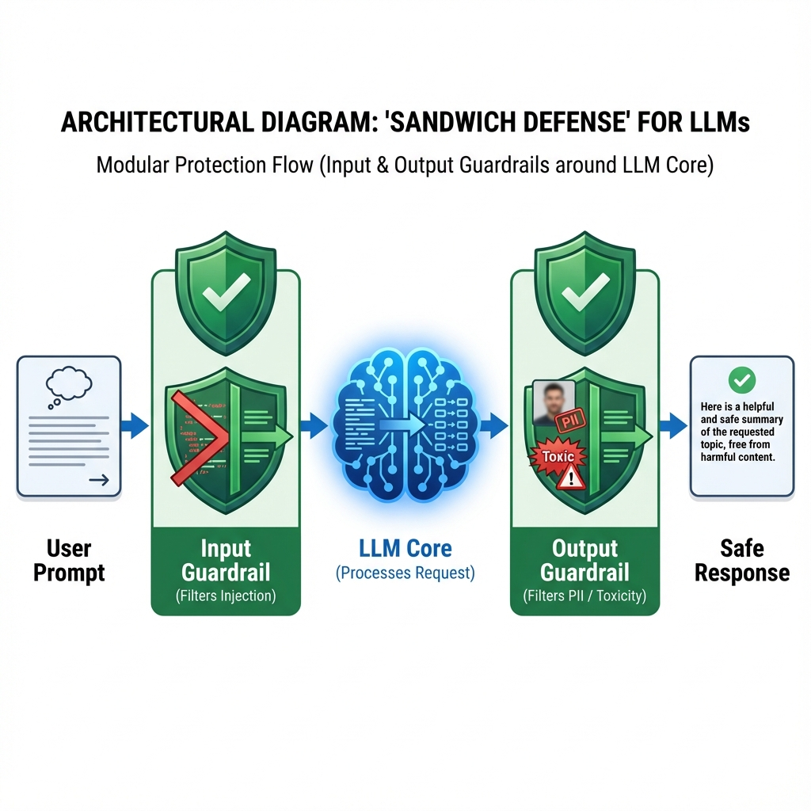
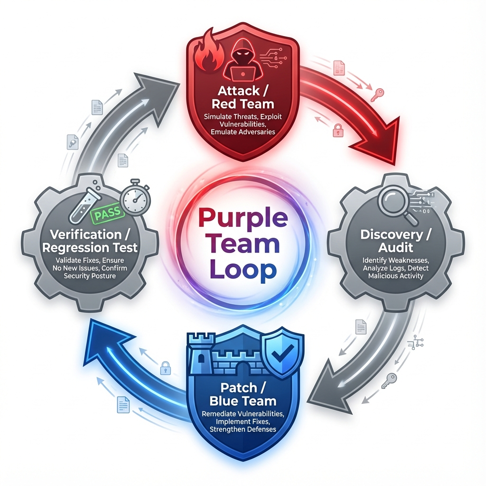

# AI Red Team Ops

## Week 4: Defense, Governance & Operations

> "Closing the Loop"

---

# Agenda: Week 4

1. **Defense in Depth**
   _The Sandwich Architecture_
2. **Compliance**
   _EU AI Act & NIST AI RMF_
3. **The Purple Team Loop**
   _Continuous Improvement_
4. **Capstone Overview**

---

# 1. The Sandwich Defense

**Concept:** Never let the raw LLM interact with the raw User.

### The Layers

- **Input Guard:** "Is this an attack?" (Regex, Similarity Search, Heuristics).
- **LLM Core:** The probabilistic engine.
- **Output Guard:** "Is this safe?" (PII Redaction, Toxicity Filter, Fact Checking).

---

# 2. Compliance Landscape (2025-2026)

### EU AI Act

- **Prohibited:** Social Scoring, Biometric Categorization, Subliminal Manipulation.
- **High Risk:** Infrastructure, HR, Law Enforcement -> _Requires Human Oversight_.
- **GenAI:** Must disclose that content is AI-generated.

### NIST AI RMF (Risk Management Framework)

- **Map:** Identify context and risks.
- **Measure:** quantitative metrics (e.g., Attack Success Rate).
- **Manage:** Resource allocation and incident response.

---

# 3. The Purple Team Loop

Red Teaming is useless if Blue Team doesn't fix it.

1. **Attack:** Find the jailbreak (`! ! ! large`).
2. **Discovery:** Log it and analyze _why_ it worked.
3. **Patch:** Add `! ! ! large` to the Input Guard blocklist.
4. **Verify:** Run regression tests (Did we break legitimate users?).

---

# Capstone: The Audit

**Scenario:**
You are hired to audit "CodeBot 9000," an autonomous GitHub PR bot.

**Deliverables:**

1. **Threat Model:** Where can it be attacked? (Supply Chain, Poisoning).
2. **Exploit:** A theoretical payload to trick it into merging bad code.
3. **Defense:** A proposed architecture to stop your own exploit.
4. **Executive Summary:** A 1-page report for the CISO.

> _Good luck, Red Team._
